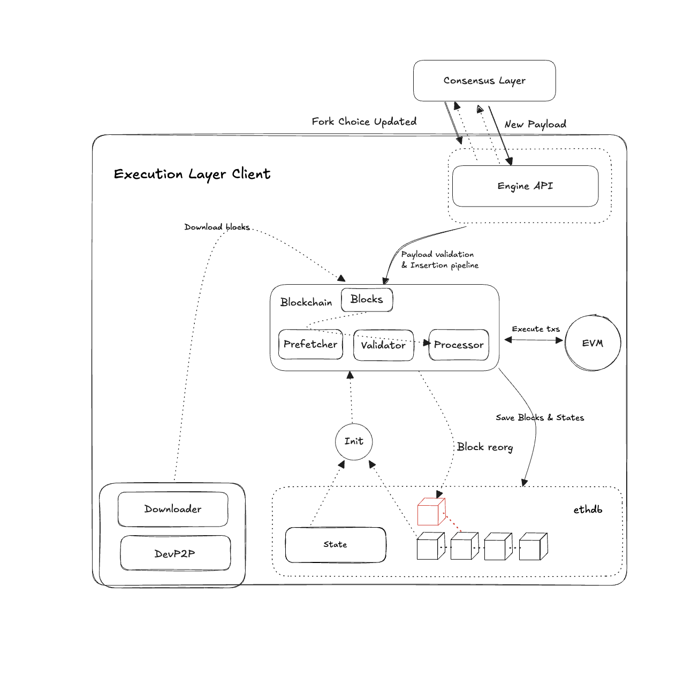

# Geth 源码系列：Blockchain 的设计及实现

Author: ray

这篇文章是 Geth 源码系列的第六篇，通过这个系列，我们将搭建一个研究 Geth 实现的框架，开发者可以根据这个框架深入自己感兴趣的部分研究。这个系列共有六篇文章，在第六篇文章中，我们将深入研究以太坊的 Blockchain 结构，Blockchain 代表的是以太坊共识结果，Blockchain 模块会负责验证新的区块、处理链重组以及区块的存储和检索，本文将深入研究 Blockchain 的设计及实现。

## 1. Blockchain 简介

在以太坊中，用户提交交易之后的所有流程，包括交易传播、出块节点选择、共识层选择链的过程，都是为了最终产出区块做准备。出块节点通过打包交易来产出区块，新区块会去链接前一个区块，最终形成一个链状结构，也就是区块链，Blockchain 模块的职责就是管理这个过程，与共识层配合，共同完成区块链状态和区块的维护。

## 2. Blockchain 架构及生命周期

Blockchain 负责对共识结果的持久化，连接了共识层和持久化数据库，负责将区块链网络中以及产生的共识结果持久化到本地。在正常情况下，区块链网络共识过程正常，节点也能正常接收对应的共识结果，执行层只需要负责接收共识层传递的共识结果，然后持久化到本地。但在以太坊这样的分布式的网络中，可能会有很多异常的情况出现，那么就有可能需要对已经产生的区块重组。Blockchain 模块的架构图如下所示：



总体来说，Blockchain 模块不会参与共识的过程，只会负责管理执行层的共识结果，Blockchain 实例会随着节点的启动而创建，在后续区块插入或者重组的流程中都会使用这一个实例。

## 3. 核心数据结构

Blockchain 涉及到的数据结构比较少，主要的业务逻辑都在围绕 Blockchain 这个结构体展开。

### Blockchain

Blockchain 在 `core/blockchain.go` 中定义，结构体中包含了在维护区块的过程中所依赖的模块。

```go
type BlockChain struct {
	chainConfig *params.ChainConfig // 链配置和网络配置，包含区块链的共识规则、分叉点和网络参数
	cacheConfig *CacheConfig        // 缓存配置，用于控制修剪（pruning）策略和内存使用

	db            ethdb.Database                   // 底层持久化数据库
	snaps         *snapshot.Tree                   // 快照树，用于快速访问 trie 叶子节点
	triegc        *prque.Prque[int64, common.Hash] // 优先队列，映射区块号到需要垃圾回收的 tries
	gcproc        time.Duration                    // 累积规范区块处理时间，用于 trie 转储
	lastWrite     uint64                           // 最后一次状态刷新的区块
	flushInterval atomic.Int64                     // 状态刷新的时间间隔（处理时间）
	triedb        *triedb.Database                 // Trie 数据库处理器，用于维护 trie 节点
	statedb       *state.CachingDB                 // 状态数据库，用于缓存状态数据的中间状态
	txIndexer     *txIndexer                       // 交易索引器，可能为 nil（如果未启用）

	hc               *HeaderChain  // 区块头链，管理区块头的导入和验证
	rmLogsFeed       event.Feed  // 移除日志的事件源
	chainFeed        event.Feed  // 链更新的事件源
	chainHeadFeed    event.Feed  // 链头更新的事件源
	logsFeed         event.Feed  // 日志的事件源
	blockProcFeed    event.Feed  // 区块处理的事件源
	blockProcCounter int32       // 区块处理计数器
	scope            event.SubscriptionScope // 事件订阅范围
	genesisBlock     *types.Block // 创世区块

	chainmu *syncx.ClosableMutex  // 链写操作的互斥锁

	currentBlock      atomic.Pointer[types.Header] // 当前链头区块
	currentSnapBlock  atomic.Pointer[types.Header] // 当前快照同步的链头
	currentFinalBlock atomic.Pointer[types.Header] // 最新的（共识）最终确定区块
	currentSafeBlock  atomic.Pointer[types.Header] // 最新的（共识）安全区块

	bodyCache     *lru.Cache[common.Hash, *types.Body] // 区块体缓存
	bodyRLPCache  *lru.Cache[common.Hash, rlp.RawValue] // 区块体 RLP 编码缓存
	receiptsCache *lru.Cache[common.Hash, []*types.Receipt] // 收据缓存
	blockCache    *lru.Cache[common.Hash, *types.Block] // 区块缓存

	txLookupLock  sync.RWMutex
	txLookupCache *lru.Cache[common.Hash, txLookup] // 交易查询缓存

	wg            sync.WaitGroup // 并发控制组，用于优雅关闭
	quit          chan struct{} // 关闭信号，在 Stop 中关闭
	stopping      atomic.Bool   // 链运行状态标志
	procInterrupt atomic.Bool   // 区块处理中断信号

	engine     consensus.Engine // 共识引擎，负责区块验证和挖矿
	validator  Validator // 区块和状态验证器接口
	prefetcher Prefetcher // 状态预取器，优化状态访问性能
	processor  Processor // 区块交易处理器接口
	vmConfig   vm.Config // EVM 设置
	logger     *tracing.Hooks // 日志钩子
}
```

在 Blockchain 结构中，有三个关键的 interface，这三个 interface 会执行具体处理区块的逻辑：

- Validator：负责验证区块和状态的合法性
    - 验证区块头信息以及叔块的有效性
    - 验证状态转换的正确性
- Prefercher：预先加载可能需要的状态数据，提升区块处理效率
    - 在区块处理前预取状态数据、减少后续实际执行时所需要加载数据的时间
- Processor：执行区块中的业务逻辑
    - 按照区块中交易打包顺序执行交易，并计算 gas 消耗和 gas 退款，生成对应的收据和日志
    - 处理共识层的请求，比如退款等等

```go
// 用于验证区块
type Validator interface {
	ValidateBody(block *types.Block) error
	ValidateState(block *types.Block, state *state.StateDB, res *ProcessResult, stateless bool) error
}

// 提前缓存状态数据
type Prefetcher interface {
	Prefetch(block *types.Block, statedb *state.StateDB, cfg vm.Config, interrupt *atomic.Bool)
}

// 处理区块，包括执行区块的中的交易，并且将交易引起的状态变更持久化到状态数据库中
type Processor interface {
	Process(block *types.Block, statedb *state.StateDB, cfg vm.Config) (*ProcessResult, error)
}
```

## 4. 关键流程

当执行层处在不同状态时，获取共识结果（区块）的方式不一样。对于Blockchain 来说，有以下的关键流程需要处理：

- 如果当前节点是一个新加入网络的节点，需要从其他的节点处同步的区块数据（Full Sync），然后由 Blockchain 模块将区块在本地执行，插入新区块和保存状态数据；
- 如果当前节点是一个已经同步完成并正常运行的节点，执行层会与共识层进行交互，获取共识层的共识结果，然后由 Blockchain 模块将区块插入，并更新状态数据；
- 在插入区块的过程中，也会判断当前同步的区块数据是否正常，是否需要触发区块的重组。

### 与共识层的交互

以太坊执行层在运行的过程中，需要共识层来确定执行层需要插入哪些区块，因此，执行层需要需要从共识层获取下一个需要插入的区块。同时，共识层会负责将一些共识的结果传递到执行层，比如头块信息、已经被 Finalized 的区块，这些信息通过 Engine API 传递到执行层之后，其中的交易会被执行，产生的区块和状态变化就会被持久化存储。

### 区块同步

当一个节点因为新加入网络或者由于宕机后重新接入网络，那么就需要重新同步区块，通过区块的方式有多种，如果采用了 Full Sync 的方式，所有同步过来的区块需要对其中的的每一条交易进行执行，然后将产生的状态变更持久化到状态数据库中。

### 新区块插入

无论是通过共识层获取到新的共识结果，还是从其他节点处同步过来了新的区块，都需要通过新区块插入的方式来完成区块验证、交易执行和持久化存储几个过程。这个过程会调用 Blockchain 中的特定方法来完成，在这个过程中，会依赖 EVM 来执行交易并产出状态变更，然后依赖状态数据库将执行结果持久化存储到磁盘中。

### 链重组

在以太坊这样一个节点遍布全球的分布式网络，会出现各种异常情况，这些情况都有可能导致区块的产生出现异常情况。在异常情况下，执行层很有可能会发生区块重组，需要回滚本地的区块和状态信息，重新同步当前的主流链。这些异常情况可能是网络分区导致竞争区块出现、节点客户端漏洞、节点客户端版本等等问题。

## 5. Blockchain 源码分析

下面通过代码来详细看一下 Blockchain 如何实现上面的各个流程。在 `eth/backend.go`  的 New 方法是启动节点的入口，在这个方法中也会创建 Blockchain 模块的实例：

```go
	// 初始化 Blockchain 实例
	eth.blockchain, err = core.NewBlockChain(chainDb, cacheConfig, config.Genesis, &overrides, eth.engine, vmConfig, &config.TransactionHistory)
	if err != nil {
		return nil, err
	}
```

在 `core/blockchain.go` 中的 NewBlockchain 方法中会执行具体的初始化工作，主要的工作有三个：

- 从磁盘中加载状态数据，并验证创世区块及状态数据的可用性，并初始化好状态数据库
- 为后续加载区块等数据设置缓存
- 为 validator、prefetcher、processor 等 interface 初始化具体实现，后续具体的区块处理逻辑依赖这三个 interface 的实现

```go
func NewBlockChain(db ethdb.Database, cacheConfig *CacheConfig, genesis *Genesis, overrides *ChainOverrides, engine consensus.Engine, vmConfig vm.Config, txLookupLimit *uint64) (*BlockChain, error) {
    // 如果缓存配置为空，使用默认配置
    if cacheConfig == nil {
        cacheConfig = defaultCacheConfig
    }
    
    // 检查是否在创世块启用Verkle树
    enableVerkle, err := EnableVerkleAtGenesis(db, genesis)
    if err != nil {
        return nil, err
    }
    
    // 使用配置创建 Trie 数据库
    triedb := triedb.NewDatabase(db, cacheConfig.triedbConfig(enableVerkle))

    // 如果数据库未初始化，写入提供的创世块
    // 返回链配置（来自提供的创世块或本地存储的配置）
    chainConfig, genesisHash, compatErr, err := SetupGenesisBlockWithOverride(db, triedb, genesis, overrides)
    if err != nil {
        return nil, err
    }
    
    //.....

    // 创建区块链核心结构
    bc := &BlockChain{
        chainConfig:   chainConfig,  // 链和网络配置
        cacheConfig:   cacheConfig,   // 缓存配置
        db:            db,           // 底层数据库
        triedb:        triedb,       // Trie数据库
        triegc:        prque.New[int64, common.Hash](nil), // Trie垃圾回收队列
        quit:          make(chan struct{}), // 关闭信号
        chainmu:       syncx.NewClosableMutex(), // 链操作互斥锁
        bodyCache:     lru.NewCache[common.Hash, *types.Body](bodyCacheLimit), // 区块体缓存
        bodyRLPCache:  lru.NewCache[common.Hash, rlp.RawValue](bodyCacheLimit), // RLP编码区块体缓存 
        receiptsCache: lru.NewCache[common.Hash, []*types.Receipt](receiptsCacheLimit), // 收据缓存
        blockCache:    lru.NewCache[common.Hash, *types.Block](blockCacheLimit), // 完整区块缓存
        txLookupCache: lru.NewCache[common.Hash, txLookup](txLookupCacheLimit), // 交易查询缓存
        engine:        engine,       // 共识引擎
        vmConfig:      vmConfig,     // 虚拟机配置
        logger:        vmConfig.Tracer, // 日志追踪器
    }
    
    // 初始化头部链
    bc.hc, err = NewHeaderChain(db, chainConfig, engine, bc.insertStopped)
    if err != nil {
        return nil, err
    }
    
    // 设置 Trie 刷新间隔
    bc.flushInterval.Store(int64(cacheConfig.TrieTimeLimit))
    
    // 创建状态数据库
    bc.statedb = state.NewDatabase(bc.triedb, nil)
    
    // 初始化区块验证器和状态处理器，这里是处理区块所用到的主要组件
    bc.validator = NewBlockValidator(chainConfig, bc)
    bc.prefetcher = newStatePrefetcher(chainConfig, bc.hc)
    bc.processor = NewStateProcessor(chainConfig, bc.hc)

    // 获取创世块头并创建创世块
    genesisHeader := bc.GetHeaderByNumber(0)
    bc.genesisBlock = types.NewBlockWithHeader(genesisHeader)
    if bc.genesisBlock == nil {
        return nil, ErrNoGenesis
    }

    // 初始化当前区块指针
    bc.currentBlock.Store(nil)
    bc.currentSnapBlock.Store(nil)
    bc.currentFinalBlock.Store(nil)
    bc.currentSafeBlock.Store(nil)

    // 更新链信息指标
    chainInfoGauge.Update(metrics.GaugeInfoValue{"chain_id": bc.chainConfig.ChainID.String()})

    // 如果使用的是 Freezer 存储，重新初始化缺失的链索引和标志
    if bc.empty() {
        rawdb.InitDatabaseFromFreezer(bc.db)
    }
    
    // 从磁盘加载区块链状态
    if err := bc.loadLastState(); err != nil {
        return nil, err
    }
    
    // 确保区块状态可用，否则等待状态同步
    head := bc.CurrentBlock()
    if !bc.HasState(head.Root) {
        if head.Number.Uint64() == 0 {
            // 创世状态缺失，等待状态同步
            log.Info("Genesis state is missing, wait state sync")
        } else {
            var diskRoot common.Hash
            if bc.cacheConfig.SnapshotLimit > 0 {
                diskRoot = rawdb.ReadSnapshotRoot(bc.db)
            }
            // 处理头部状态缺失情况
            if diskRoot != (common.Hash{}) {
                log.Warn("Head state missing, repairing", "number", head.Number, "hash", head.Hash(), "snaproot", diskRoot)
                snapDisk, err := bc.setHeadBeyondRoot(head.Number.Uint64(), 0, diskRoot, true)
                if err != nil {
                    return nil, err
                }
                if snapDisk != 0 {
                    rawdb.WriteSnapshotRecoveryNumber(bc.db, snapDisk)
                }
            } else {
                log.Warn("Head state missing, repairing", "number", head.Number, "hash", head.Hash())
                if _, err := bc.setHeadB eyondRoot(head.Number.Uint64(), 0, common.Hash{}, true); err != nil {
                    return nil, err
                }
            }
        }
    }
    
    //....
    
    // 验证当前头块
    bc.engine.VerifyHeader(bc, bc.CurrentHeader())

    //......

    // 加载或重建快照
    if bc.cacheConfig.SnapshotLimit > 0 {
        var recover bool
        head := bc.CurrentBlock()
        if layer := rawdb.ReadSnapshotRecoveryNumber(bc.db); layer != nil && *layer >= head.Number.Uint64() {
            log.Warn("Enabling snapshot recovery", "chainhead", head.Number, "diskbase", *layer)
            recover = true
        }
        
        snapconfig := snapshot.Config{
            CacheSize:  bc.cacheConfig.SnapshotLimit,
            Recovery:   recover,
            NoBuild:    bc.cacheConfig.SnapshotNoBuild,
            AsyncBuild: !bc.cacheConfig.SnapshotWait,
        }
        bc.snaps, _ = snapshot.New(snapconfig, bc.db, bc.triedb, head.Root)
        bc.statedb = state.NewDatabase(bc.triedb, bc.snaps)
    }

    //....
    
    return bc, nil
}
```

到这里，Blockchain 模块就初始化完成，可以用于处理具体的业务逻辑。先考虑节点处在同步状态下的行为，当节点处在同步状态时，那么以太坊就还无法作为出块节点或者接收新的共识结果，需要等待节点节点同步完成。如果节点使用的是 Full Sync，那么所有的区块中的交易都需要被执行，然后通过交易执行的结果来还原出状态数据库。

在 `eth/downloader/downloader.go`  的 processFullSyncContent 方法中，最后会调用 Blockchain 中的 InsertChain 来处理从其他节点同步过来的区块。

```go
func (d *Downloader) processFullSyncContent() error {
	for {
		results := d.queue.Results(true)
		if len(results) == 0 {
			return nil
		}
		if d.chainInsertHook != nil {
			d.chainInsertHook(results)
		}
		// 在这里处理同步过来的区块
		if err := d.importBlockResults(results); err != nil {
			return err
		}
	}
}

func (d *Downloader) importBlockResults(results []*fetchResult) error {
	// ....
	// 在这里调用 Blockchain 的 InsertChain 方法来处理区块
	if index, err := d.blockchain.InsertChain(blocks); err != nil {
		// ...
	}
	return nil
}
```

共识层会通过 `eth/catalyst/api.go` 中的 forkchoiceUpdated 方法来判断区块是否同步完成，如果同步完成，那么就会将整个执行层的状态设置为同步完成，然后就可以开始通过共识层来接收最新的共识结果了。同时，这个方法还会去判断当前以太坊网络中是否已经对一些区块达成了 Finalized 状态，如果已经达成，那么也会使用 Blockchain 中的方法来设置区块为 Finalized，后续将无法回滚和重组：

```go
func (api *ConsensusAPI) forkchoiceUpdated(update engine.ForkchoiceStateV1, payloadAttributes *engine.PayloadAttributes, payloadVersion engine.PayloadVersion, payloadWitness bool) (engine.ForkChoiceResponse, error) {
    //...
    api.eth.SetSynced()
    //...
    if update.FinalizedBlockHash != (common.Hash{}) {
		    // 获取要设置为 Finalized 的区块
		    finalBlock := api.eth.BlockChain().GetBlockByHash(update.FinalizedBlockHash)
		    if finalBlock == nil {
			    log.Warn("Final block not available in database", "hash", update.FinalizedBlockHash)
			    return engine.STATUS_INVALID, engine.InvalidForkChoiceState.With(errors.New("final block not available in database"))
		    } else if rawdb.ReadCanonicalHash(api.eth.ChainDb(), finalBlock.NumberU64()) != update.FinalizedBlockHash {
			    log.Warn("Final block not in canonical chain", "number", finalBlock.NumberU64(), "hash", update.FinalizedBlockHash)
			    return engine.STATUS_INVALID, engine.InvalidForkChoiceState.With(errors.New("final block not in canonical chain"))
		    }
		    // 将这个区块设置为 Finalized
		    api.eth.BlockChain().SetFinalized(finalBlock.Header())
	   }
    //...
}
```

区块在同步完成之后，执行层就可以接收共识层最新的共识结果，并验证共识结果然后持久化存储，共识层会通过 `eth/catalyst/api.go` 中的 newPayload 来导入最新的共识结果，调用 Blockchain 的 InsertBlockWithoutSetHead 方法来导入新的区块：

```go
func (api *ConsensusAPI) newPayload(params engine.ExecutableData, versionedHashes []common.Hash, beaconRoot *common.Hash, requests [][]byte, witness bool) (engine.PayloadStatusV1, error) {

	//...
	proofs, err := api.eth.BlockChain().InsertBlockWithoutSetHead(block, witness)
	if err != nil {
		//...
	}
	//...
}
```

无论是区块同步，还是从共识层接收最新的共识结果，最后都是通过 `core/blockchain.go` 中的 insertChain 方法来实际插入区块，在这个过程中会使用到  validator、prefetcher、processor 这三个 interface 的具体实现来处理区块：

```go
// insertChain 是区块链插入新链的核心函数
func (bc *BlockChain) insertChain(chain types.Blocks, setHead bool, makeWitness bool) (*stateless.Witness, int, error) {
    // 1. 检查链是否已停止
    if bc.insertStopped() {
        return nil, 0, nil
    }
    // ...
    for ; block != nil && err == nil || errors.Is(err, ErrKnownBlock); block, err = it.next() {
        // ...

        // 2. 启用状态预取，会调用 prefetcher 的实现来加载数据
        if bc.chainConfig.IsByzantium(block.Number()) {
            if bc.vmConfig.StatelessSelfValidation || (makeWitness && len(chain) == 1) {
                witness, err = stateless.NewWitness(block.Header(), bc)
                if err != nil {
                    return nil, it.index, err
                }
            }
            statedb.StartPrefetcher("chain", witness)
        }
        activeState = statedb

        // ...
        // 3. 处理区块，在 processBlock 方法种会调用 Validator 的 ValidateState 方法来验证状态是否正确
        res, err := bc.processBlock(block, statedb, start, setHead)
        followupInterrupt.Store(true)
        if err != nil {
            return nil, it.index, err
        }
        // ...
    }
}

```

其中 Prefetch 预加载数据的逻辑其实很简单，就是直接将所有的交易执行一遍，预热这个过程中会使用到的状态数据：

```go
func (p *statePrefetcher) Prefetch(block *types.Block, statedb *state.StateDB, cfg vm.Config, interrupt *atomic.Bool) {
	// 构造一个交易执行的上下文信息
	var (
		header       = block.Header()
		gaspool      = new(GasPool).AddGas(block.GasLimit())
		blockContext = NewEVMBlockContext(header, p.chain, nil)
		evm          = vm.NewEVM(blockContext, statedb, p.config, cfg)
		signer       = types.MakeSigner(p.config, header.Number, header.Time)
	)
	
	byzantium := p.config.IsByzantium(block.Number())
	for i, tx := range block.Transactions() {
		// 如果预加载被中断，那么就直接返回
		if interrupt != nil && interrupt.Load() {
			return
		}
		// 构造交易执行的消息
		msg, err := TransactionToMessage(tx, signer, header.BaseFee)
		if err != nil {
			return 
		}
		// 设置交易的上下文信息
		statedb.SetTxContext(tx.Hash(), i)

		// 通过执行交易来预热数据，但直接丢弃直接结果
		if _, err := ApplyMessage(evm, msg, gaspool); err != nil {
			return 
		}
		
		if !byzantium {
			statedb.IntermediateRoot(true)
		}
	}
	if byzantium {
		statedb.IntermediateRoot(true)
	}
}
```

在 processBlock ****中，则包含处理交易的实际逻辑，包括具体执行区块中的交易，这部分我们在之前的文章中已经详细说明，这里不再赘述，然后是验证区块执行完成之后的状态数据，如果符合预期，就再根据传入的参数来判断是否要将当前的区块信息设置为头块。

```go
func (bc *BlockChain) processBlock(block *types.Block, statedb *state.StateDB, start time.Time, setHead bool) (_ *blockProcessingResult, blockEndErr error) {
	//...
	// 处理具体的交易逻辑
	res, err := bc.processor.Process(block, statedb, bc.vmConfig)
	if err != nil {
		bc.reportBlock(block, res, err)
		return nil, err
	}
  // 验证区块中交易执行完成之后的状态信息
	if err := bc.validator.ValidateState(block, statedb, res, false); err != nil {
		bc.reportBlock(block, res, err)
		return nil, err
	}
	
	//...

	var (
		wstart = time.Now()
		status WriteStatus
	)
	// 是否要设置头区块
	if !setHead {
		err = bc.writeBlockWithState(block, res.Receipts, statedb)
	} else {
		status, err = bc.writeBlockAndSetHead(block, res.Receipts, res.Logs, statedb, false)
	}
	//...
}
```

在执行层中，当出现同步的区块不一致时，就会触发区块的重组，在这个过程中，需要对本地已经同步的区块和状态数据进行回滚，并重新同步新的区块。区块重组会分为三个阶段：

- 寻找共同祖先，对于产生分叉的两条链，先找到共同的祖先
- 找到共同的祖先之后，就会执行区块重组和状态回滚
- 最后会更新链状态并且清理无用的数据

```go
func (bc *BlockChain) reorg(oldHead *types.Header, newHead *types.Header) error {
    var (
        newChain    []*types.Header  // 新链区块头列表
        oldChain    []*types.Header  // 旧链区块头列表
        commonBlock *types.Header    // 共同祖先区块
    )
	// 将两条链调整到相同高度，便于寻找共同祖先
	if oldHead.Number.Uint64() > newHead.Number.Uint64() {
		// 旧链更长，收集所有将被删除的交易和日志
		for ; oldHead != nil && oldHead.Number.Uint64() != newHead.Number.Uint64(); oldHead = bc.GetHeader(oldHead.ParentHash, oldHead.Number.Uint64()-1) {
			oldChain = append(oldChain, oldHead)
		}
	} else {
		// 新链更长，暂存所有新块待后续插入
		for ; newHead != nil && newHead.Number.Uint64() != oldHead.Number.Uint64(); newHead = bc.GetHeader(newHead.ParentHash, newHead.Number.Uint64()-1) {
			newChain = append(newChain, newHead)
		}
	}
	if oldHead == nil {
		return errInvalidOldChain
	}
	if newHead == nil {
		return errInvalidNewChain
	}
	// 寻找两条链共同的祖先
	for {
		if oldHead.Hash() == newHead.Hash() {
			commonBlock = oldHead
			break
		}
		oldChain = append(oldChain, oldHead)
		newChain = append(newChain, newHead)

		oldHead = bc.GetHeader(oldHead.ParentHash, oldHead.Number.Uint64()-1)
		if oldHead == nil {
			return errInvalidOldChain
		}
		newHead = bc.GetHeader(newHead.ParentHash, newHead.Number.Uint64()-1)
		if newHead == nil {
			return errInvalidNewChain
		}
	}
	// 记录重组日志
	if len(oldChain) > 0 && len(newChain) > 0 {
		logFn := log.Info
		msg := "Chain reorg detected"
		if len(oldChain) > 63 {
			msg = "Large chain reorg detected"
			logFn = log.Warn  // 记录重组的区块高度信息
		}
		logFn(msg, "number", commonBlock.Number, "hash", commonBlock.Hash(),
			"drop", len(oldChain), "dropfrom", oldChain[0].Hash(), "add", len(newChain), "addfrom", newChain[0].Hash())
		blockReorgAddMeter.Mark(int64(len(newChain)))
		blockReorgDropMeter.Mark(int64(len(oldChain)))
		blockReorgMeter.Mark(1)
	} else if len(newChain) > 0 {
		log.Info("Extend chain", "add", len(newChain), "number", newChain[0].Number, "hash", newChain[0].Hash())
		blockReorgAddMeter.Mark(int64(len(newChain)))
	} else {
		log.Error("Impossible reorg, please file an issue", "oldnum", oldHead.Number, "oldhash", oldHead.Hash(), "oldblocks", len(oldChain), "newnum", newHead.Number, "newhash", newHead.Hash(), "newblocks", len(newChain))
	}
	
	// 通过 txLookupLock 确保交易索引更新与链重组原子化，避免中间状态被外部读取
	bc.txLookupLock.Lock()

	// 准备存储受影响的交易和日志
  var (
      deletedTxs []common.Hash  // 将被删除的交易
      rebirthTxs []common.Hash  // 将被恢复的交易
      deletedLogs []*types.Log // 将被删除的日志
      rebirthLogs []*types.Log // 将被恢复的日志
  )
	// 这里是旧的业务逻辑，为了保持兼容性不能删除
	{
		for i := len(oldChain) - 1; i >= 0; i-- {
			block := bc.GetBlock(oldChain[i].Hash(), oldChain[i].Number.Uint64())
			if block == nil {
				return errInvalidOldChain 
			}
			if logs := bc.collectLogs(block, true); len(logs) > 0 {
				deletedLogs = append(deletedLogs, logs...)
			}
			if len(deletedLogs) > 512 {
				bc.rmLogsFeed.Send(RemovedLogsEvent{deletedLogs})
				deletedLogs = nil
			}
		}
		if len(deletedLogs) > 0 {
			bc.rmLogsFeed.Send(RemovedLogsEvent{deletedLogs})
		}
	}
	// 反向处理旧链 日志删除按从新到旧（反向遍历），新增按 从旧到新（正向遍历），这样比较符合区块执行顺序
	for i := 0; i < len(oldChain); i++ {
		// 收集即将被删除的交易
		block := bc.GetBlock(oldChain[i].Hash(), oldChain[i].Number.Uint64())
		if block == nil {
			return errInvalidOldChain 
		}
		for _, tx := range block.Transactions() {
			deletedTxs = append(deletedTxs, tx.Hash())
		}
		if logs := bc.collectLogs(block, true); len(logs) > 0 {
			slices.Reverse(logs)

		}
	}
	// 按照区块产生的顺序来处理信链
	for i := len(newChain) - 1; i >= 1; i-- {
		// 收集即将被新增加的交易
		block := bc.GetBlock(newChain[i].Hash(), newChain[i].Number.Uint64())
		if block == nil {
			return errInvalidNewChain // Corrupt database, mostly here to avoid weird panics
		}
		for _, tx := range block.Transactions() {
			rebirthTxs = append(rebirthTxs, tx.Hash())
		}
		// 收集要产生的日子
		if logs := bc.collectLogs(block, false); len(logs) > 0 {
			rebirthLogs = append(rebirthLogs, logs...)
		}
		if len(rebirthLogs) > 512 {
			bc.logsFeed.Send(rebirthLogs)
			rebirthLogs = nil
		}
		// 从共同祖先后第一个新区块开始，按顺序写入新链区块，并更新链头
		bc.writeHeadBlock(block)
	}
	if len(rebirthLogs) > 0 {
		bc.logsFeed.Send(rebirthLogs)
	}
	// 删除无用的交易索引
	batch := bc.db.NewBatch()
	for _, tx := range types.HashDifference(deletedTxs, rebirthTxs) {
		rawdb.DeleteTxLookupEntry(batch, tx)
	}
	// 删除因重组而不再属于链的区块哈希标记，确保数据库只保留当前有效链的索引
	number := commonBlock.Number
	if len(newChain) > 1 {
		number = newChain[1].Number
	}
	for i := number.Uint64() + 1; ; i++ {
		hash := rawdb.ReadCanonicalHash(bc.db, i)
		if hash == (common.Hash{}) {
			break
		}
		rawdb.DeleteCanonicalHash(batch, i)
	}
	if err := batch.Write(); err != nil {
		log.Crit("Failed to delete useless indexes", "err", err)
	}
	// 重置缓存
	bc.txLookupCache.Purge()

	// 释放锁
	bc.txLookupLock.Unlock()

	return nil
}
```

## 6. 总结

对于以太坊，最终的目的都是为了将用户提交的交易转化为共识的结果，而区块就是共识的结果。在正常情况下，用户提交交易之后，会经历进入交易池、广播、然后被出块节点打包进区块，最终区块广播给网络中所有的节点，最后再完成区块的最终性确认。但是在以太坊这样一个开放的分布式网络中，可能会出现各种意外情况，比如区块重组等情况。这些流程都将由 Blockchain 模块配合共识层来完成执行，保证以太坊有序处理所有交易，不断接收新的共识结果。

## Ref

[1][https://github.com/ethereum/go-ethereum/commit/c8a9a9c0917dd57d077a79044e65dbbdd421458b](https://github.com/ethereum/go-ethereum/commit/c8a9a9c0917dd57d077a79044e65dbbdd421458b)

[2][https://hackmd.io/@danielrachi/engine_api](https://hackmd.io/@danielrachi/engine_api)