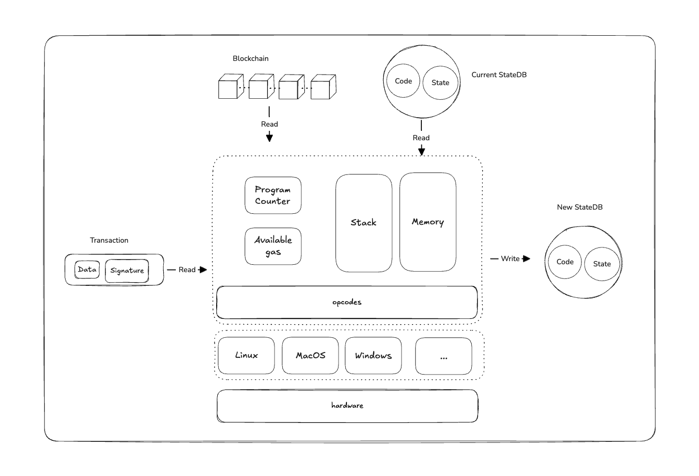
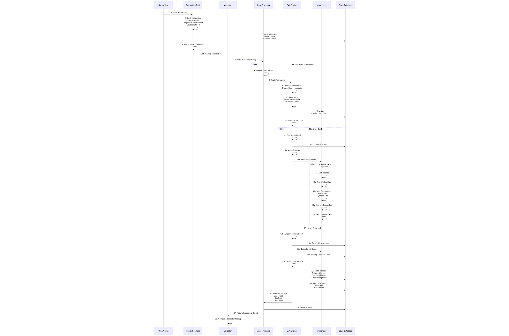
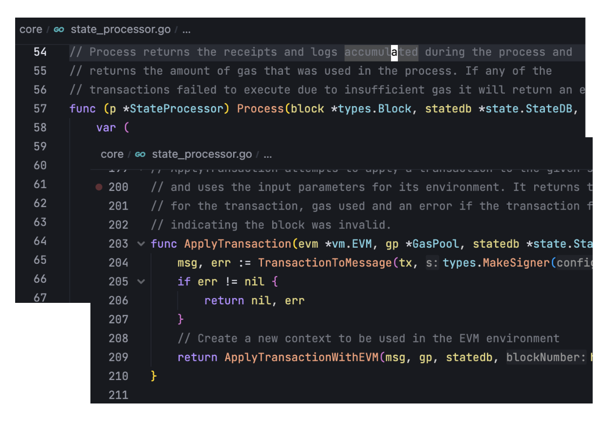
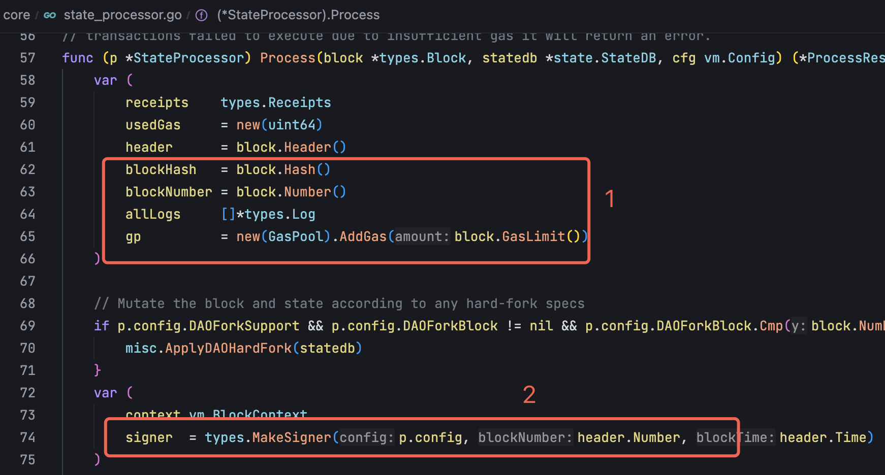
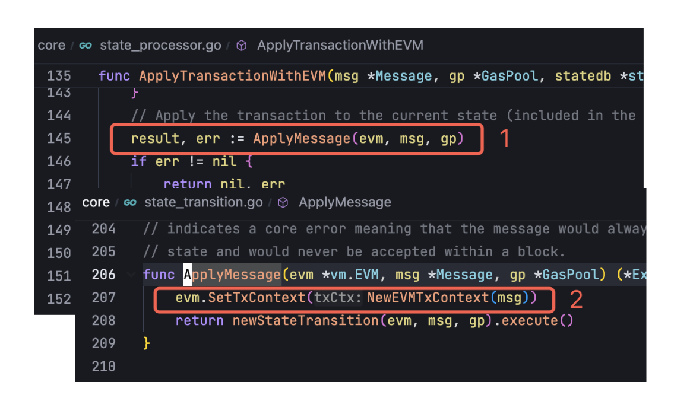
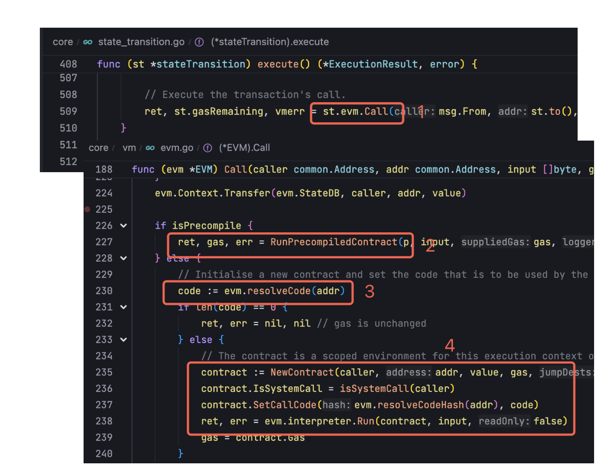
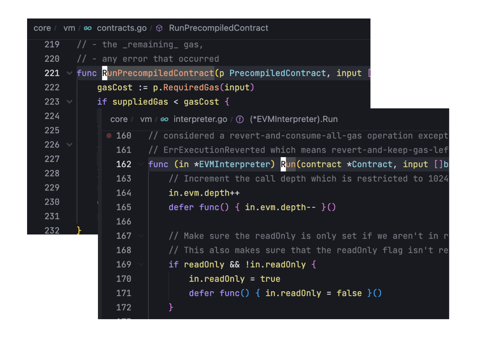
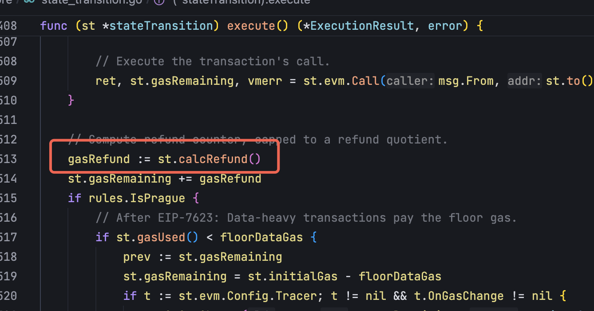
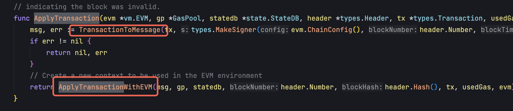

# Geth 源码系列：EVM 设计及实现

Author: ray

这篇文章是 Geth 源码系列的第五篇，通过这个系列，我们将搭建一个研究 Geth 实现的框架，开发者可以根据这个框架深入自己感兴趣的部分研究。这个系列共有六篇文章，在第五篇文章中，我们将深入研究 EVM，EVM 是以太坊执这个交易驱动的状态机的核心部分，所有的交易需要经过 EVM 的执行才能成为状态的一部分。会详细介绍 EVM 的版本迭代，也会详细说明 EVM 的设计及实现，以及对交易的处理细节。

## 1. EVM 简介

如果把以太坊看作是一个交易驱动的状态机，那么 EVM 就是其中的状态转换函数，EVM 会以当前的世界状态和交易作为输入，输出下一个世界状态。

在了解 EVM 之前，需要先理解一下以太坊的账户模型， 与比特币不一样，以太坊中是以账户为基础的存储单元，每个账户都有一个地址，地址之间的账户会引起世界状态的变化。在以太坊中有两种账户类型：

- EOA（Externally-owned account）：通常称为外部账户，这类账户由私钥控制
- 合约账户（Contract account）：需要部署合约代码，由代码来控制账户

但是在 EIP-7702 实施之后，EOA 也能附加代码，EOA 和合约账户的界限正在模糊。这两种账户都能持有发送和接收 ETH（以太币），并且都可以与其他的地址进行交互。每个账户都有四个属性：

- `nonce` ：一个计数器，用来显示 EOA 发送的交易数量或合约帐户创建的合约数量，这个字段主要用来防止重放攻击
- `balance` ：这个地址拥有的 ETH  数量，以 Wei 为单位，每个 ETH 有 1e^18 Wei
- `codeHash` ： 这个字段表示该地址指向的代码，可以被 EVM 执行，默认情况下， EOA 的这个字段为空，但是可以通过 EIP-7702 为 EOA 附加合约代码，合约账户的这个字段不能被修改
- `storageRoot` ： 存储 hash，指向合约的状态存储，默认情况下为空，只有合约中代码执行之后引起了状态的变化，这个字段才会有数据

以太坊的世界状态就是将这些账户的数据通过 MPT 的方式组织起来，EVM 在执行交易之后，会更新这些账户中的数据，然后更新后的数据会引起 MPT 的更新，从而引起每个区块中状态根的变化。也只有 EVM 能够更新世界状态，所以可以把 EVM 看作是以太坊这个状态机的状态转换函数。

以太坊中可以由 Solidity、Vyper、Yul 等语言来编写合约，合约实际在部署到链上的时候，实际上会被编译成**字节码**，EVM 也只能处理字节码，而不能直接执行编程语言。字节码在 EVM 中会被解析为具体的**操作码，**这也是 EVM 最终执行的指令。合约部署到链上之后，合约暴露出来的方法可以被 EOA 账户或者其他其他合约调用，调用合约的过程中就是解析**字节码**到**操作码**的过程。

## 2. EVM 的主要迭代

EVM 从主网上线之后，结构和运行方式基本没有变更，每次硬分叉升级基本都是 EVM 的指令集（opcodes）进行更新，一般是新增指令或者对现有指令的更新。以下是各个硬分叉升级中 EVM 的更新情况：

### Frontier 到 London

- Frontier（2015 年 7 月）：EVM 的最初版本，包括基础的算术、逻辑、存储、控制等操作，包含 STOP，ADD，MUL，SUB，DIV，KECCAK256，BALANCE，SLOAD，SSTORE，JUMP 等基础指令
- Homestead（2016 年 3 月）：新增 `DELEGATECALL` 指令
- Tangerine Whistle（2016 年 10 月）：
    - 没有新增指令，提高了 BALANCE，EXTCODESIZE，SLOAD，EXTCODECOPY，CALL，CALLCODE，DELEGATECALL 的 gas 成本
- Spurious Dragon（2016 年 11 月）：
    - 调整了 EXP 指令的 gas 计算方式
- Byzantium（2017 年 10 月）：
    - 新增 `REVERT` 指令 - 回滚状态并返回数据
    - 新增 STATICCALL 指令 - 静态调用，不允许状态修改
    - 新增 RETURNDATASIZE 指令 - 获取返回数据大小
    - 新增 RETURNDATACOPY 指令 - 复制返回数据
- Constantinople（2019 年 2 月）：
    - 新增位移操作指令： SHL (左移), SHR (右移), SAR (算术右移)
    - 新增 EXTCODEHASH 指令 - 获取合约代码哈希
    - 新增 `CREATE2` 指令 - 确定性合约创建
- Istanbul（2019 年 12 月）：
    - 新增 CHAINID 指令 - 获取链 ID
    - 优化了 SSTORE 的 gas 计量
- Berlin（2021 年 04 月）：
    - 引入 AccessList 交易
- London （2021 年 08 月）：
    - 交易手续费机制改变，引入 `BASEFEE` 指令

### Paris 到 Prague

- Paris（The Merge 2022 年 9 月）：
    - 将 DIFFICULTY 指令重新定义为 PREVRANDAO，废除挖矿难度机制，用来存储 RANDAO 随机数
- Shanghai（2023 年 4 月）：
    - 新增 PUSH0 指令 - 推送零值到栈
- Cancun（2024 年 3 月）：
    - 新增 TLOAD 和 TSTORE 指令 - 支持瞬态存储操作
    - 新增 BLOBHASH 指令 - 获取 blob 哈希
    - 新增 BLOBBASEFEE 指令 - 获取 blob 基础费用
    - 新增 MCOPY 指令 - 内存复制操作
    - 修改 SELFDESTRUCT 行为，只在同一交易中生效
- Prague（2025 年 5 月）：
    - 引入 SetCode 交易

## 3. EVM 架构

EVM 需要确保每个交易在不同的硬件既不同的操作系统上执行的结果是一致的，由于不同的硬件和不同的操作系统系统对应指令解析以及内存管理等等都不相同，EVM 相当于在计算机和合约之间搭建了一个中间层，EVM 负责执行所有的字节码，然后将数据调用系统的能力保存到此案。 EVM 屏蔽了不同硬件和操作系统的实现，Java 语言中的 JVM 也是同样的原理。



EVM 是以太坊的核心组件，在 `core/vm` 中实现，EVM 是一个基于栈的虚拟机，负责执行智能合约代码，提供的核心功能包括：

- 提供交易（包括合约创建交易）的执行环境，管理交易执行的状态和上下文，并输出最后的状态数据更新情况
- 实现所有 EVM 操作码（opcodes）
- 实现 gas 计算和消耗机制

EVM 只负责执行交易和输出新的状态数据，但是不会负责状态变更的保存。EVM 会有多种用途，一种是出块节点用于产出新的区块，新产生的区块会广播到网络中被其他的节点所验证；二是验证区块也需要执行区块中的交易；三是调用 `eth_call` 等 API 来模拟执行一笔交易的时候，也会使用 EVM 来执行。

EVM 的生命周期很简单，当需要执行交易时， 就会创建一个 EVM 实例，当交易执行结束之后， EVM 实例被回收。

## 4. EVM 核心数据结构

EVM 的实现中有三个主要的数据结构， EVM 结构体定义了 EVM 的结构及依赖，包括执行上下文，状态数据库依赖等等，EVMInterpreter 结构体定义了解释器的实现，负责执行 EVM 字节码，Contract 结构体封装合约调用的具体参数，包括调用者、合约代码、输入等等，并且在 opcodes.go 中定义了当前所有的操作码。

EVM 结构体，在 `core/vm/evm.go`  中定义，表示一个 EVM 实例，其中包括了执行一个交易所需要的全部信息，每次在执行交易前，都需要实例化一个 EVM 实例：

```go
type EVM struct {
  // 提供区块链和交易级别的上下文信息
	Context BlockContext
	TxContext
  
  // 对底层状态信息的访问接口
	StateDB StateDB

	// 跟踪调用栈深度
	depth int

	// 当前链配置信息
	chainConfig *params.ChainConfig

	// 当前环境的规则，用于判断特定 EIP 是否在当前环境中激活
	chainRules params.Rules

	// 虚拟机配置选项
	Config Config

	// EVM 字节码解释器
	interpreter *EVMInterpreter

	// 用于中止 EVM 执行的原子布尔标志
	abort atomic.Bool

	// 临时存储当前执行可用的 Gas
	callGasTemp uint64

	// 预编译合约映射表
	precompiles map[common.Address]PrecompiledContract

	// JUMPDEST 分析结果缓存
	jumpDests map[common.Hash]bitvec
}
```

### EVM 解释器

EVM 指令解释器，在 `core/vm/interpreter.go` 中定义，会根据当前指令集来执行交易，当前的指令集在 table 中定义，table 会根据当前网络的硬分叉版本来决定。

```go
type EVMInterpreter struct {
	// EVM 实例
	evm   *EVM
	// EVM 指令集，根据当前的硬分叉版本来选择指令集
	table *JumpTable
  
  // 共享的 hash 计算实例
	hasher    crypto.KeccakState 
	// 哈希计算结果的缓冲区
	hasherBuf common.Hash    

  // 只读标识，当设置为 True 时，任何的状态修改都会抛出异常
	readOnly   bool   
	// 存储最近一次 CALL 操作的返回数据，供后续操作使用
	returnData []byte
}
```

JumpTable 是一个长度为 256 的数组，在 `core/vm/jump_table.go` 中定义，其中数组元素的类型是 operation，也在 `core/vm/jump_tanle.go` 中定义， 每个 operation 代表一个具体的指令，新增也是创建一个 operation 实例，目最多支持 256 个 指令，目前还有很大的扩展空间，目前已经定义的操作码指令在 `core/vm/opcodes.go` 。

```go
type JumpTable [256]*operation

type operation struct {
	// 指令执行函数
	execute     executionFunc
	// 固定 gas 消耗
	constantGas uint64
	// 动态 gas 消耗
	dynamicGas  gasFunc
	// 最小堆栈要求
	minStack int
	// 最大堆栈要求
	maxStack int

	// 内存大小计算
	memorySize memorySizeFunc

	// 是否为未定义指令
	undefined bool
}
```

### 合约抽象

合约结构体，在 `core/vm/contract.go` 中定义，代表对一次合约调用上下文的封装，会在解释器中被执行：

```go
type Contract struct {
	// 调用者地址
	caller  common.Address
	// 合约地址
	address common.Address
	// 跳转目标缓存
	jumpdests map[common.Hash]bitvec
	// 本地分析缓存
	analysis  bitvec                 
  // 合约字节码
	Code     []byte
	// 合约字节码 hash
	CodeHash common.Hash
	// 输入数据
	Input    []byte

	// 是否为合约部署
	IsDeployment bool
	// 是否为合约调用
	IsSystemCall bool

  // 可用 Gas
	Gas   uint64
	// 转帐的金额
	value *uint256.Int
}
```

## 5. EVM 实现详解

在了解完 EVM 的架构和关键组件之后，我们来看一下 EVM 完整的实现，EVM 的核心逻辑是将交易转换成状态变化，然后将状态变化输出给存储模块处理。这个过程，需要依赖多个流程才能实现。首先需要为交易执行提供对应的上下文信息，包括状态数据、合约信息、区块数据等等信息，然后在交易执行的过程中，需要将合约字节码解析成具体的操作码并执行，在执行操作码的过程中，还需要计算交易的 gas 消耗，最后将交易执行完成对状态数据的更新情况返回。

### EVM 运行时环境

首先，EVM 在执行交易之前，需要实例化一个 EVM，EVM 不是线程安全的，所以也不能并行处理交易，每次执行交易前都需要实例化一个 EVM，这样可以确保每个交易的执行都是隔离的，以防会出现在交易执行结果不一致的情况。

EVM 的运行时环境可以分为两部分：

- 交易执行所依赖的信息
    - 区块上下文信息：当前的区块的高度、区块 Hash、区块的 Gas Limit、BaseFee、RANDDAO 随机数等等
    - 交易上下文信息：交易发起的地址、GasPrice 等等
    - 合约代码：以字节码的形式存储在状态数据库中，使用合约地址进行引用
    - EVM 的配置信息
- 交易的执行环境
    - Stack：操作码执行的栈空间，每个合约在 EVM 执行期间，都会初始化一个空的栈，栈是一个 32 字节的数组列表，合约的操作码在执行的过程中，栈用来存储操作码的输入和输出。当交易调用结束的时候，它就会被销毁。目前栈的最大深度是 1024
    - Memory：操作码执行的内存空间，为每个 EVM 合约执行而初始化的一个内存空间，在调用结束之后，内存空间就会被销毁
    - Storage：状态数据的存储，每个合约都有自己的存储，不能直接读取或者修改其他合约的存储内容，只能通过合约调用来读取。依赖存储模块提供的 StateDB 模块来实现，EVM 只负责更新相关数据，不负责持久化存储
    - Calldata：交易传入的参数，calldata 区域是作为交易的一部分，如果是普通的合约调用，其中就是调用合约所需要的参数，如果是部署一个新的合约，calldata 中就是合约字节码信息以及合约构造函数的参数
    - Return Data：合约调用所返回的数据，可以通过 RETURN 或者 REVERT 操作码来返回

**区块上下文信息**

BlockContext 结构体在 `core/vm/evm.go` 中定义，在初始化 EVM 实例时，在执行区块中的交易之前，会通过 `core/evm.go` 中的 NewEVMBlockContext 函数来负责初始化区块下文信息。

```go
type BlockContext struct {
    // 转账相关函数
    CanTransfer CanTransferFunc  // 检查账户是否有足够余额进行转账
    Transfer    TransferFunc     // 执行账户间的以太币转移
    GetHash     GetHashFunc      // 获取指定区块号的哈希值
    
    // 区块信息（对应EVM指令）
    Coinbase    common.Address   // 矿工地址
    GasLimit    uint64          // 区块Gas限制
    BlockNumber *big.Int        // 区块号
    Time        uint64          // 区块时间戳
    Difficulty  *big.Int        // 区块难度（当前已经无用）
    BaseFee     *big.Int        // EIP-1559 基础费用
    BlobBaseFee *big.Int        // EIP-4844 Blob 基础费用
    Random      *common.Hash    // 随机数
}
```

**交易上下文信息**

TxContext 结构体在 `core/vm/evm.go` 中定义，包含特定于单个交易的信息，每个交易都有独立的上下文， 通过 `core/evm.go`  中的 NewEVMTxContext 函数来负责创建交易的上下文信息：

```go
type TxContext struct {
    Origin       common.Address      //  交易发起者地址
    GasPrice     *big.Int           //  有效Gas价格
    BlobHashes   []common.Hash      // EIP-4844 Blob哈希列表
    BlobFeeCap   *big.Int          // Blob 费用上限
    AccessEvents *state.AccessEvents // EIP-4762 状态访问事件记录
}
```

**合约代码**

在执行合约时，会根据需要调用的合约地址，从 StateDB 的接口中加载对应的合约代码，然后使用 EVM interpreter 执行：

```go
	// 根据合约地址加载合约代码
	contract := NewContract(caller, caller, value, gas, evm.jumpDests)
	contract.SetCallCode(evm.resolveCodeHash(addr), evm.resolveCode(addr))
	ret, err = evm.interpreter.Run(contract, input, false)
```

在 EVM 的结构体中 有一个 `jumpDests` 字段，在执行 JUMP 和 JUMPI 操作码时，EVM 需要验证跳转目标是否为有效的 JUMPDEST 指令。通过 jumpDests 可以快速查找已分析的结果。jumpDests 会懒加载，只有在第一次需要验证跳转目标时才进行分析：

```go
func (c *Contract) isCode(udest uint64) bool {
    // ... 
    if c.CodeHash != (common.Hash{}) {
        analysis, exist := c.jumpdests[c.CodeHash]
        if !exist {
            // 首次分析该合约代码
            analysis = codeBitmap(c.Code)
            c.jumpdests[c.CodeHash] = analysis
        }
        c.analysis = analysis
        return analysis.codeSegment(udest)
    }
    // ... 
}
```

**Stack**

Stack 是 EVM 的核心数据结构，在 `core/vm/stack.go` 中定义，栈使用 uint256.Int 类型的切片来存储数据，这是因为 EVM 使用 256 位整数作为基本数据类型，用于存储操作码执行时的操作数和中间结果。EVM 是基于栈的虚拟机，所有的计算都通过栈操作完成。

```go
type Stack struct {
	data []uint256.Int
}
```

Stack 采用了对象池来优化性能：

```go
var stackPool = sync.Pool{
    New: func() interface{} {
        return &Stack{data: make([]uint256.Int, 0, 16)}
    },
}

func newstack() *Stack {
    return stackPool.Get().(*Stack)
}

func returnStack(s *Stack) {
    s.data = s.data[:0]
    stackPool.Put(s)
}
```

Stack 在 EVM interprter 执行合约代码时创建，具体在 `Run` 方法中，和内存、合约信息一起作为本次合约组成一个 ScopeContext 实例，作为本次执行的上下文：

```go
func (in *EVMInterpreter) Run(contract *Contract, input []byte, readOnly bool) (ret []byte, err error) {
    // ... 
    var (
        op          OpCode        // 当前的操作码
        mem         = NewMemory() // 内存
        stack       = newstack()  // 在这里新建栈
        callContext = &ScopeContext{ // 和内存、合约信息一起作为本次合约执行的上下文
            Memory:   mem,
            Stack:    stack,
            Contract: contract,
        }
        // ... 
    )
    
    defer func() {
        returnStack(stack)
        mem.Free()
    }()
    // ... 
}
```

Stack 提供了以下基本操作：

- Push 操作 ：将数据压入栈顶
- Pop 操作 ：从栈顶弹出数据
- Peek 操作 ：查看栈顶数据但不弹出
- Swap 操作 ：交换栈中不同位置的元素
- Dup 操作 ：复制栈中的元素

**Memory**

EVM 中的内存是通过 `core/vm/memory.go` 文件中的 Memory 结构体实现，内存使用字节切片 store 来存储数据， lastGasCost 字段用于跟踪上次内存扩展的 gas 成本，用于计算增量 gas 费用。

```go
type Memory struct {
	store       []byte
	lastGasCost uint64
}
```

Memory 同样采用了对象池来优化性能，与 Stack 的创建时机相同：

```go
var memoryPool = sync.Pool{
    New: func() any {
        return &Memory{}
    },
}

func NewMemory() *Memory {
    return memoryPool.Get().(*Memory)
}

func (m *Memory) Free() {
    // To reduce peak allocation, return only smaller memory instances to the pool.
    const maxBufferSize = 16 << 10
    if cap(m.store) <= maxBufferSize {
        m.store = m.store[:0]
        m.lastGasCost = 0
        memoryPool.Put(m)
    }
}
```

Memory 是 EVM 的临时存储区域，用于：

- 存储函数调用的参数和返回值
- 保存中间计算结果
- 处理动态数据（如字符串、数组）
- 作为操作码之间的数据传递媒介

### Gas 计算机制

EVM 会使用 Gas 来衡量交易所消耗的计算资源，每个操作都会消耗 Gas，这些 Gas 会从交易的 Gas limit 中扣取，这里需要注意，不同操作所消耗的 gas 不一样。而且既有固定 Gas 成本的操作，也有动态 Gas 成本的操作。

EVM 中的 gas 计算采用分层设计，主要包括以下几个组成部分：

- 静态 gas (constantGas) ：固定消耗，在操作码定义时确定
- 动态 gas (dynamicGas) ：根据运行时状态计算，如内存扩展、存储访问等
- 内存扩展 gas ：内存使用量增加时的二次方成本
- 访问列表 gas ：EIP-2929 引入的冷/热访问机制，通过预先声明访问的地址和存储槽来降低 gas 成本
- 如果是转帐交易或者预编译合约调用，会独立进行 gas 计算

gas 的计算流程在 `core/vm/interpreter.go` 的 Run  方法主执行循环中，Gas 计算按以下顺序进行：

首先扣除操作码执行的静态 gas：

```go
// 获取操作码和对应的操作定义
op = contract.GetOp(pc)
operation := in.table[op]
cost = operation.constantGas // 静态Gas

// 检查Gas是否足够并扣除
if contract.Gas < cost {
    return nil, ErrOutOfGas
} else {
    contract.Gas -= cost
}
```

然后计算执行操作码过程中的动态 gas，如果一个操作码有动态 gas 的部分，会在这里根据执行的情况来计算：

```go
if operation.dynamicGas != nil {
    // 计算内存大小
    if operation.memorySize != nil {
        memSize, overflow := operation.memorySize(stack)
        if overflow {
            return nil, ErrGasUintOverflow
        }
        if memorySize, overflow = math.SafeMul(toWordSize(memSize), 32); overflow {
            return nil, ErrGasUintOverflow
        }
    }
    
    // 计算动态Gas
    var dynamicCost uint64
    dynamicCost, err = operation.dynamicGas(in.evm, contract, stack, mem, memorySize)
    cost += dynamicCost
    
    // 检查并扣除动态Gas
    if contract.Gas < dynamicCost {
        return nil, ErrOutOfGas
    } else {
        contract.Gas -= dynamicCost
    }
}
```

其中动态内存扩展的成本会按照指数成长，在 `core/vm/gas_table.go` 中实现：

```go
func memoryGasCost(mem *Memory, newMemSize uint64) (uint64, error) {
    if newMemSize == 0 {
        return 0, nil
    }
    
    // 防止溢出检查
    if newMemSize > 0x1FFFFFFFE0 {
        return 0, ErrGasUintOverflow
    }
    
    newMemSizeWords := toWordSize(newMemSize)
    newMemSize = newMemSizeWords * 32

    if newMemSize > uint64(mem.Len()) {
        square := newMemSizeWords * newMemSizeWords
        linCoef := newMemSizeWords * params.MemoryGas  // 线性部分：3 * words
        quadCoef := square / params.QuadCoeffDiv       // 二次方部分：words² / 512
        newTotalFee := linCoef + quadCoef

        fee := newTotalFee - mem.lastGasCost  // 只收取增量部分
        mem.lastGasCost = newTotalFee

        return fee, nil
    }
    return 0, nil
}
```

在计算 gas 的过程中，如果交易中的 gas 不够，就会报 `ErrOutOfGas`。

EVM 的 Gas 计算是一个精密的经济模型，通过不同的定价策略来，在保证网络安全的同时，提供了可预测的执行成本：

- 防止 DoS 攻击 ：为计算资源定价
- 激励优化 ：昂贵操作促使开发者优化
- 网络平衡 ：通过动态定价调节网络负载
- 安全保障 ：防止无限循环和资源滥用

### StateDB 接口

在 `/core/vm/interface.go` 中定义了 EVM 在状态读写中所需要的接口，通过 StateDB 接口，EVM 实现了对状态存储的解耦，EVM 可以通过 StateDB 来获取执行交易所需要的状态数据，然后输出交易执行完成之后状态的变化情况，后续状态变化的持久化操作完全由存储模块来完成。

```go
type StateDB interface {
  // 账户管理
	CreateAccount(common.Address)
	CreateContract(common.Address)
  // 余额操作
	SubBalance(common.Address, *uint256.Int, tracing.BalanceChangeReason) uint256.Int
	AddBalance(common.Address, *uint256.Int, tracing.BalanceChangeReason) uint256.Int
	GetBalance(common.Address) *uint256.Int
  // Nonce 管理
	GetNonce(common.Address) uint64
	SetNonce(common.Address, uint64, tracing.NonceChangeReason)
  // 合约代码管理 
	GetCodeHash(common.Address) common.Hash
	GetCode(common.Address) []byte

	// 为地址设置代码
	SetCode(common.Address, []byte) []byte
	GetCodeSize(common.Address) int

	//......
}
```

### 错误处理机制

以下是 EVM 中的错误定义，在 EVM 执行交易的过程中，如果出现不符合 EVM 规范，就会抛出以下错误。其中 `out of gas` 是日常最常见的错误，如果在调用合约的交易中，如果 gas limit 设置的不够，就会出现这个错误。

```go
var (
	ErrOutOfGas                 = errors.New("out of gas")
	ErrCodeStoreOutOfGas        = errors.New("contract creation code storage out of gas")
	ErrDepth                    = errors.New("max call depth exceeded")
	ErrInsufficientBalance      = errors.New("insufficient balance for transfer")
	ErrContractAddressCollision = errors.New("contract address collision")
	ErrExecutionReverted        = errors.New("execution reverted")
	ErrMaxCodeSizeExceeded      = errors.New("max code size exceeded")
	ErrMaxInitCodeSizeExceeded  = errors.New("max initcode size exceeded")
	ErrInvalidJump              = errors.New("invalid jump destination")
	ErrWriteProtection          = errors.New("write protection")
	ErrReturnDataOutOfBounds    = errors.New("return data out of bounds")
	ErrGasUintOverflow          = errors.New("gas uint64 overflow")
	ErrInvalidCode              = errors.New("invalid code: must not begin with 0xef")
	ErrNonceUintOverflow        = errors.New("nonce uint64 overflow")

	// 用于控制内部循环终止，不会对外部调用开放
	errStopToken = errors.New("stop token")
)
```

### 预编译合约

预编译合约（Precompiled Contracts）是 EVM 中一种特殊的合约类型，它们以原生 Go 代码实现，而不是以字节码形式存在，预编译合约通常是为密码学相关操作提供标准实现，会比 EVM 字节码执行的速度更快，并且在执行过程中，gas 的消耗是可以预测的。预编译合约都定义在 `core/vm/contracts.go` 中，预编译合约都需要实现 `PrecompiledContract` 接口：

```go
type PrecompiledContract interface {
  // 计算预编译合约需要消耗的 gas
	RequiredGas(input []byte) uint64
	// 运行预编译合约 
	Run(input []byte) ([]byte, error)
}

```

以太坊地址是20字节（160位）的十六进制数，从 0x0000000000000000000000000000000000000000 到 0xFFFFFFFFFFFFFFFFFFFFFFFFFFFFFFFFFFFFFFFF。

**低地址空间**（Low Address Space）通常指接近零的小数值地址，这些地址会专门分配给预编译合约，在 Prague 升级之前，地址从 0x01 到 0x11 都已经分配给了预编译合约，具体在 `core/vm/contracts.go` 中可见，后续可能会接着这些地址继续增加行的预编译合约。

**高地址空间**（High Address Space）通常指数值较大的地址，通常是经过计算生成的复杂地址，用于普通合约地址、EOA 地址、系统合约地址等等。

### 系统调用

在以太坊协议中，**系统调用**指的是以太坊协议中由系统账户（0xfffffffffffffffffffffffffffffffffffffffe）发起的交易，而不是由普通用户发起，并且系统调用通常用于实现特定的协议功能，通常会在处理区块的特定阶段执行。

常见的几个系统调用合约：

- 信标链根处理（EIP-4788）：ProcessBeaconBlockRoot 函数实现了EIP-4788，它将信标链区块根写入到一个特殊的预编译合约中。这使得以太坊执行层可以访问共识层（信标链）的信息
- 父区块哈希处理 （EIP-2935/7709）：ProcessParentBlockHash 函数实现了EIP-2935/7709，它将父区块哈希存储在历史存储合约中，使智能合约能够访问历史区块哈希
- 提款队列处理（EIP-7002）：ProcessWithdrawalQueue 函数处理EIP-7002中定义的提款队列，用于处理从共识层到执行层的提款请求
- 合并队列处理 （EIP-7251）：ProcessConsolidationQueue 函数处理EIP-7251中定义的合并队列

系统调用交易和普通交易不一样：

- 它们由系统账户（ params.SystemAddress ）发起，而非普通用户
- 它们不消耗实际的 gas（使用固定的大量 gas 限制，目前是 30,000,000）
- 它们在区块处理的特定阶段执行，而不是作为普通交易

预编译合约的执行和系统调用会按照不同的路径来执行，如果是预编译合约，会直接调用预编译合约的 Run 相关的方法来执行，系统调用依然需要加载合约代码并执行。

```go
// 检查是否为预编译合约
p, isPrecompile := evm.precompile(addr)

if isPrecompile {
    // 直接调用预编译合约
    ret, gas, err = RunPrecompiledContract(p, input, gas, evm.Config.Tracer)
} else {
    // 创建合约实例并设置是否是系统调用标志
    contract := NewContract(caller, addr, value, gas, evm.jumpDests)
    contract.IsSystemCall = isSystemCall(caller)  // 根据调用者判断是否为系统调用
    contract.SetCallCode(evm.resolveCodeHash(addr), code)
    ret, err = evm.interpreter.Run(contract, input, false)
}
```

## 6. EVM 运行流程源码分析

在上文我们已经完成对整个 EVM 的设计和关键组件的实现有了详细的了解，下面来看一下 EVM 执行一笔交易的完整流程。如果从用户提交一笔交易，从交易进入交易池到被 EVM 执行完成打包进区块的完整流程如下：



如果把以太坊可以看作是一个交易区块的状态机，那么 EVM 就可以看作是其中的状态转换函数，只能由交易来驱动状态的转变。交易执行的起点在 `core/state_processor.go` 中，通过 ApplyTransaction 方法或者 Process 作为入口，让 EVM 开始处理交易，这两个方法是  EVM 的入口：



ApplyTransaction 和 Process 都可以作为交易的入口，但是适用的场景不一样：

- Process：Process 用于区块导入和验证过程，而且需要准备整个区块的执行的环境，包括 EVM 实例、区块上下文等等，处理执行交易外，还需要处理区块奖励、系统调用等等内容
- ApplyTransaction：可用于模拟交易执行、测试或交易池验证，在调用 ApplyTransaction 时，需要实例化 EVM，并且准备好交易的上下文，只会执行单个交易，不涉及其他区块级别的操作
- Process 和 ApplyTransaction 内部都会调用 `ApplyTransactionWithEVM` 来执行交易

### 区块打包或者验证流程

这个流程由 `core/state_processor.go` 中的 Process 方法来完成。在执行交易之前，需要先初始化执行交易所需要的上下文，主要包括区块信息，包括区块头、区块 hash、区块号、gas 池（初始容量为区块的 Gas 上限）、签名验证器（用于验证签名和恢复交易发送者的地址）：



然后打开 StateDB，并且创建 EVM 实例：

[image](https://github.com/user-attachments/assets/6bd92059-d51f-4838-9268-6c71ca09c0f7)

在执行环境准备完成之后，就会开始处理区块的具体业务逻辑，首先需要处理系统调用，首先处理信标链根（EIP-4788）将信标链（Beacon Chain）的区块根存储到执行层的预编译合约中，然后将父区块哈希存储到历史存储合约中，提供区块哈希的历史查询功能（EIP-2935/EIP-7709）。

[image](https://github.com/user-attachments/assets/868e6522-0c4d-4c75-affb-610d5a7ab481)

处理完系统调用，之后，然后就会开始处理区块的中的交易，交易会按照区块中交易的打包顺序执行，在取出一笔交易之后，首先会将交易转换为 Message，并从 stateDB 中加载交易所需要的状态数据：

[image](https://github.com/user-attachments/assets/70b90ca9-32e6-47b3-a1d8-e7436c0713d4)

然后进入 `ApplyTransactionWithEVM` 方法中执行交易。在这个方法中会调用 ApplyMessage 函数来执行具体的交易，并且在这个函数中会设置 EVM 交易的上下文信息：



然后在 execute 方法中调用 EVM 的 Call 方法，Call 方法中会根据交易的具体情况，是单纯的转帐交易还是调用预编译合约或者是调用合约，然后做出对应的执行操作：



如果是预编译合约，那么就会去执行预编译合约，如果是合约调用，就会调用 EVM Interpreter 的 Run 方法去执行具体的合约：



在交易执行过程中，会按照上文所说的 gas 计算流程去计算 gas，在交易执行完成之后，如果用户的 gas 还没有用完，就会退还用户的 gas：



### ApplyTransaction 流程

这个流程相对简单，只需要将单笔交易转换成 Message，然后调用 AplyTransactionWithEVM 方法执行交易，具体流程和上文一致，只是在这种情况下，不需次去恶意处理系统调用等信息，而且，对于返回的状态变更结果也不需要持久化保存，所以这个流程可以看作是验证交易的有效性。



## 7. 总结

EVM 作为以太坊这个交易驱动的状态机中的状态转换函数，只负责交易的执行，执行交易之后会输出对应的状态变更，但是 EVM 本身不参与状态的持久化存储。可以使用 Solidity 或者其他语言来编写合约，最终合约部署时，会将合约代码编译成字节码部署到链上，EVM 也读取字节码并根据调用情况解析成对应的操作码来执行。EVM 屏蔽了不同的硬件和操作系统，确保合约字节码的执行在任何地方都能保持一致，相当于在各个不同的计算平台上添加了一个中间层。以太坊中的 EVM 不是线程安全的，交易也无法在 EVM 中并行执行。虽然当前有 RISC-V 等 EVM 的替代方案正在讨论中，但 EVM 依然是目前最主流并且经过长时间线上验证过的方案。

## Ref

[1][https://ethereum.org/zh/developers/docs/evm/](https://ethereum.org/zh/developers/docs/evm/)

[2][https://github.com/ethereum/go-ethereum/commit/c8a9a9c0917dd57d077a79044e65dbbdd421458b](https://github.com/ethereum/go-ethereum/commit/c8a9a9c0917dd57d077a79044e65dbbdd421458b)

[3][https://notes.ethereum.org/@ipsilon/why-evm-has-jumpdest](https://notes.ethereum.org/@ipsilon/why-evm-has-jumpdest)

[4][https://epf.wiki/#/wiki/EL/evm](https://epf.wiki/#/wiki/EL/evm)