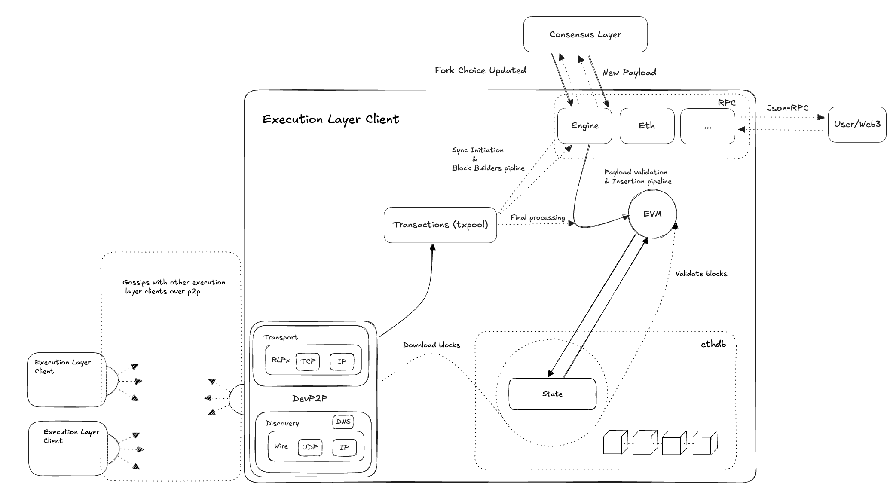
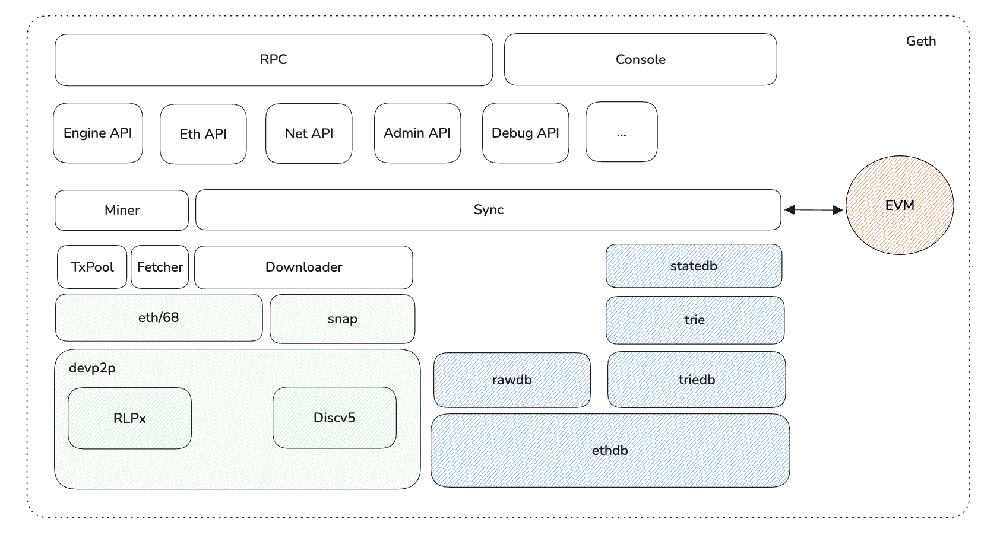
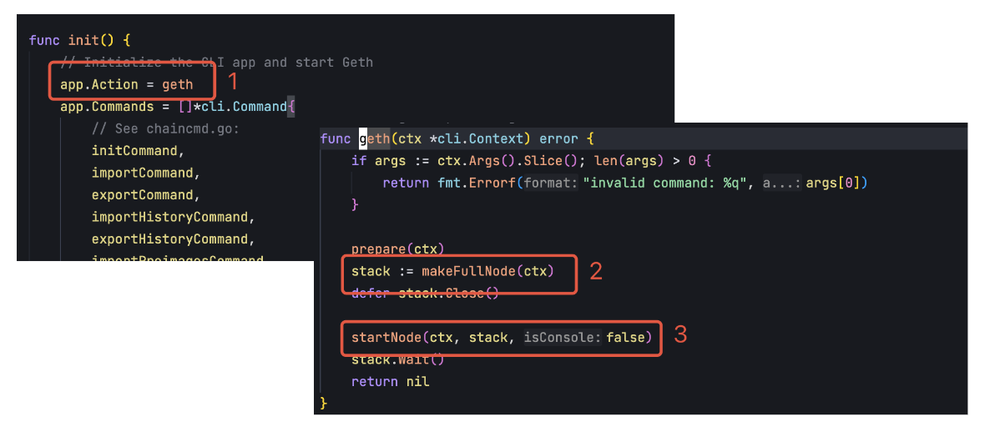
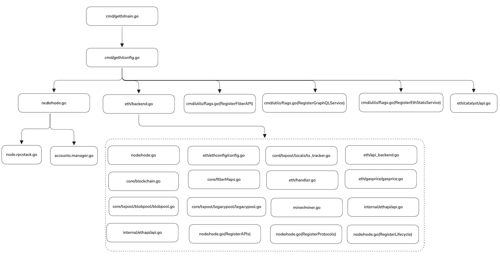
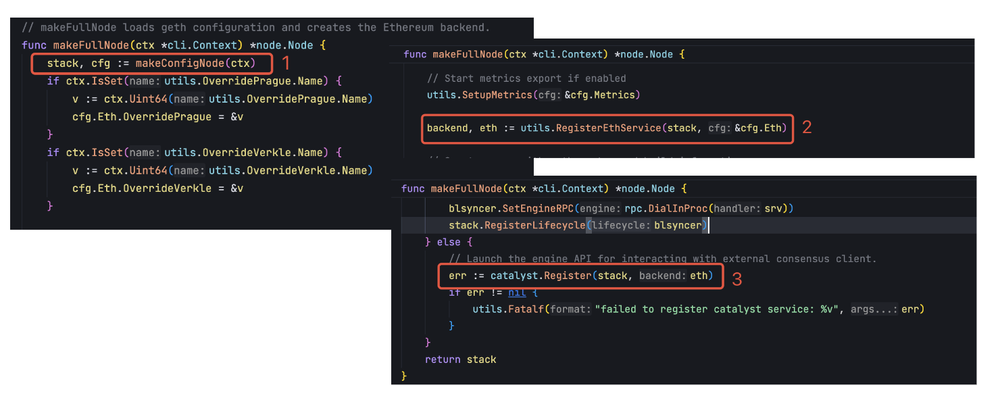
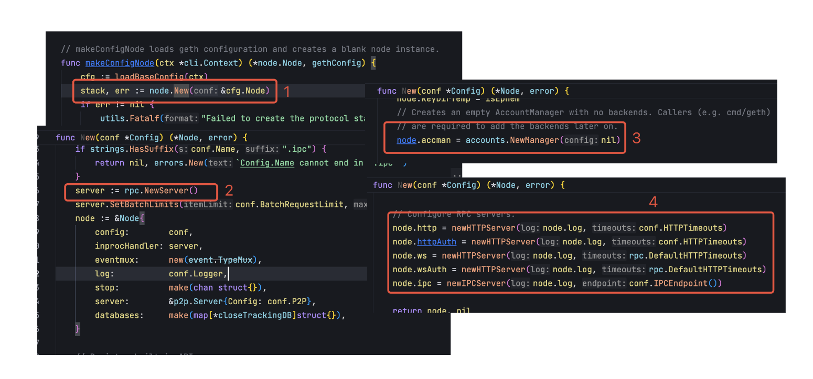
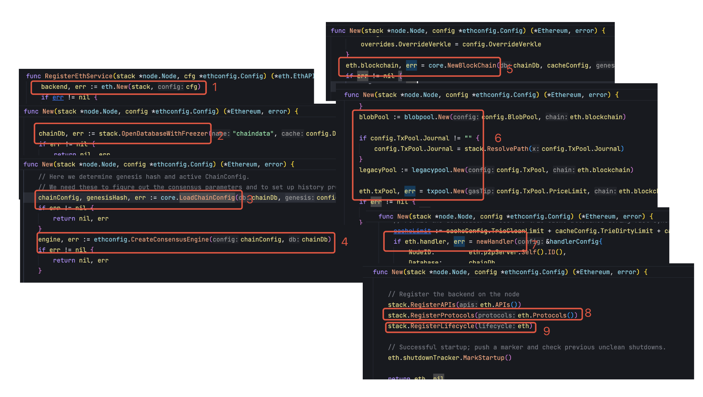
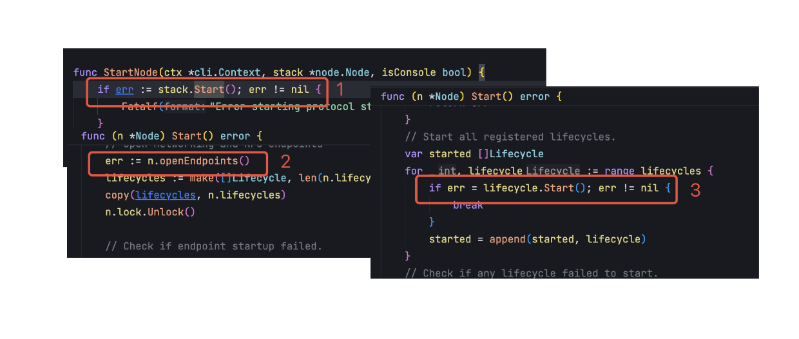

# Geth 源码系列：Geth 整体架构

Author: ray

这篇文章是 Geth 源码系列的第一篇，通过这个系列，我们将搭建一个研究 Geth 实现的框架，开发者可以根据这个框架深入自己感兴趣的部分研究。这个系列共有六篇文章，在第一篇文章中，将研究执行层客户端 Geth 的设计架构以及 Geth 节点的启动流程。Geth 代码更新的速度很快，后续看到的代码可能会有所不同，但是整体的设计大体一致，新的代码也可以用同样的思路阅读。

源码版本：[https://github.com/ethereum/go-ethereum/commit/c8a9a9c0917dd57d077a79044e65dbbdd421458b](https://github.com/ethereum/go-ethereum/commit/c8a9a9c0917dd57d077a79044e65dbbdd421458b)

## 1. 以太坊客户端

以太坊在进行 The Merge 升级之前，以太坊只有一个客户端，这个客户端及负责交易的执行，也会负责区块链的共识，保证区块链以一定的顺序产生新的区块。在 The Merge 升级之后，以太坊客户端分为了执行层和共识层，执行层负责交易的执行、状态和数据的维护，共识层则负责共识功能的实现，执行层和共识层通过 API 来通信。执行层和共识层有各自的规范，客户端可以使用不同的语言来实现，但是要符合对应的规范，其中 Geth 就是执行层客户端的一种实现。当前主流的执行层和共识层客户端有如下实现：

### 执行层

- Geth：由以太坊基金会直接资助的团队维护，使用 Go 语言开发，是公认的最稳定、久经考验的客户端
- Nethermind：由 Nethermind 团队开发和维护，使用 C# 语言开发，早期获以太坊基金会和 Gitcoin 社区资助
- Besu：最初由 ConsenSys 的 PegaSys 团队开发，现为 Hyperledger 社区项目，使用 Java 语言开发
- Erigon：由 Erigon 团队开发和维护，获以太坊基金会、BNB Chain 资助。2017 年从 Geth 分叉而来，目标是提升同步速度和磁盘效率
- Reth：由 Paradigm 主导开发，开发语言是 Rust，强调模块化和高性能，目前已经趋近成熟，可以在生产环境使用

### 共识层

- Prysm：由 Prysmatic Labs 维护，是以太坊最早的共识层客户端之一，用 Go 语言开发，专注于可用性和安全性，早期获以太坊基金会资助
- Lighthouse：由 Sigma Prime 团队维护，使用 Rust 语言开发，主打高性能和企业级安全，适用于高负载场景
- Teku：早起由 ConsenSys 的 PegaSys 团队开发，后成为 Hyperledger Besu 社区的一部分，使用 Java 语言开发
- Nimbus：由 Status Network 团队开发和维护，使用 Nim 语言开发**，**专为资源受限设备（如手机、物联网设备）优化，目标是在嵌入式系统中实现轻量化运行

## 2. 执行层简介

可以将以太坊执行层看作是一个由交易驱动的状态机，执行层最基础的职能就是通过 EVM 执行交易来更新状态数据。除了交易执行之外，还有保存并验证区块和状态数据，运行 p2p 网络并维护交易池等功能。

交易由用户（或者程序）按照以太坊执行层规范定义的格式生成，用户需要对交易进行签名，如果交易是合法的（Nonce 连续、签名正确、gas fee 足够、业务逻辑正确），那么交易最终就会被 EVM 执行，从而更新以太坊网络的状态。这里的状态是指数据结构、数据和数据库的集合，包括外部账户地址、合约地址、地址余额以及代码和数据。

执行层负责执行交易以及维护交易执行之后的状态，共识层负责选择哪些交易来执行。EVM 则是这个状态机中的状态转换函数，函数的输入会来源于多个地方，有可能来源于共识层提供的最新区块信息，也有可能来源于 p2p 网络下载的区块。

共识层和执行层通过 Engine API 来进行通信，这是执行层和共识层之间唯一的通信方式。如果共识层拿到了出块权，就会通过 Engine API 让执行层产出新的区块，如果没有拿到出块权，就会同步最新的区块让执行层验证和执行，从而与整个以太坊网络保持共识。

执行层从逻辑上可以分为 6 个部分：

- EVM：负责执行交易，交易执行也是修改状态数的唯一方式
- 存储：负责 state 以及区块等数据的存储
- 交易池：用于用户提交的交易，暂时存储，并且会通过 p2p 网络在不同节点之间传播
- p2p 网络：用于发现节点、同步交易、下载区块等等功能
- RPC 服务：提供访问节点的能力，比如用户向节点发送交易，共识层和执行层之间的交互
- BlockChain：负责管理以太坊的区块链数据

下图展示了执行层的关键流程，以及每个部分的职能：



对于执行层（这里暂时只讨论 Full Node），有三个关键流程：

- 如果是新加入以太坊的节点，需要通过 p2p 网络从其他的节点同步区块和状态数据，如果是 Full Sync，会从创世区块开始逐个下载区块，验证区块并通过 EVM 重建状态数据库，如果是 Snap Sync，则跳过全部区块验证的过程，直接下载最新 checkpoint 的状态数据和以后的区块数据
- 如果是已经同步到最新状态的节点，那么就会持续通过 Engine API 从共识层获取到当前最新产出的区块，并验证区块，然后通过 EVM 执行区块中所有的交易来更新状态数据库，并将区块写入本地链
- 如果是已经同步到最新状态，并且共识层拿到了出块权的节点，就会通过 Engine API 驱动执行层产出最新的区块，执行层从交易池获取交易并执行，然后组装成区块通过 Engine API 传递给共识层，由共识层将区块广播到共识层 p2p 网络

## 3. 源码结构

go-ethereum 的代码结构很庞大，但其中很多代码属于辅助代码和单元测试，在研究 Geth 源码时，只需要关注协议的核心实现，各个模块功能如下。需要重点关注 core、eth、ethdb、node、p2p、rlp、trie & triedb 等模块：

- accounts：管理以太坊账户，包括公私钥对的生成、签名验证、地址派生等
- beacon：处理与以太坊信标链（Beacon Chain）的交互逻辑，支持权益证明（PoS）共识的合并（The Merge）后功能
- build：构建脚本和编译配置（如 Dockerfile、跨平台编译支持）
- cmd：命令行工具入口，包含多个子命令
- common：通用工具类，如字节处理、地址格式转换、数学函数
- consensus：定义consensus engine ，包括之前的工作量证明（Ethash）和单机权益证明（Clique）以及 Beacon engine 等
- console：提供交互式 JavaScript 控制台，允许用户通过命令行直接与以太坊节点交互（如调用 Web3 API、管理账户、查询区块链数据）
- core：区块链核心逻辑，处理区块/交易的生命周期管理、状态机、Gas计算等
- crypto：加密算法实现，包括椭圆曲线（secp256k1）、哈希（Keccak-256）、签名验证
- docs：文档（如设计规范、API 说明）
- eth：以太坊网络协议的完整实现，包括节点服务、区块同步（如快速同步、归档模式）、交易广播等
- ethclient：实现以太坊客户端库，封装 JSON-RPC 接口，供 Go 开发者与以太坊节点交互（如查询区块、发送交易、部署合约）
- ethdb：数据库抽象层，支持 LevelDB、Pebble、内存数据库等，存储区块链数据（区块、状态、交易）
- ethstats：收集并上报节点运行状态到统计服务，用于监控网络健康状态
- event：实现事件订阅与发布机制，支持节点内部模块间的异步通信（如新区块到达、交易池更新）
- graphql：提供 GraphQL 接口，支持复杂查询（替代部分 JSON-RPC 功能）
- internal：内部工具或限制外部访问的代码
- log：日志系统，支持分级日志输出、上下文日志记录
- mertrics：性能指标收集（Prometheus 支持）
- miner：挖矿相关逻辑，生成新区块并打包交易（PoW 场景下）
- node：节点服务管理，整合 p2p、RPC、数据库等模块的启动与配置
- p2p：点对点网络协议实现，支持节点发现、数据传输、加密通信
- params：定义以太坊网络参数（主网、测试网、创世区块配置）
- rlp：实现以太坊专用的数据序列化协议 RLP（Recursive Length Prefix），用于编码/解码区块、交易等数据结构
- rpc：实现 JSON-RPC 和 IPC 接口，供外部程序与节点交互
- signer：交易签名管理（硬件钱包集成）
- tests：集成测试和状态测试，验证协议兼容性
- trie & triedb：默克尔帕特里夏树（Merkle Patricia Trie）的实现，用于高效存储和管理账户状态、合约存储

## 4. 执行层模块划分

外部访问 Geth 节点有两种形式，一种是通过 RPC，另外一种是通过 Console。RPC 适合开放给外部的用户来使用，Console 适合节点的管理者使用。但无论是通过 RPC 还是 Console，都是使用内部已经封装好的能力，这些能力通过分层的方式来构建。

最外层就是 API 用于外部访问节点的各项能力，Engine API 用于执行层和共识层之间的通信，Eth API 用于外部用户或者程序发送交易，获取区块信息，Net API 用于获取 p2p 网络的状态等等。 比如用户通过 API 发送了一个交易，那么这个交易最终会被提交到交易池中，通过交易池来管理，再比如用户需要获取一个区块数据，那么就需要调用数据库的能力去获取对应的区块。

在 API 的下一层就核心功能的实现，包括交易池、交易打包、产出区块、区块和状态的同步等等。这些功能再往下就需要依赖更底层的能力，比如交易池、区块和状态的同步需要依赖 p2p 网络的能力，区块的产生以及从其他节点同步过来的区块需要被验证才能写入到本地的数据库，这些就需要依赖 EVM 和数据存储的能力。



### 执行层核心数据结构

**Ethereum**

在 `eth/backend.go` 中的 Ethereum 结构是整个以太坊协议的抽象，基本包括了以太坊中的主要组件，但 EVM 是一个例外，它会在每次处理交易的时候实例化，不需要随着整个节点初始化，下文中的 Ethereum 都是指这个结构体：

```go
type Ethereum struct {
  // 以太坊配置，包括链配置
	config         *ethconfig.Config
	// 交易池，用户的交易提交之后先到交易池
	txPool         *txpool.TxPool
	// 用于跟踪和管理本地交易（local transactions）
	localTxTracker *locals.TxTracker
	// 区块链结构
	blockchain     *core.BlockChain

  // 是以太坊节点的网络层核心组件，负责处理所有与其他节点的通信，包括区块同步、交易广播和接收，以及管理对等节点连接
	handler *handler
	// 负责节点发现和节点源管理
	discmix *enode.FairMix

	// 负责区块链数据的持久化存储
	chainDb ethdb.Database
  // 负责处理各种内部事件的发布和订阅
	eventMux       *event.TypeMux
	// 共识引擎
	engine         consensus.Engine
	// 管理用户账户和密钥
	accountManager *accounts.Manager

  // 管理日志过滤器和区块过滤器
	filterMaps      *filtermaps.FilterMaps
	// 用于安全关闭 filterMaps 的通道，确保在节点关闭时正确清理资源
	closeFilterMaps chan chan struct{}

  // 为 RPC API 提供后端支持
	APIBackend *EthAPIBackend

  // 在 PoS 下，与共识引擎协作验证区块
	miner    *miner.Miner
	// 节点接受的最低gas价格
	gasPrice *big.Int
  // 网络 ID
	networkID     uint64
	// 提供网络相关的 RPC 服务，允许通过 RPC 查询网络状态
	netRPCService *ethapi.NetAPI

  // 管理P2P网络连接，处理节点发现和连接建立并提供底层网络传输功能
	p2pServer *p2p.Server

  // 保护可变字段的并发访问
	lock sync.RWMutex 
	// 跟踪节点是否正常关闭，在异常关闭后帮助恢复
	shutdownTracker *shutdowncheck.ShutdownTracker 
}
```

**Node**

在 `node/node.go` 中的 Node 是另一个核心的数据结构，它作为一个容器，负责管理和协调各种服务的运行。在下面的结构中，需要关注一下 lifecycles 字段，Lifecycle 用来管理内部功能的生命周期。比如上面的 Ethereum 抽象就需要依赖 Node 才能启动，并且在 lifecycles 中注册。这样可以将具体的功能与节点的抽象分离，提升整个架构的扩展性，这个 Node 需要与 devp2p 中的 Node 区分开。

```go
type Node struct {
	eventmux      *event.TypeMux
	config        *Config
	// 账户管理器，负责管理钱包和账户
	accman        *accounts.Manager
	log           log.Logger
	keyDir        string        
	keyDirTemp    bool          
	dirLock       *flock.Flock  
	stop          chan struct{}
	// p2p 网络实例 
	server        *p2p.Server   
	startStopLock sync.Mutex
	// 跟踪节点生命周期状态（初始化、运行中、已关闭）    
	state         int           

	lock          sync.Mutex
	// 所有注册的后端、服务和辅助服务
	lifecycles    []Lifecycle
	// 当前提供的 API 列表 
	rpcAPIs       []rpc.API
	// 为 RPC 提供的不同访问方式   
	http          *httpServer 
	ws            *httpServer 
	httpAuth      *httpServer 
	wsAuth        *httpServer 
	ipc           *ipcServer  
	inprocHandler *rpc.Server 
	databases map[*closeTrackingDB]struct{} 
}
```

如果以一个抽象的维度来看以太坊的执行层，以太坊作为一台世界计算机，需要包括三个部分，网络、计算和存储，那么以太坊执行层中与这三个部分相对应的组件是：

- 网络：devp2p
- 计算：EVM
- 存储：ethdb

### devp2p

以太坊本质还是一个分布式系统，每个节点通过 p2p 网络与其他节点相连。以太坊中的 p2p 网络协议的实现就是 devp2p。

devp2p 有两个核心功能，一个是节点发现，让节点在接入网络时能够与其他节点建立联系；另一个是数据传输服务，在与其他节点建立联系之后，就可以想换交换数据。

在 `p2p/enode/node.go` 中的 Node 结构代表了 p2p 网络中一个节点，其中 enr.Record 结构中存储了节点详细信息的键值对，包括身份信息（节点身份所使用的签名算法、公钥）、网络信息（IP 地址，端口号）、支持的协议信息（比如支持 eth/68 和 snap 协议）和其他的自定义信息，这些信息通过 RLP 的方式编码，具体的规范在 eip-778  中定义：

```go

type Node struct {
    // 节点记录，包含节点的各种属性
    r  enr.Record
    // 节点的唯一标识符，32字节长度  
    id ID          

    // hostname 跟踪节点的DNS名称
    hostname string

    // 节点的IP地址
    ip  netip.Addr
    // UDP端口  
    udp uint16     
    // TCP端口 
    tcp uint16      
}

// enr.Record
type Record struct {
    // 序列号
    seq       uint64       
    // 签名
    signature []byte       
    // RLP 编码后的记录
    raw       []byte       
    // 所有键值对的排序列表
    pairs     []pair       
}
```

在 `p2p/discover/table.go` 中的 Table 结构是 devp2p 实现节点发现协议的核心数据结构，它实现了类似 Kademlia 的分布式哈希表，用于维护和管理网络中的节点信息。

```go
type Table struct {
	mutex        sync.Mutex
	// 按距离索引已知节点        
	buckets      [nBuckets]*bucket
	// 引导节点 
	nursery      []*enode.Node     
	rand         reseedingRandom   
	ips          netutil.DistinctNetSet
	revalidation tableRevalidation
  
  // 已知节点的数据库
	db  *enode.DB 
	net transport
	cfg Config
	log log.Logger

	// 周期性的处理网络中的各种事件
	refreshReq      chan chan struct{}
	revalResponseCh chan revalidationResponse
	addNodeCh       chan addNodeOp
	addNodeHandled  chan bool
	trackRequestCh  chan trackRequestOp
	initDone        chan struct{}
	closeReq        chan struct{}
	closed          chan struct{}

  // 增加和移除节点的接口
	nodeAddedHook   func(*bucket, *tableNode)
	nodeRemovedHook func(*bucket, *tableNode)
}
```

### ethdb

ethdb 完成以太坊数据存储的抽象，提供统一的存储接口，底层具体的数据库可以是 leveldb，也可以是 pebble 或者其他的数据库。可以有很多的扩展，只要在接口层面保持统一。

有些数据（如区块数据）可以通过 ethdb 接口直接对底层数据库进行读写，其他的数据存储接口都是建立的 ethdb 的基础上，比如数据库有很大部分的数据是状态数据，这些数据会被组织成 MPT 结构，在 Geth 中对应的实现是 trie，在节点运行的过程中，trie 数据会产生很多中间状态，这些数据不能直接调用 ethdb 进行读写，需要 triedb 来管理这些数据和中间状态，最后才通过 ethdb 来持久化。

在 `ethdb/database.go` 中定义底层数据库的读写能力的接口，但没有包括具体的实现，具体的实现将由不同的数据库自身来实现。比如 leveldb 或者 pebble 数据库。在 Database 中定义了两层数据读写的接口，其中 KeyValueStore 接口用于存储活跃的、可能频繁变化的数据，如最新的区块、状态等。AncientStore 则用于处理历史区块数据，这些数据一旦写入就很少改变。

```go

// 数据库的顶层接口
type Database interface {
    KeyValueStore
    AncientStore
}

// KV 数据的读写接口
type KeyValueStore interface {
	KeyValueReader
	KeyValueWriter
	KeyValueStater
	KeyValueRangeDeleter
	Batcher
	Iteratee
	Compacter
	io.Closer
}

// 处理老数据的读写的接口
type AncientStore interface {
	AncientReader
	AncientWriter
	AncientStater
	io.Closer
}

```

### EVM

EVM 是以太坊这个状态机的状态转换函数，所有状态数据的更新都只能通过 EVM 来进行，p2p 网络可以接受到交易和区块信息，这些信息被 EVM 处理之后会成为状态数据库的一部分。EVM 屏蔽了底层硬件的不同，让程序在不同平台的 EVM 上执行都能得到一致的结果。这是一种很成熟的设计方式，Java 语言中 JVM 也是类似的设计。

EVM 的实现有三个主要的组件，`core/vm/evm.go`  中的 EVM 结构体定义了 EVM 的总体结构及依赖，包括执行上下文，状态数据库依赖等等； `core/vm/interpreter.go` 中的 EVMInterpreter 结构体定义了解释器的实现，负责执行 EVM 字节码；`core/vm/contract.go` 中的 Contract 结构体封装合约调用的具体参数，包括调用者、合约代码、输入等等，并且在  `core/vm/opcodes.go` 中定义了当前所有的操作码：

```go
// EVM
type EVM struct {
    // 区块上下文，包含区块相关信息
    Context BlockContext
    // 交易上下文，包含交易相关信息     
    TxContext
    // 状态数据库，用于访问和修改账户状态               
    StateDB StateDB
    // 当前调用深度         
    depth int
    // 链配置参数               
    chainConfig *params.ChainConfig  
    chainRules params.Rules
    // EVM配置          
    Config Config
    // 字节码解释器                    
    interpreter *EVMInterpreter
    // 中止执行的标志      
    abort atomic.Bool                
    callGasTemp uint64
    // 预编译合约映射               
    precompiles map[common.Address]PrecompiledContract  
    jumpDests map[common.Hash]bitvec  
}

type EVMInterpreter struct {
    // 指向所属的EVM实例
    evm   *EVM
    // 操作码跳转表               
    table *JumpTable         
    // Keccak256哈希器实例，在操作码间共享
    hasher    crypto.KeccakState
    // Keccak256哈希结果缓冲区  
    hasherBuf common.Hash         
    // 是否为只读模式，只读模式下不允许状态修改
    readOnly   bool
    // 上一次CALL的返回数据，用于后续重用          
    returnData []byte        
}

type Contract struct {
    // 调用者地址
    caller  common.Address
    // 合约地址   
    address common.Address   

    jumpdests map[common.Hash]bitvec  
    analysis  bitvec                  
    // 合约字节码
    Code     []byte
    // 代码哈希          
    CodeHash common.Hash
    // 调用输入     
    Input    []byte          
    // 是否为合约部署
    IsDeployment bool
    // 是否为系统调用        
    IsSystemCall bool        
    // 可用gas量
    Gas   uint64
    // 调用附带的 ETH 数量             
    value *uint256.Int       
}
```

### 其他模块实现

执行层的功能通过分层的方式来实现，其他的模块和功能都是在这三个核心组件的基础之上构建起来的。这里介绍一下几个核心的模块。

在 eth/protocols 下有当前以太坊的p2p网络子协议的实现。有 eth/68 和 snap 子协议，这个些子协议都是在 devp2p 上构建的。

eth/68 是以太坊的核心协议，协议名称就是 eth，68 是它的版本号，然后在这个协议的基础之上又实现了交易池（TxPool）、区块同步（Downloader）和交易同步（Fetcher）等功能。snap 协议用于新节点加入网络时快速同步区块和状态数据的，可以大大减少新节点启动的时间。

ethdb 提供了底层数据库的读写能力，由于以太坊协议中有很多复杂的数据结构，直接通过 ethdb 无法实现这些数据的管理，所以在 ethdb 上又实现了 rawdb 和 statedb 来分别管理区块和状态数据。

EVM 则贯穿所有的主流程，无论是区块构建还是区块验证，都需要用 EVM 执行交易。

## 5. Geth 节点启动流程

Geth 的启动会分为两个阶段，第一阶段会初始化节点所需要启动的组件和资源，第二节点会正式启动节点，然后对外服务。



### 节点初始化

在启动一个 geth 节点时，会涉及到以下的代码：



各模块的初始化如下：

- cmd/geth/main.go：geth 节点启动入口
- cmd/geth/config.go（makeFullNode）：加载配置，初始化节点
    - node/node.go：初始化以太坊节点的核心容器
        - node.rpcstack.go：初始化 RPC 模块
        - accounts.manager.go：初始化 accountManager
    - eth/backend.go：初始化 Ethereum 实例
        - node/node.go OpenDatabaseWithFreezer：初始化 chaindb
        - eth/ethconfig/config.go：初始化共识引擎实例（这里的共识引擎并不真正参与共识，只是会验证共识层的结果，以及处理 validator 的提款请求）
        - core/blockchain.go：初始化 blockchain
        - core/filterMaps.go：初始化 filtermaps
        - core/txpool/blobpool/blobpool.go：初始化 blob 交易池
        - core/txpool/legacypool/legacypool.go：初始化普通交易池
        - cord/txpool/locals/tx_tracker.go：本地交易追踪（需要配置开启本地交易追踪，本地交易会被更高优先级处理）
        - eth/handler.go：初始化协议的 Handler 实例
        - miner/miner.go：实例化交易打包的模块（原挖矿模块）
        - eth/api_backend.go：实例化 RPC 服务
        - eth/gasprice/gasprice.go：实例化 gas 价格查询服务
        - internal/ethapi/api.go：实例化 P2P 网络 RPC API
        - node/node.go(RegisterAPIs)：注册 RPC API
        - node/node.go(RegisterProtocols)：注册 p2p 的 Ptotocols
        - node/node.go(RegisterLifecycle)：注册各个组件的生命周期
    - cmd/utils/flags.go(RegisterFilterAPI)：注册 Filter RPC API
    - cmd/utils/flags.go(RegisterGraphQLService)：注册 GraphQL RPC API（如果配置了的话）
    - cmd/utils/flags.go(RegisterEthStatsService)：注册 EthStats RPC API（如果配置了的话）
    - eth/catalyst/api.go：注册 Engine API

节点的初始化会在 `cmd/geth/config.go` 中的 makeFullNode 中完成，重点会初始化以下三个模块



在第一步会初始化 `node/node.go` 中的 Node 结构，就是整个节点容器，所有的功能都需要在这个容器中运行，第二步会初始化 Ethereum 结构，其中包括以太坊各种核心功能的实现，Etherereum 也需要注册到 Node 中，第三步就是注册 Engine API 到 Node 中。

其中 Node 初始化就是创建了一个 Node 实例，然后初始化 p2p server、账号管理以及 http 等暴露给外部的协议端口。



Ethereum 的初始化就会复杂很多，大多数的核心功能都是在这里初始化。首先会初始化化 ethdb，并从存储中加载链配置，然后创建共识引擎，这里的共识引擎不会执行共识操作，而只是会对共识层返回的结果进行验证，如果共识层发生了提款请求，也会在这里完成实际的提款操作。然后再初始化 Block Chain 结构和交易池。

这些都完成之后就会初始化 handler，handler 是所有 p2p 网络请求的处理入口，包括交易同步、区块下载等等，是以太坊实现去中心化运行的关键组件。在这些都完成之后，就会将一些在 devp2p 基础之上实现的子协议，比如 eth/68、snap 等注册到 Node 容器中，最后 Ethereum 会作为一个 lifecycle 注册到 Node 容器中，Ethereum 初始化完成。



最后 Engine API 的初始化相对简单，只是将 Engine API 注册到 Node 中。到这里，节点初始化就全部完成了。 

### 节点启动

在完成节点的初始化之后，就需要启动节点了，节点启动的流程相对简单，只需要将已经注册的 RPC 服务和 Lifecycle 全部启动，那么整个节点就可以向外部提供服务了。



## 6. 总结

在深入理解以太坊执行层的实现之前，需要对以太坊有一个整体的认识，可以将以太坊整体看作是一个交易驱动的状态机，执行层负责交易的执行和状态的变更，共识层则负责驱动执行层运行，包括让执行层产出区块、决定交易的顺序、为区块投票、以及让区块获得最终性。由于这个状态机是去中心化的，所以需要通过 p2p 网络与其他的节点通信，共同维护状态数据的一致性。

在执行层不负责决定交易的顺序，只负责执行交易并记录交易执行之后的状态变化。这里的记录有两种形式，一种是以区块的方式将所有的状态变化都记录下来，另一种是在数据库中记录当前的状态。同时执行层也是交易的入口，通过交易池来存储还没有被打包进区块的交易。如果其他的节点需要获取区块、状态和交易数据，执行层就会通过 p2p 网络将这些信息发送出去。

对于执行层，有三个核心模块：计算、存储和网络。计算对应 EVM 的实现，存储则对应了 ethdb 的实现，网络对了 devp2p 的实现。有了这样的整体认识之后，就可以深入去理解每一个子模块，而不会迷失在具体的细节中。

## Ref

[1][https://ethereum.org/zh/what-is-ethereum/](https://ethereum.org/zh/what-is-ethereum/)

[2][https://epf.wiki/#/wiki/protocol/architecture](https://epf.wiki/#/wiki/protocol/architecture)

[3][https://clientdiversity.org/#distribution](https://clientdiversity.org/#distribution)

[4][https://github.com/ethereum/devp2p](https://github.com/ethereum/devp2p)

[5][https://github.com/ethereum/execution-specs](https://github.com/ethereum/execution-specs)

[6][https://github.com/ethereum/consensus-specs](https://github.com/ethereum/consensus-specs)