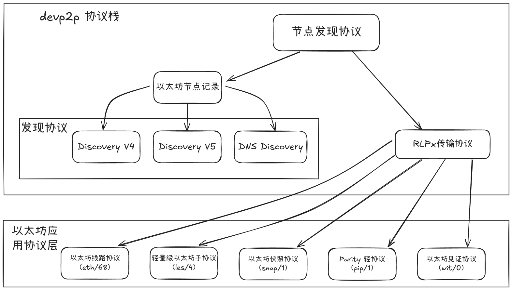
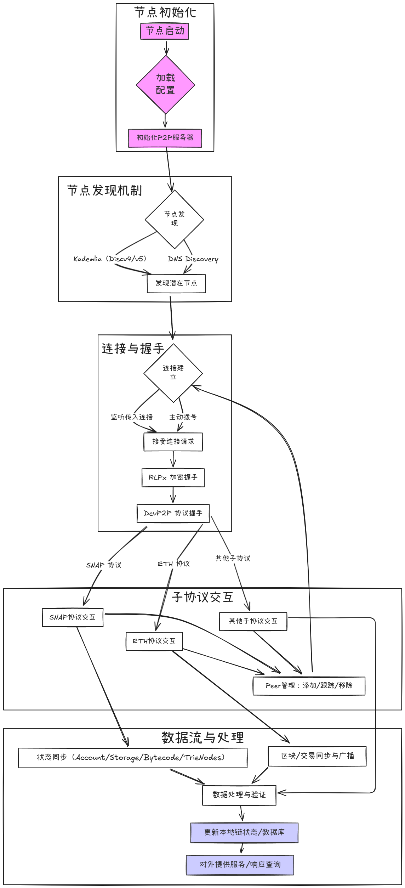
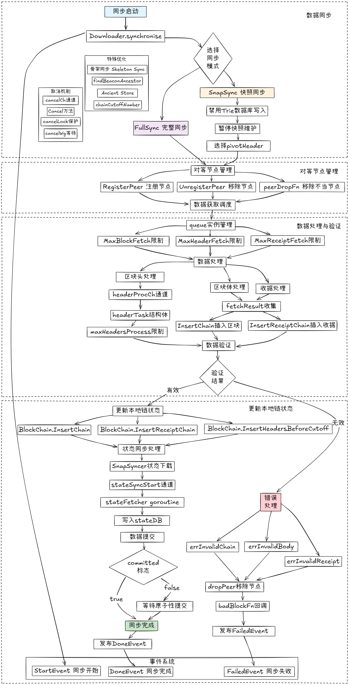

# Geth源码系列：p2p网络设计及实现

Author: zhou

这篇文章是 Geth 源码系列的第三篇，通过这个系列，我们将搭建一个研究 Geth 实现的框架，开发者可以根据这个框架深入自己感兴趣的部分研究。这个系列共有六篇文章，在这第三篇文章中，将系统讲解 Geth 的 p2p 网络设计与相关源码，包括以太坊的 DevP2P 协议规范，以及 Geth 中 p2p 网络架构及代码实现。

**以太坊**作为一个去中心化平台，其核心功能依赖于 **p2p**（peer-to-peer）网络，p2p 网络负责执行层节点之间的通信，为其他子协议提供底层能力、传播区块和交易，并支持以太坊实现去中心化。

# 1. p2p 网络设计概述

## 1.1 DevP2P 简介

以太坊执行层 p2p 网络功能的实现基于 [**DevP2P 协议栈**](https://github.com/ethereum/devp2p/tree/master)所定义的标准，p2p 网络层独立于共识机制（无论是之前的 **PoW** 还是当前的 **PoS**，后者由共识层协调）。Geth 的网络架构包含两个并行工作的协议栈：基于 **UDP** 的**发现协议栈**（主要用于网络节点间发现）和基于 **TCP** 的**通信协议栈**（主要用于节点间数据交换与同步）。

## 1.2 DevP2P 协议栈

DevP2P 并非指单一协议，而是为以太坊 p2p 网络定制的一套**网络协议。**其设计不局限于特定的区块链，但主要服务与以太坊生态的需求。其核心包括：

1. **节点发现层：**基于 UDP 协议，用于在 p2p 网络上定位其他以太坊节点。包含如 DiscoveryV4、DiscoveryV5、DNS Discovery 等协议。
2. **数据传输层：**基于 TCP 的协议，为节点间提供加密且经过身份验证的通信会话。主要由 RLPx 传输协议提供支持，基于此协议还衍生出多种应用层协议。
3. **应用层子协议**：在 RLPx 建立的节点发现和安全连接的基础之上，处理节点间的具体数据交互和应用逻辑。这些协议使得节点能够进行区块链同步、交易传播、状态查询等操作。包含如核心的 **ETH** 协议（Ethereum Wire Protocol）、服务轻客户端的 **LES** 协议（Light Ethereum Subprotocol）、用于快照同步的 **SNAP** 协议，以及 **WIT**（Witness Protocol）、**PIP** (Parity Light Protocol) 。

以下为 DevP2P 协议栈整体结构图：



DevP2P 协议栈整体结构图

应用层子协议简要说明：

| 协议 | 版本 | 主要功能 |
| --- | --- | --- |
| 以太坊线路协议[（Ethereum Wire Protocol）](https://github.com/ethereum/devp2p/blob/master/caps/eth.md) | eth/68 | 区块链同步和交易交换的主协议 |
| 以太坊快照协议（[Ethereum Snapshot Protocol](https://github.com/ethereum/devp2p/blob/master/caps/snap.md)） | snap/1 | 高效状态快照交换 |
| 轻量级以太坊子协议（[Light Ethereum Subprotocol](https://github.com/ethereum/devp2p/blob/master/caps/les.md)） | les/4 | 轻客户端协议（暂未在 Geth 中实现） |
| Parity 轻协议（[Parity Light Protocol](https://github.com/ethereum/devp2p/blob/master/caps/pip.md)） | pip/1 | Parity 对轻客户端的实现（暂未在 Geth 中实现） |
| 以太坊见证协议（[Ethereum Witness Protocol](https://github.com/ethereum/devp2p/blob/master/caps/wit.md)） | wit/0 | 节点间见证数据交换（暂未在 Geth 中实现） |

## 1.3 DevP2P 与 LibP2P 的关系

[**LibP2P**](https://docs.libp2p.io/concepts/introduction/overview/)（library peer-to-peer）是一个 p2p **网络框架**，与以太坊的 DevP2P 在功能定位上有相似之处，它通过一系列协议、规范和库为 p2p 应用的开发提供支持。尽管两者存在相似性，以太坊在其发展初期（约 2014-2015年）并未选择采用LibP2P 作为其P2P层。

原因是以太坊团队开发 p2p 网络模块（最终形成了 DevP2P）的关键时期，LibP2P 虽然已经作为 [IPFS](https://docs.ipfs.tech/) 项目的一部分，但它在当时尚未成熟到能够被以太坊直接集成。为了满足以太坊自身的需求，以太坊的开发者们自行设计和实现了一套 p2p 协议。

与 DevP2P 不同，LibP2P 最开始的核心目标便是构建一个更具普适性、高度模块化的 P2P 网络基础，旨在服务多样化的去中心化应用，而非仅仅应用在某一特定平台或应用场景。

DevP2P 可以被视为一个**协议集合**，明确定义了以太坊所需的组件，如 ENR、discv5 和 RLPx。而 LibP2P 更像是一个**编程库集合**，提供了可组合的模块来构建各种 P2P 功能，包括传输、流多路复用、安全通道、节点发现、发布/订阅消息传递等。

目前在以太坊共识层，如 Lighthouse，Prysm，Teku，Nimbus 等客户端，主要采用 LibP2P，共识层利用了 LibP2P 的传输层实现（TCP, QUIC）、加密（Noise）、流多路复用（mplex, yamux）、节点发现（基于 ENR 的 discv5）以及强大的发布/订阅系统（gossipsub）来高效广播证明和区块。

# 2. DevP2P 协议栈详解

## 2.1 发现层

**发现协议V4（Discovery Protocol v4）**

[发现协议V4](https://github.com/ethereum/devp2p/blob/master/discv4.md) （简称DiscV4）是以太坊 DevP2P 协议栈中的核心组件之一，它是一种基于 **Kademlia 算法**思想的**分布式哈希表**（**DHT**），用于网络中的**节点发现**。Kademlia 的核心机制在于通过**节点 ID 间的特定“距离”度量**（通过 XOR 异或运算得到）来组织节点，并将其他节点的信息（如IP地址、端口和节点 ID）存储到称为“**k桶**”（k-buckets）的**路由表**中。这些信息会被组织为为**以太坊节点记录**（Ethereum Node Records, ENR），其中包含了节点的网络地址（IP地址、TCP 与 UDP 端口）、由公钥生成的唯一节点 ID、公钥本身，以及用于验证记录有效性的签名和序列号。

因此，DiscV4 的目标是帮助节点在未知网络中其他节点地址的情况下，能够**高效地发现并连接到这些对等节点**。这种高效性得益于其迭代查询方法：当一个节点 A 要查找目标节点 B 时，它会向自己k 桶中已知且 ID “距离”目标 B 最近的一批节点发送查询请求。这些被查询的节点会回复它们各自路由表中离目标 B 更近的节点列表。节点 A 持续向这些新发现的、更近的节点发起查询，逐步逼近目标，通常能在**对数时间复杂度**（O(log N)，其中 N为网络节点总数）内定位到网络中的任意节点，这远比随机探测或全网广播更为高效且节省网络资源。

**发现协议V5（Discovery Protocol v5）**

[发现协议V5](https://github.com/ethereum/devp2p/blob/master/discv5/discv5.md)（简称Discv5，当前最新规范为v5.1）作为对 DiscV4 的重大升级版本，在保留了基于 UDP 的 Kademlia DHT 核心思想（例如通过节点 ID 的 XOR “距离”定义网络拓扑、使用“k桶”维护路由表，以及通过 `PING`/`PONG` 和迭代的 `FINDNODE`/`NODES` 消息进行节点发现）的同时，引入了多项关键改进以弥补前代协议在地址管理、信息承载和可扩展性上的不足。**其关键更新在于原生实现了以太坊节点记录（ENR，遵循 EIP-778标准）**。

这与 Discv4 后期才通过扩展有限度支持 ENR 不同，DiscV5 将 ENR 作为其基础数据单元，不仅允许 ENR 携带更丰富、可验证的键值对元数据（如支持的协议、特定角色等），而且 ENR 直接包含在常规消息（例如 `NODES` 响应）中进行交换，无需像 DiscV4 那样需要特定的 `ENRRequest`。**另一项改进是 DiscV5 引入了基于“主题”（Topic）的发现机制**；节点可以通过 `TOPICREGISTER` 消息广播其提供的服务或对特定主题的兴趣，其他节点则能通过 `TOPICQUERY` 精确查找到这些具有特定能力的对等节点，实现了比 DiscV4 更精细化的服务发现能力。

此外，DiscV5 还定义了全新的、具有更强安全保障的 **discv5-wire 底层协议**，通过改进握手过程（使用临时密钥和认证标签 AuthTag）来建立加密通信通道，并对消息格式进行了更为严格和清晰的规范。

| 特性 | Discv4 | Discv5 |
| --- | --- | --- |
| ENR 集成与规范基础 | 对 EIP-778 定义的 ENR 支持是后期通过 EIP-868 作为扩展加入的。 | 从设计之初就**原生基于** EIP-778 定义的 ENR 构建，ENR 是其核心基础。 |
| ENR 交换机制 | 获取最新 ENR 通常需要发送一个特定的 `ENRRequest` 请求。 | ENR直接包含在常规的消息中（如 `FINDNODE` 的 `NODES` 响应），无需特定请求。 |
| ENR 内容与功能利用 | 主要用于提供更丰富的节点元数据和改进的端点证明。 | 充分利用ENR的键值对灵活性，支持如**主题宣告（Topic Advertisement）**等高级功能，允许节点声明特定服务或协议，实现更精确的节点发现。 |
| 身份方案 | ENR 使用 "v4" 身份方案。（此处的 v4 为身份方法的名称，而非上文的 discv4） | 依赖 EIP-778 定义的身份方案，具有更好的扩展性（尽管 "v4" 仍常用）。 |

**DNS 发现（DNS Discovery）**
该机制作为基于 UDP 的 P2P 发现协议（Discv4/Discv5）的补充，旨在提供一个**稳定且易于更新的节点列表（特别是引导节点）作为客户端连接网络的初始入口点**。[文档](https://github.com/ethereum/devp2p/blob/master/dnsdisc.md)详细说明了如何将以太坊节点信息（通常是**以太坊节点记录 ENR**）编码成特定的字符串格式，并存储在 DNS 记录（通常是 `TXT` 记录）中。这些 DNS 域名和记录由可信的列表维护者管理和发布。客户端通过查询这些特定的 DNS 域名来获取 ENR 列表，然后可以使用列表中的节点启动 Discv5 或 Discv4 p2p 发现流程。

## 2.2 数据传输层

RLPx（Recursive Length Prefix Transport Protocol）作为 DevP2P 协议栈的**底层传输协议**，运行在 TCP 协议之上，专为以太坊节点间提供经过认证、加密且支持多路复用的安全通信通道。

在两个通过发现协议定位彼此并决定建立连接的节点之间，RLPx 通过**初始握手流程**来确保通信双方身份的真实性并协商加密参数，此过程利用非对称加密技术，节点会交换临时密钥并结合其长期身份密钥进行相互认证，最终通过[**椭圆曲线迪菲-赫尔曼密钥交换**](https://zh.wikipedia.org/zh-cn/%E6%A9%A2%E5%9C%93%E6%9B%B2%E7%B7%9A%E8%BF%AA%E8%8F%B2-%E8%B5%AB%E7%88%BE%E6%9B%BC%E9%87%91%E9%91%B0%E4%BA%A4%E6%8F%9B)（ECDH）算法安全地生成一个**共享密钥**。在握手成功之后，该共享密钥会用于**加密后续在该 TCP 连接上所有传输的数据**，从而保障了通信内容的机密性。

RLPx 的一个关键特性是其**多路复用能力**，它允许在单一的 TCP 连接上同时承载和区分多个不同的上层应用协议（即 DevP2P 子协议，如 ETH 协议用于区块链同步，LES 协议服务于轻客户端等）的消息流，通常通过消息头部内嵌的协议类型 ID 来识别和路由。所有在 RLPx 之上传输的应用层消息都会被组织成特定格式的“**帧**”（frames）进行传输，这些帧不仅包含了加密后的消息负载（通常是已经过 RLP 编码的应用层数据），还附带有消息大小、协议类型等必要的元数据，并支持将较大的消息分割成多个帧进行**分块传输**。

总之，**RLPx 通过加密握手、消息封装和多路复用机制，为以太坊节点提供了一个独立于具体应用逻辑的、通用的安全管道**，是实现高效数据同步、交易广播等功能的基础。

## 2.3 应用层子协议

**ETH（Ethereum Wire Protocol）**

`ETH` **通过 RLPx 传输协议促进对等节点间以太坊区块链信息的交换**。`ETH` 协议定义了节点如何交换与区块链相关的信息，例如区块头、区块体、交易数据以及状态信息。包括了协议的版本协商机制、不同消息类型的结构（使用RLP编码）、消息代码以及这些消息在诸如区块同步、交易广播等过程中的交互流程，确保网络中的节点能够有效地同步和验证区块链数据，从而共同维护以太坊网络的一致性和完整性。

**SNAP（Ethereum Snapshot Protocol）**

`SNAP` 运行在 RLPx 之上，用于在节点间传播以太坊的**状态快照**。其主要目的是**提供近期状态的动态快照以供半实时数据检索**，但不参与链的维护，需要与 `ETH` 协议协同工作。`SNAP` 支持检索状态树中的连续账户片段或特定存储树中的存储槽，并带有默克尔证明以便快速验证，同时也能批量检索字节码。该协议通过允许节点直接获取账户和存储数据并在本地重组状态树，减少了对中间默克尔树节点的下载需求，从而降低了网络带宽消耗和延迟。它主要作为新加入全节点的引导辅助工具，并依赖 `ETH` 协议。

**LES（Light Ethereum Subprotocol）**

`LES` **专为轻客户端设计**，使它们能够安全地访问以太坊区块链而无需参与共识过程，主要通过下载区块头并按需获取其他区块链部分。该协议利用规范哈希树（CHT）进行快速同步和安全数据检索（如区块头、总难度），并采用 BloomBits 技术优化日志搜索。为了防止服务器过载并管理请求速率，`LES` 还引入了客户端流控制机制，通过缓冲区限制、最小充值速率和最大请求成本等参数进行调节，从而为轻客户端提供高效且安全的区块链交互方式。

**PIP（Parity Light Protocol）**

`PIP` 是 **Parity Technologies 为其以太坊客户端设计的 `LES` 协议变种**。它也使用规范哈希树（CHT），但每2048个区块生成一次。`PIP` 采用类似令牌桶的流量控制机制，客户端需镜像服务器的状态。协议消息包括状态、宣告、请求批处理、响应批处理、更新信用参数等。值得注意的是，PIP 的请求和响应消息是批处理的，不可单独发送，旨在优化客户端与服务器的交互轮次。协议支持多种请求/响应对，用于检索区块头、交易信息、区块体、账户及存储证明、合约代码和执行证明等。

**WIT（Ethereum Witness Protocol）**

WIT 运行在 RLPx 之上，用于在**对等节点间交换以太坊状态见证**。它旨在帮助客户端同步到链的顶端，并最终支持**无状态客户端操作**，但不参与链的维护，而是与 `ETH` 协议并行工作。协议的第 0 版主要提供见证的元数据（如区块执行期间读取的树节点哈希列表，包括存储、字节码和账户节点），以辅助节点通过 `ETH` 协议下载实际见证，从而更快地完成同步。

# 3. 以太坊节点生命周期和数据流图



节点生命周期和数据流图

流程图简要说明：

1. **节点启动：**以太坊客户端（Geth）开始运行
2. **加载配置：**读取配置文件，包括网络 ID、创世区块信息、端口设置等
3. **初始化 p2p 服务器：**设置 p2p 服务器，准备监听和发起连接
4. **节点发现：**节点开始寻找网络中的其他对等节点
    - **DNS Discovery**：通过 DNS 种子节点列表获取初始节点信息
    - **Kademlia（Discv4/v5）**：使用节点发现协议发现其他节点
5. **发现潜在节点：**汇总来自不同发现机制的节点信息
6. **连接建立：**
    - **监听传入连接：**接受来自其他节点的连接请求
    - **主动拨号：**向已发现的节点发起连接请求
7. **接受连接请求/发起连接：**成功建立 TCP 连接
8. **RLPx 加密握手：**在 TCP 连接之上进行加密握手，确保通信安全，协商会话密钥
9. **DevP2P 协议握手：**RLPx 握手成功后，进行 DevP2P 层的握手。节点交换各自支持的子协议（如`eth`, `snap`, `les`等）及其版本。双方会就共同支持的最高版本协议进行协商
10. **子协议交互：**
    - **ETH 协议交互：**如果协商成功 `eth` 协议，节点将通过此协议交换区块、交易、链状态等信息
    - **Snap 协议交互：**如果协商成功 `snap` 协议，节点可以通过此协议更高效地同步状态数据，如账户、存储、字节码和 Trie 节点
    - **其他子协议交互：**如 `les`（Light Ethereum Subprotocol）等
11. **Peer 管理：**节点会维护一个对等节点列表，跟踪其状态（如健康状况、支持的协议、最新的区块高度等），并根据需要添加新节点或移除断开/行为不当的节点
12. **数据交换与处理：**
    - **区块/交易同步与广播：**通过 ETH 协议，节点下载新的区块和交易，验证它们，并将自己的新区块和交易广播给其他节点
    - **状态同步：**通过 snap 协议（或 eth 协议的某些消息），节点请求并接收账户数据、存储槽、合约字节码和状态树（Merkle Trie）的节点数据，用于快速构建或更新本地状态
    - **数据处理与验证：**接收到的所有数据（区块、交易、状态片段）都需要经过严格验证，确保其符合协议规则和链的一致性
13. **更新本地链状态/数据库：**验证通过的数据被用于更新本地的区块链数据库和状态树
14. **对外提供服务/响应查询：**节点根据其角色（全节点、轻节点等）对外提供服务，如响应 RPC 请求、处理交易等

下面将对该流程图结合源码进行详细说明。

# 4. Geth 代码具体实现

下文将通过对 geth 中相关代码的分析来说明 devp2p 协议规范的具体实现。

## 4.1 节点初始化与发现

### 4.1.1 节点的启动与配置加载

**网络中的一个参与者（即节点）通常是一台运行以太坊客户端软件（如 Geth）的计算机**。每个节点都拥有其独特的**身份标识**，主要包括 **`enode ID`（节点 ID）**和 **`ENR` （Ethereum Node Record）**。

具体来说，**`enode ID` 是基于节点自身加密密钥对**（通常为 secp256k1 公钥）通过特定哈希运算产生的唯一标识。而 **`ENR` 则是由节点自行构建并签名的一个可扩展记录**。它封装了节点的网络联络信息（如 IP 地址、用于 P2P 通信的 TCP/UDP 端口——通常默认为 30303，以及节点 ID 和公钥）和其提供的服务能力，充当其在网络中的名片。这些 ENR 随后被节点发现协议（如 Discovery v4/v5）用来帮助节点互相定位和建立连接。执行层节点包含以下类型**：**

- **引导节点（Bootnode）：**这类节点的主要职责是帮助新加入的节点接入 p2p 网络。它们的 ENR 信息通常被硬编码在客户端的配置文件中，或通过 DNS 发现机制提供，作为新节点首次连接网络的入口点
- **本地节点（LocalNode）：**指用户当前正在直接运行和控制的那个以太坊节点实例
- **远程节点（RemoteNode）：**泛指在以太坊 p2p 网络中，除了本地节点以外的所有其他参与节点

Geth 节点的程序入口位于 `cmd/geth/main.go` 。紧接着会加载节点的配置文件，具体包括网络 ID、端口、种子节点、引导节点等。

这里的 `main` 函数会解析命令行参数，创建和配置节点。`main` 中的 `app.Run` 会默认执行 `geth` 函数。在 geth 函数中，涉及到了 `makeFullNode` 和 `startNode` ，其中 `makeFullNode` 主要加载配置（`makeConfigNode`）并创建节点的核心服务，包括以太坊服务（`utils.RegisterEthService`）。而 `startNode` 负责则启动已经配置好的节点。

配置加载主要在 `makeFullNode` 和 `makeConfigNode` 中完成，结合了默认配置、配置文件以及命令行参数。`cmd/geth/makeFullNode → makeConfigNode → loadBaseConfig` 负责加载基础配置。节点配置相关的结构体和默认值定义在 `node/config.go` ，引导节点列表硬编码在 `params/bootnodes.go` 中。

```go
func loadBaseConfig(ctx *cli.Context) gethConfig {
	// 加载默认配置
	cfg := gethConfig{
		Eth:     ethconfig.Defaults,
		Node:    defaultNodeConfig(),
		Metrics: metrics.DefaultConfig,
	}
	// 加载配置文件（如果有 TOML 文件的话）
	if file := ctx.String(configFileFlag.Name); file != "" {
		if err := loadConfig(file, &cfg); err != nil {
			utils.Fatalf("%v", err)
		}
	}
	// 应用节点
	utils.SetNodeConfig(ctx, &cfg.Node)
	return cfg
}
```

### 4.1.2 节点发现

在一个动态的、不断有节点加入和离开的网络中，一个节点需要一种机制来找到其他可以连接的节点。以太坊的节点发现协议包含上文介绍过的三种发现协议，可通过下表快速回顾：

| 协议名称 | 特点 | 关键代码 |
| --- | --- | --- |
| [DiscV4](https://github.com/ethereum/devp2p/blob/master/discv4.md) | 基于 [Kademlia](https://github.com/ethereum/devp2p/blob/master/discv4.md#kademlia-table) 思想的**分布式哈希表**（**DHT**），用于网络中的**节点发现**。 | `p2p/discover` |
| [DiscV5](https://github.com/ethereum/devp2p/blob/master/discv5/discv5.md) | 对 Discv4 的升级，且原生支持 ENR。 | `p2p/discover` |
| [DNS Discovery](https://github.com/ethereum/devp2p/blob/master/enr.md) | 应用于公共引导节点列表的维护，以及私有网络的节点引导。 | `p2p/enr` |

DNS Discovery 实现位于 `p2p/dnsdisc` 包中。核心是 `dnsdisc.Client` 结构体（定义在 `p2p/dnsdisc/client.go` ）。`Client` 负责与配置的 DNS 服务器交互，获取 DNS TXT 记录，这些记录指向一个 ENR 树。客户端会解析这个树来获取节点列表。`p2p.Server` 会使用 `dnsdisc.Client` 来轮询 DNS 列表，并将发现的节点添加到拨号候选池中。

Discv4的实现位于 `p2p/discover/v4_udp.go` 

- `ping` 用于发送 PING 消息检查节点是否在线，并获取其 ENR 序列号。
- `findnode` 向目标节点发送 FINDNODE 请求，获取其 Kademlia 桶中距离特定目标最近的一组节点。
- `LookupPubkey` 在DHT网络中查找与给定公钥最接近的节点。
- `ListenV4` 用于启动v4发现协议的监听和处理。

Discv5的实现位于 `p2p/discover/v5_udp.go` 。

- `ping` v5版本的PING操作。
- `Findnode` v5版本的FINDNODE操作，允许查询特定距离的节点。
- `Lookup` v5版本的节点查找。
- `ListenV5`（实际行号可能根据版本变化）负责v5协议的运行。

`p2p/discover/table.go` 实现了 Kademlia 路由表，用于存储和管理已发现的节点信息。`p2p/discover/v4wire` 和 `p2p/discover/v5wire` 定义了 `Discovery v4/v5` 协议的网络消息格式。

在 `p2p/server.go` 文件中，`Server.setupDiscovery` 方法会根据节点配置来初始化并启动节点发现服务，这可能包括 Discovery v4/v5。该方法会调用相应的 `discover.ListenV4` 或 `discover.ListenV5` 函数来启动 UDP 监听，以接收来自其他节点的发现消息。

当节点需要查找新的对等节点或定位某个特定节点时，会触发相应的查找操作，例如 discv5 中的 `Lookup` 或 discv4 中的 `LookupPubkey`。这些操作是一个迭代的查询过程：节点会向其路由表中已知的、距离目标最近的一批节点发送 `FINDNODE` 请求。收到对端节点回复的 `NEIGHBORS`（discv4）或 `NODES` （discv5）响应后，节点会将响应中新发现的、更近的节点信息更新到自己的路由表中，并继续向这些新节点发起查询。这个迭代过程会持续进行，直到找到目标节点，或者无法找到比当前已知节点更接近目标的节点为止。

此外，为了维护路由表的健康和时效性，节点会定期向表中的其他节点发送 `PING` 消息，以检查它们的在线状态并刷新相关信息。收到对方回复的 `PONG` 消息即确认该节点仍然活跃。在某些情况下，例如需要获取某个节点的最新详细信息时，节点还可以通过发送 `REQUESTENR` 消息来请求对方的最新 ENR 信息。

## 4.2 p2p 服务的启动与连接握手

### 4.2.1 初始化 p2p 服务

根据配置初始化 p2p 服务，设置本地节点信息、加密密钥等。

以太坊 p2p 服务的初始化过程主要涉及 `node/node.go` 文件中的 `node.New` 函数和 `node.Node.Start` 方法。首先，在 `node.New` 函数内部，系统会依据传入的配置（`config.P2P`）来创建并配置一个 `p2p.Server` 的实例。

随后，在 `node.Node.Start` 方法中，`openEndpoints` 这一步骤会调用位于 `p2p/server.go` 文件中的 `Server.Start` 方法。`Server.Start` 方法是启动 p2p 服务各项核心功能的入口，包括启动网络监听、节点发现服务等。在 `Server.Start` 的执行过程中，会进行一系列关键的设置和初始化操作。例如，通过 `srv.setupLocalNode` 来配置和准备本地节点的信息，加载用于节点身份验证的私钥至 `srv.PrivateKey`，并通过 `srv.setupDialScheduler` 设置连接的拨号调度器。

最终，`srv.setupListening` 方法会被调用以启动监听循环。这个监听循环可以视为 p2p 服务的主事件循环，它持续运行，负责处理所有的 p2p 网络活动，包括响应节点发现请求、管理新连接的握手过程以及处理节点间的消息传递等。

### 4.2.2 连接建立与通信

以太坊节点间的连接建立是一个确保通信安全与有效的多阶段过程。在基础的连接管理层面，节点间的**数据交换依赖于标准的 TCP 连接**。节点可以通过“拨号”（Dialing）操作主动向目标节点的 IP 地址和 TCP 端口发起连接，同时也通过“监听”（Listening）特定 TCP 端口来接受入站连接请求。为了有效管理网络资源和连接稳定性，客户端通常会配置如最大连接数、最大尝试拨号节点数等参数。

底层的 TCP 连接建立由 Go 的 `net` 包处理。而 `server.go` 下的 `conn` 结构体封装了底层的 `net.Conn`，并增加了与 p2p 协议相关的状态和标志位，如 `inboundConn` 和 `trustedConn` 等。

```go
// conn wraps a network connection with information gathered
// during the two handshakes.
type conn struct {
	fd net.Conn      // 底层的网络连接
	transport        // 定义了加密握手 doEncHandshake 和协议握手 doProtoHandshake 的接口，以及消息读写 MsgReadWriter。
	node  *enode.Node// 远端节点的 enode.Node 表示
	flags connFlag   // 连接的标志位，如 inboundConn , staticDialedConn , trustedConn 等。
	cont  chan error // 用于在 run 循环和 SetupConn 之间传递错误。
	caps  []Cap      // 协议握手后远端节点支持的能力（Capabilities）。
	name  string     // 协议握手后远端节点的名称。
}
```

对于**入站连接的监听与接收**，服务器端的 `listenLoop` 方法会持续监听在预先配置好的 TCP 地址和端口上。一旦其内部的 `listener.Accept` 成功接收到一个新的 TCP 连接请求，系统会先执行一些初步的有效性检查，比如核实请求方 IP 地址是否位于受限列表（黑名单）中，或者其连接尝试是否过于频繁等。只有通过了这些前置检查的连接，服务器才会为其启动一个新的 goroutine，并调用 `Server.SetupConn` 方法，引导该连接进入后续的详细设置与握手阶段。

与此同时，p2p 服务也会根据自身维护网络状态的需求（例如保持足够的对等节点数量、或连接到特定的静态节点等）**主动发起出站连接**。这项任务主要由位于 `p2p/dial.go` 文件中的拨号调度器（`dialScheduler`）来管理。该调度器会选择合适的目标节点并发起 TCP 连接尝试。当 TCP 连接成功建立后，与处理入站连接的后续步骤类似，系统同样会调用 `Server.SetupConn` 方法来对这个新建立的出站连接进行配置。

无论是入站还是出站连接，在基础的 TCP 通道打通并通过初步校验之后，都会进入由 `Server.SetupConn` 方法负责的**连接设置流程**。在此方法中，系统首先会为这个新连接创建一个代表 p2p 层连接状态的 `p2p.conn` 对象。紧接着，为了处理 RLPx 传输层协议的细节，会进一步创建一个 `rlpx.Conn` 对象，该对象封装了底层的原始网络连接（`net.Conn`）。最后，也是建立安全通信渠道的关键步骤，系统会调用此 `conn` 对象的 `doEncHandshake` 方法（该方法内部实际上会触发 `rlpx.Conn.Handshake` 的执行），以便与对等节点完成 RLPx 加密握手，从而正式构建起一个安全的通信会话。

连接一旦成功建立，双方节点必须进行后续的**握手**流程，以验证身份并协商通信参数。这个关键过程主要分为两步：

- **RLPx握手**：此步骤旨在通过 RLPx 协议（以太坊的底层传输协议）**构建一个安全的、经过加密的通信通道**。它通过以下交互实现：发起方首先发送一个包含其临时公钥和签名的 `auth` 消息；接收方验证签名后，亦生成临时密钥对，并回复一个包含其临时公钥的 `ack` 消息。基于双方交换的临时公钥及各自的临时私钥，它们通过**椭圆曲线迪菲-赫尔曼密钥交换**（ECDH）算法计算出**共享密钥**。此后，在该 TCP 连接上传输的所有数据都将使用此共享密钥进行**对称加密**，保障通信内容的机密性。
- **协议握手**（也称应用层握手）：在 RLPx 加密通道安全建立之后，节点间还需进一步明确彼此支持的**应用层子协议**及其版本，例如 `eth/66`、`snap/1` 等。为此，双方会互发一个 `Hello` 消息，其中详细列出了各自的节点 ID、客户端软件版本以及所支持的协议列表（称为 Capabilities 或 Caps ）。通过比对这些信息，节点会选取双方共同支持的、版本号最高的协议作为在该连接上进行后续具体数据（如区块、交易等）交换的标准。

### 4.2.3 RLPx 握手

RLPx 协议的握手过程是确保以太坊节点间 p2p 通信安全的关键步骤，其实现位于 `p2p/rlpx/rlpx.go` 。整个过程围绕 `Conn` 对象展开，该对象封装了底层的 TCP 连接并管理着包括加密密钥、MAC密钥在内的会话状态。握手的入口点是 `Conn.Handshake` 方法，它会根据节点是连接发起方还是接收方，分别调用 `runInitiator` 或 `runRecipient` 函数来执行具体的握手逻辑。在整个握手期间，`rlpx.handshakeState` 对象会临时存储必要的中间状态信息，如临时密钥对和 Nonces。

```go
// protoHandshake is the RLP structure of the protocol handshake.
type protoHandshake struct {
	Version    uint64 // DevP2P 协议版本。
	Name       string // 客户端名称和版本（例如 "Geth/v1.10.0/..."）.
	Caps       []Cap  // 节点支持的子协议能力列表，每个 Cap 包含协议名称（如 "eth"）和版本（如 66）。
	ListenPort uint64 // 节点的监听端口。
	ID         []byte // secp256k1 节点的公钥（Enode ID）。

	// Ignore additional fields（for forward compatibility）.
	Rest []rlp.RawValue `rlp :"tail"`
}
```

握手流程：

1. **发起方**：`runInitiator` 生成临时椭圆曲线迪菲-赫尔曼（ECDH）密钥对和随机 Nonce  `initNonce`，并计算与接收方的静态共享密钥 `staticSharedSecret`。接着，使用其临时 ECDH 私钥对静态共享密钥与 `initNonce` 的异或值进行签名。然后，将此签名、自身的静态公钥 `InitiatorPubkey` 和 `initNonce` 打包成 `authMsgV4` 消息。最后，使用接收方的静态公钥通过[椭圆曲线集成加密方案](https://cryptobook.nakov.com/asymmetric-key-ciphers/ecies-public-key-encryption)（ECIES）加密 `authMsgV4` 并发送。
2. **接收方**：`runRecipient` 收到并解密 `authMsgV4` 后，利用消息中的 `InitiatorPubkey`、Nonce `initNonce` 及本地计算的静态共享密钥来验证签名，并恢复出发起方的临时公钥 `remoteRandomPub`。随后，接收方也生成自己的临时 ECDH 密钥对和随机 Nonce `respNonce`。它将自己的临时公钥 `RandomPubkey` 和 `respNonce` 构造成 `authRespV4` 消息。最后，使用发起方的静态公钥通过 ECIES 加密 `authRespV4` 并发送。
3. **密钥派生**：双方首先使用各自的临时私钥和对方的临时公钥计算 ECDHE 共享密钥 `ecdheSecret`。随后，结合 `ecdheSecret`、`respNonce` 和 `initNonce`，通过 Keccak256 哈希运算依次派生出主共享秘密 `sharedSecret`、AES 密钥 `aesSecret` 和 MAC 密钥 `macSecret`。最后，双方使用 `macSecret` 分别与 `respNonce` 和 `initNonce` 进行异或，并结合各自发送和接收的初始认证消息（`authMsg` 或 `authRespMsg`），初始化出站 `egressMAC` 和入站 `ingressMAC` 的 Keccak256 哈希实例，用于后续消息的完整性校验。
4. **握手完成**：至此，双方都拥有了对称的 AES 密钥和 MAC 密钥，可以用于后续 RLPx 帧数据的加密和完整性验证，标志着握手成功。在 `p2p/server.go` 的实现中，`Server.checkpoint` 会在 RLPx 握手成功后，将此连接推送到 `checkpointPostHandshake` 通道，以等待进行更高级别的 devp2p 协议层握手。

握手成功后，节点间的应用层消息通过 RLPx 协议被**封装成帧**。较大的消息会被分割成一或多个帧进行传输，每个帧都包含了必要的元数据（如消息代码、长度）及加密后的消息体。整个过程实现了即使在不安全的网络上，两个节点也能安全地协商出会话密钥，用于后续通信的加密和完整性保护。

### 4.2.4 DevP2P 应用子协议握手

在 RLPx 传输层的加密握手成功之后，节点间会立即进行 devp2p 协议层面的握手。这个过程的核心是通过交换一个 `Hello` 消息（其消息码为 `0x00`）来完成的，目的是让双方节点了解彼此的能力和身份。

"Hello" 消息（`protoHandshake` 结构体）包含了节点的协议版本、客户端名称（如 "Geth/v1.10.0"）、支持的子协议和版本（Capabilities）、监听端口以及节点ID（公钥）。

在 `p2p/peer.go` 文件中，每个 `Peer` 对象通过其 `run` 方法来管理与对端节点的主通信循环。在此循环开始，即连接建立之初，会调用 `Peer.handshake` 方法。这个方法负责主动向对端发送本地节点的 `Hello` 消息，并同时等待接收来自对方的 `Hello` 消息。

当双方都完成 `Hello` 消消息的交换后，服务器端的逻辑（在 `Server.run` 方法中，通过 `checkpointPostHandshake` 和 `checkpointAddPeer` 等检查点）会进一步验证握手结果的有效性。这些检查包括确认连接是否仍然存活、对方是否是节点自身（防止自连接）、当前连接数是否已达到上限等，具体的检查逻辑可以参考 `Server.postHandshakeChecks` 和 `Server.addPeerChecks` 等函数。

最后，双方节点会比较各自在 `Hello` 消息中声明的支持子协议列表。通过这个比较，它们会协商出共同支持的子协议及其版本，并以此为基础在后续的通信中运行这些选定的子协议，进行如区块同步、交易广播等具体的数据交换。

在 DevP2P 基础协议握手成功之后，如果双方节点都支持某些共同的子协议（例如 eth 协议），它们会为这些子协议进行特定的握手。

`p2p/server.go` 中当一个新对等节点成功完成基础握手并通过检查后（ `checkpointAddPeer` 逻辑）， `Server.launchPeer` 函数会被调用，其会为每个协商成功的子协议启动一个对应的处理例程。它会遍历 `srv.Protocols` ，并与对端节点的能力（ `c.caps` ）进行匹配。匹配中会创建一个 `protoRW` 实例，并通过 `go p.run()` 启动该协议的通信循环（见 `peer.go` 中的 `Peer.startProtocols` ）。

**ETH 协议的特定握手与消息处理：**

`ETH` 协议自身也有一个特定的握手环节，它紧随 DevP2P 的 `Hello` 消息交换之后进行。此握手通过双方交换 `Status` 消息完成，该消息包含了节点的网络ID、链的总难度（TD）、当前最佳区块哈希等关键区块链状态信息，用于快速评估节点间的兼容性和同步需求。这个 `Status` 交换逻辑主要在 `eth/protocols/eth/handshake.go` 的 `Handshake` 函数中实现。

Status 消息结构如下：

```go
type StatusPacket struct {
	ProtocolVersion uint32      // eth 协议的版本
	NetworkID       uint64      // 网络的 ID（例如，1代表主网）
	TD              *big.Int    // （Total Difficulty）链的总难度
	Head            common.Hash // 头区块的哈希
	Genesis         common.Hash // 创世区块的哈希
	ForkID          forkid.ID   // 分叉的 ID
}
```

一旦 `ETH` 协议的 `Status` 握手成功，后续的通信便由 `eth/protocols/eth/handler.go` 中的 `Handle` 函数（及其内部的 `handleMessage` 方法）主导。`Handle` 函数会进入一个消息处理循环，负责接收和处理该 `ETH` 子协议下定义的各种消息。这些消息类型多样，例如用于广播新区块哈希的 `NewBlockHashesMsg`、请求区块头的 `GetBlockHeadersMsg`、传递区块体的 `BlockBodiesMsg` 以及处理交易的 `TransactionsMsg` 等（其具体消息代码和处理函数通常与协议版本对应，如 `eth/68` 版本）。通过这个循环，节点得以执行区块同步、交易传播等核心操作。

为了支持不同版本的 `ETH` 协议（如 `eth/66`, `eth/67`, `eth/68` ），同样在 `handler.go` 中的 `MakeProtocols` 函数会为每个版本创建相应的 `p2p.Protocol` 定义。当一个新的对等节点连接并协商确定使用特定版本的 `ETH` 协议时，该 `p2p.Protocol` 定义中的 `Run` 方法即作为此子协议的执行入口。 `Run` 方法通常会初始化一个特定于 `ETH` 协议的 `Peer` 对象（这是对通用 `p2p.Peer` 的封装，增加了`ETH`协议相关的状态与功能），然后调用 `backend.RunPeer(peer, Handle)` 来启动该对等节点的 `ETH` 协议消息处理主循环，并将 `Handle` 函数作为核心回调传入。

**SNAP协议：**

除了 `ETH` 协议，Geth客户端还支持 **SNAP 协议**，主要用于**加速节点的状态快照同步**。其实现位于 `eth/protocols/snap` 目录。与 `ETH` 协议类似，`SNAP` 协议也有其特定的消息处理逻辑，主要由该目录下的 `handler.go` 中的 `Handle` 和 `HandleMessage` 函数负责，专门处理与状态快照数据请求、传输和验证相关的消息。

## 4.3 数据同步与处理

数据处理与同步的主要结构如下图所示：



### 4.3.1 数据同步

数据同步是新节点加入网络或落后节点追赶最新链状态的核心过程。在 `Geth` 中，这个过程主要由 `eth/downloader/downloader.go` 模块负责。

**同步启动与模式选择**

同步过程主要通过 `Downloader.synchronise` 方法启动。Geth 支持多种同步模式，例如**完整同步（FullSync）和快照同步（SnapSync）**，具体模式由 `d.mode` 变量控制，并可通过 `Downloader.getMode` 方法获取。值得一提的是，在 SnapSync 模式下，Geth 会先禁用 Trie 数据库的写入并暂停快照维护，以确保数据的一致性。

**对等节点（Peer）管理**

Geth 通过以下方法管理同步过程中的对等节点：`Downloader.RegisterPeer` 方法用于注册新的下载节点，这些节点保存在 `d.peers`（ `peerSet` 实例）中。相应的，`Downloader.UnregisterPeer` 方法则用于移除节点。此外，`peerDropFn` 回调函数会在节点行为不当（如发送无效数据）时被触发，以便及时将其移除。

**数据获取与调度**

数据获取的调度由 `d.queue`（ `queue` 实例）负责，它管理着需要下载的数据哈希。Geth 定义了诸如 `MaxBlockFetch`、`MaxHeaderFetch`、`MaxReceiptFetch` 等常量，用以限制单次请求可以获取的数据量。而 `fetchRequest` 结构体则表示一个正在进行的数据检索操作。

**同步过程中的特定优化**

在以太坊合并之后，Geth 引入了**骨架同步（Skeleton Sync）**，用于高效地同步信标链的头部信息，并通过 `Downloader.findBeaconAncestor` 寻找共同祖先。同时，在 SnapSync 模式下，Geth 会选择一个 `pivotHeader` 作为状态同步的起点。

**同步过程控制与事件通知**

Geth 提供了一套完善的控制机制来管理同步的生命周期。`d.cancelCh` 通道可用于中途中止同步过程。`d.syncStatsChainOrigin` 和 `d.syncStatsChainHeight` 记录了同步的起始和目标高度，方便进度追踪。此外，`d.mux`（ `event.TypeMux` 实例）负责广播同步相关的事件，例如 `StartEvent`（同步开始）、`DoneEvent`（同步完成）和 `FailedEvent`（同步失败），这些事件对于客户端状态显示和外部监控至关重要。

### 4.3.2 数据处理与验证

在 Geth 客户端中，当从网络获取到数据后，需要对其进行处理、验证，并最终整合到本地的区块链中。

**区块头（Header）处理**

下载的**区块头**（`types.Header`）会通过 `d.headerProcCh` 通道传递给专门的头部处理器。`headerTask` 结构体则封装了一批下载的区块头及其预计算的哈希值。Geth 通过 `maxHeadersProcess` 常量限制一次性导入链中的区块头数量，以优化处理效率。

**区块（Block）与收据（Receipt）处理**

`fetchResult` 结构体负责收集部分下载结果，包括区块体、叔块、交易、收据和提款，直到所有部分都完整获取。数据准备就绪后，`InsertChain` 方法用于将一批区块插入本地链，而 `InsertReceiptChain` 方法则用于将一批区块及其对应的收据插入本地链。值得注意的是，`ancientLimit` 定义了被认为是“远古”数据的最大区块号，早于此号的数据在 SnapSync 模式下可能会直接写入专门的远古存储。`chainCutoffNumber` 和 `chainCutoffHash` 则定义了同步时可以跳过的链段截止点。

**数据验证与错误处理**

Geth 对获取到的数据进行严格验证，并定义了多种错误类型来指示验证失败，例如：

- `errInvalidChain`：检索到的哈希链无效。
- `errInvalidBody`：检索到的区块体无效。
- `errInvalidReceipt`：检索到的收据无效。

如果 Geth 检测到无效数据或发现对等节点的恶意行为，会立即通过 `dropPeer` 回调函数移除对应的节点，以维护网络健康。`badBlockFn` 回调函数则用于在异步信标同步中，通知调用者某个区块因验证失败而被拒绝。

**状态同步**

`d.SnapSyncer`（一个 `snap.Syncer` 实例）专门负责处理快照同步中的状态数据下载和处理。`d.stateSyncStart` 通道用于启动状态同步过程，而 `d.stateFetcher`（一个在 `New` 方法中启动的 goroutine）则具体负责状态数据的获取。

**数据提交与异常处理**

`d.committed` 布尔值标记着数据是否已最终提交。在 SnapSync 模式中，数据可能直到同步完全完成前都不会被最终提交，以确保原子性。`SnapSyncCommitHead` 方法用于在快照同步中直接提交头区块。同步过程中可能出现的错误类型包括 `errBusy`（下载器正忙）、`errTimeout`（超时）和 `errCanceled`（同步被取消）等，Geth 会对这些异常情况进行妥善处理。

### 4.3.3 更新本地链状态/数据库

经过验证的数据会被写入本地数据库，从而更新节点的链状态。Geth 中本地链状态和数据库的更新主要通过以下机制实现：

**区块和收据插入**

- `Downloader` 结构体依赖一个 `BlockChain` 接口，该接口定义了插入区块和收据的方法。
    - `BlockChain.InsertChain` 将一批区块插入本地链。
    - `BlockChain.InsertReceiptChain` 将一批区块及其收据插入本地链。对于早于 `ancientLimit` 的数据，会直接存入 ancient store。
    - `BlockChain.InsertHeadersBeforeCutoff` 在配置的 `chainCutoffNumber` 之前插入一批区块头到 ancient store。
- `processFullSyncContent` 和 `processSnapSyncContent` （在 `fetcher.go` 中，但由 `downloader` 调用）函数负责处理下载到的区块和收据，并调用上述 `BlockChain` 接口的方法将它们插入数据库。

**Snap Sync 状态更新**

- `Downloader` 包含一个 `Downloader.SnapSyncer`（`snap.Syncer` 类型），专门负责 Snap Sync 过程中的状态下载和应用。
- 在 Snap Sync 期间，状态数据（账户、存储、字节码等）会直接写入 `Downloader.stateDB` 。
- `syncToHead` 函数中，如果采用 Snap Sync 模式，会调用 `rawdb.WriteLastPivotNumber` 将 pivot 区块号写入数据库，以便在回滚时能够重新启用 Snap Sync。
- `SnapSyncer.Progress()` 方法用于获取 Snap Sync 的进度，包括已同步的账户、字节码、存储等数量。

**Ancient Store 和 Chain Cutoff**

- `Downloader.ancientLimit`：定义了可以被视为 ancient 数据的最大区块号。在 Snap Sync 模式下，早于此限制的数据会直接写入 ancient store。
- `Downloader.chainCutoffNumber` 和 `Downloader.chainCutoffHash` ：定义了同步时跳过区块体和收据的截止点。

**数据库提交**

- `Downloader.committed` 标志位：在 Snap Sync 模式下，如果 pivot 区块号不为 0，初始时 `committed` 为 `false` ，表示数据库中的状态可能是不完整的，直到同步完成。

### 4.3.4 对等节点管理

以太坊节点通过对等节点管理（Peer Management）来维护其 P2P 网络连接的稳定性和效率。一个成功与本节点建立连接并完成所有必需握手流程的远程节点，即成为一个对等节点（Peer）。有效的对等节点管理对于保障网络的连通性、促进数据的顺畅交换以及优化节点自身资源利用至关重要，这一管理过程主要涵盖了以下几个核心方面：

- **对等节点的识别与连接池维护**：在本地节点成功与远程节点完成所有握手步骤，确认其为对等节点后，节点会在本地维护一个当前所有这些活跃对等节点的列表或池（Connection Pool）。这个连接池是节点进行一切网络通信的动态基础。
- **连接操作与访问策略**：节点会执行一系列连接操作，如通过主动“拨号”出站或“监听”并接受入站请求来添加新的对等节点。同时，节点也会根据通信错误、超时、对方离线或预设的访问策略（例如优先保障“受信任的” Peer 的连接，或对总连接数、单个 IP 连接数进行限制）来决定断开连接并移除相应的对等节点。
- **对等节点状态事件的响应**：系统中对等节点的各种状态变化，例如新连接的成功建立、现有连接的意外断开或在通信过程中发生的错误，通常会触发内部的事件通知。这些事件使得客户端软件中的其他相关模块（如负责区块链同步的逻辑单元或交易池管理等）能够及时感知到 P2P 网络拓扑的实时动态，并据此作出必要的响应或调整。

**对等节点（Peer）管理**

- `Downloader.RegisterPeer` 将新的 peer 注入到下载源集合中。
- `Downloader.UnregisterPeer` 从已知列表中移除 peer，并尝试将该 peer 待处理的 fetch 任务返回到队列中。
- `Downloader.dropPeer` 当检测到 peer 行为不当（例如发送无效数据）时，会调用此函数来移除该 peer。

错误类型如下：

```go
errBusy                     // 表示下载器正忙，无法处理新的同步请求
errBadPeer                  // 表示来自不良 peer 的操作被忽略
errTimeout                  // 表示操作超时
errInvalidChain             // 表示检索到的哈希链无效
errInvalidBody              // 表示检索到的区块体无效
errInvalidReceipt           // 表示检索到的收据无效
errCancelStateFetch         // 表示取消状态获取
errCancelContentProcessing  // 表示取消内容执行
errCanceled                 // 表示同步被取消
errNoPivotHeader            // 表示未找到 pivot header
```

**取消机制**

- `Downloader.cancelCh` 一个 channel，用于取消正在进行的同步操作。
- `Downloader.Cancel`  （在 `synchronise` 函数的 `defer` 中调用）确保在同步过程退出时关闭 `cancelCh` ，并等待所有 `fetcher` goroutine 退出。
- `cancelLock` 和 `cancelWg` 用于保护 `cancelCh` 的并发访问和确保 goroutine 正确退出。

**处理无效数据和坏块**

- 当从 peer 接收到的数据（如区块头、区块体、收据）验证失败时，会返回相应的错误（如 `errInvalidChain` , `errInvalidBody` , `errInvalidReceipt` ）。
- `Downloader.badBlock` 用于异步 beacon sync 通知调用者，请求同步的源头 header 产生了一个包含坏块的链。
- `queue.DeliverHeaders` , `queue.DeliverBodies` , `queue.DeliverReceipts`（在 `queue.go` 中）等函数会进行数据校验，如果校验失败，可能会导致 peer 被标记为不良或被移除。

**同步失败事件**

- 当同步过程因任何错误而意外终止时，Geth 会通过 `d.mux.Post(FailedEvent{err})` 发布一个 `FailedEvent` 事件，其中包含了具体的错误信息。这使得 Geth 的其他模块或外部监控工具能够及时感知同步状态的变化并做出相应处理。

# 5. 测试关键步骤

Geth 中包含了大量测试用例，我们可以对上文提到的关键步骤直接进行测试。

## 5.1 节点发现测试

在目录 `p2p/discover` 下

`v4_udp_test.go` 此文件包含了针对基于UDP的v4发现协议的测试

- `TestUDPv4_findnode` 测试 `findnode` 请求，这是节点发现的核心。它会检查是否能找到并返回最近的邻居节点。
- `TestUDPv4_pingTimeout` 测试 `ping` 请求的超时处理， `ping/pong` 用于检查节点是否在线。
- `TestUDPv4_packetErrors` 测试各种数据包错误处理，例如过期的包、未请求的回复等。

`v5_udp_test.go` 这个文件包含了针对基于 UDP 的 discv5 发现协议的测试。

- `TestUDPv5_lookupE2E` 进行端到端的节点查找测试，确保节点可以成功发现网络中的其他节点。
- `TestUDPv5_pingHandling` 测试对 PING 请求的处理和 PONG 回复的生成。
- `TestUDPv5_unknownPacket` 测试当收到未知来源的数据包时的处理逻辑，这通常会触发握手流程。

`table_test.go` 包含对路由表（Kademlia 表）操作的测试，例如节点的添加、删除、查找等。

`v4_lookup_test.go` 这个文件用于 discv4 发现协议中的节点查找（lookup）逻辑测试。

## 5.2 建立连接

`handshake_test.go` 这个文件专门测试以太坊协议（eth protocol）的握手过程。

- 通常会包含测试握手消息的编码/解码、状态转换（例如，从等待状态到握手成功/失败）、版本协商、能力通告等。

`v5_udp_test.go`（也与握手相关）：

- `TestUDPv5_handshakeRepeatChallenge` 测试在握手过程中重复收到挑战（challenge）时的处理逻辑，确保握手的健壮性。
- `TestUDPv5_unknownPacketKnownNode` 测试当收到来自已知节点的未知数据包时的行为，这可能也与握手或会话重新建立有关。

## 5.3 RLPx 握手测试

RLPx 测试（加密握手、消息收发等）主要位于 `p2p/rlpx_test.go` 文件：

- `TestHandshake` 测试握手，里面包括创建对等节点。
- `createPeers` 创建对等节点，并尝试进行握手。
- `doHandshake` 进行握手测试。

## 5.4 节点管理测试

主要集中在 `p2p/server_test.go` 、 `p2p/discover/v4_udp_test.go` 、 `p2p/discover/v4_lookup_test.go` 、 `p2p/discover/v5_udp_test.go` 。

- 例如 `server_test.go` 涵盖了节点的添加、移除、信任管理、连接建立等核心逻辑。
- `v4_udp_test.go` 和 `v5_udp_test.go` 主要测试节点发现协议（如 Ping/Pong、FindNode、Neighbors、Whoareyou 等包的处理），包括节点查找、握手、包处理异常等。
- `v4_lookup_test.go` 重点测试节点查找流程、查找迭代器、查找结果的正确性和排序。

# 6. 总结

Geth 的网络核心构建在 DevP2P 协议栈之上，这是一个专为以太坊网络层通信设计的协议集合。节点首先通过多种机制发现对等节点，主要包括基于 Kademlia 的分布式哈希表（如 Discv4/v5 协议）和 DNS 种子节点。一旦发现潜在的对等节点，Geth 会尝试建立 TCP 连接。成功建立 TCP 连接后，会进行 RLPx 加密握手，以确保通信的机密性和完整性，并协商会话密钥。

在 RLPx 握手之后，节点会进行 DevP2P 协议层的握手。在这一阶段，节点会交换它们各自支持的子协议及其版本，例如 `eth` （以太坊主协议）、 `snap` （快速同步协议）、 `les` （轻客户端协议）等。双方会协商使用共同支持的最高版本的子协议进行后续通信。这个过程确保了不同能力的节点可以有效地交互。

协商成功后，节点便通过选定的子协议进行具体的数据交换。例如，通过 eth 协议，节点同步区块、交易、链状态等核心数据，这是以太坊网络功能的基础。而 snap 协议则允许节点更高效地同步状态数据，加速新节点的初始同步过程。Geth 会持续管理其对等节点列表，监控连接状态，并根据网络情况和节点行为动态调整连接。

总之，Geth 的网络模块是一个分层且模块化的系统，从底层的节点发现和安全连接建立，到上层的特定功能子协议协商与数据交换，共同构成了一个健壮且高效的去中心化网络通信框架。这种设计使得 Geth 能够灵活适应网络变化，并支持以太坊生态系统的持续发展。

# Ref

[1]https://github.com/ethereum/go-ethereum

[2]https://github.com/ethereum/devp2p

[3]https://www.geeksforgeeks.org/what-is-the-difference-between-libp2p-devp2p-and-rlpx/

[4][Welcome to go-ethereum | go-ethereum](https://geth.ethereum.org/docs)

[5]https://ethereum.org/zh/developers/docs/