# Geth 源码系列：交易设计及实现

Author: ray

这篇文章是 Geth 源码系列的第四篇，通过这个系列，我们将搭建一个研究 Geth 实现的框架，开发者可以根据这个框架深入自己感兴趣的部分研究。这个系列共有六篇文章，在第四篇文章中， мы将深入研究以太坊交易，包括交易机制的设计和交易的生命周期。最后会详细说明交易的执行流程，包括在执行层和共识层的交互流程。

## 1. 交易简介

以太坊执行层可以看作是一个交易驱动的状态机，交易是唯一修改状态的方式。交易只能由 EOA 发起，并且会在交易中附加私钥的签名，交易执行之后就会更新以太坊网络的状态。以太坊网络中最简单的交易就是 ETH 的转账，从一个帐户转帐到另一个帐户。

这里需要说明一下，随着 EOA 通过 EIP-7702 的升级可以支持合约的能力，以后合约账户和 EOA 的概念会逐渐模糊，但在当前的版本中，还是认为只有私钥控制的 EOA 才能发起交易。

以太坊支持不同类型的交易，在以太坊主网刚上线时，只支持一种交易，后续在以太坊不断升级的过程中，才陆续支持了不同类型的交易。当前主流的交易是可以支持动态费率 EIP-1559 的交易，大多数用户提交的都是这类交易。EIP-4844 中则引入了可以为 Layer2 或者其他链下扩容方案提供更加便宜的数据存储，而在最新的 Pectra 升级中，则通过 EIP-7702 引入了可以将 EOA 扩展为合约的交易形式。

随着以太坊的发展，后续可能还会支持其他的交易类型，但是交易总体的处理流程变化不会太大，都需要经过交易提交 → 交易校验 → 进入交易池 → 交易传播 → 打包进入区块的流程。

## 2. 交易结构的演进

从以太坊主网上线开始，以太坊交易结构可以总结为四次大的变化，分别从安全性和扩展性打好了基础，后续以太坊可以用低成本的方式增加交易类型。

### 防止跨链重放攻击

最开始的交易结构如下所示，RLP 标识交易数据会被编码成 RLP 结构后再传播和处理：

```bash
RLP([nonce, gasPrice, gasLimit, to, value, data, v, r, s])
```

这个结构最大的问题在于没有和链关联，在主网生成的交易可以被随意放到其他链上去执行，所以 **EIP-155** 中通过在签名`v`值中嵌入`chainId`（如主网ID=1），隔离不同链的交易，从而保证每条链的交易都无法在其他链重放。

涉及 EIP：

- EIP-155

### 交易扩展的标准化

随着以太坊的发展，最开始的交易格式已经无法满足一些场景的需求，所以需要增加新的交易类型，但是如果随意增加交易的类型，后续可能会面临管理复杂，无法标准化的问题。在 **EIP-2718** 中，定义了后续交易的格式，主要定义了 `TransactionType || TransactionPayload`  结构，其中：

- TransactionType 定义类交易类型，至多可以扩展到 128 种交易类型，足够新增交易类型使用
- TransactionPayload 定义了交易的数据格式，当前使用 RLP 来编码数据，后续也有可能会升级到 SSZ 或者其他编码

这次升级是在 Berlin 升级中完成，除了 EIP-2718 之外，这次升级中还通过 **EIP-2930** 引入了 **Access List** 交易类型，这个交易类型允许用户在交易中预先声明需要访问的合约和存储，可以降低交易执行过程中的 gas 消耗。

涉及 EIP：

- EIP-2718
- EIP-2930

### 以太坊经济模型变革

在 London 升级中，EIP-1559 引入了 **Base Fee** 机制**，**让 ETH 发行的速度减缓甚至通缩，对于参与质押的节点来说，还有可能通过小费（maxPriorityFeePerGas）获得额外的收入。EIP-1559 交易继承了 Access List 机制，这已经是目前最主要的交易。并且在 Paris 的 The Merge 升级之后，以太坊从 PoW 转向 PoS，原先的挖矿经济模型已经不再适用，以太坊进入 Staking 时代。

另外在 EIP-1559 中，还通过引入 target 机制，可以动态调整 Base Fee，相当于为以太坊引入了负载均衡的能力，target 值是区块 Gas Limit 的一半，如果超出这个值，Base Fee 就会持续上涨，这样很多交易就会避开拥堵时间，这样可以让链的整体拥堵情况能减缓，用户体验更好。

涉及 EIP：

- EIP-1559

### 增加各类扩展交易

在 EIP-2718 和 EIP-1559 分别定义好扩展交易的标准和经济模型之后，就陆续有新的交易类型增加。在最近两次的升级中，分别增加了 EIP-4844 和 EIP-7702，前者增加了 Blob 交易类型，为链下扩容方案提供了理想化的存储方案，空间大，价格还低，而且也有着类似 EIP-1559 的经济模型和负载机制，EIP-7702 则可以将 EOA 改造成掌握私钥的智能合约账户，为后续帐号抽象的大规模采用做好准备。

涉及 EIP：

- EIP-4844
- EIP-7702

## 3. 交易模块架构

交易作为以太坊这个状态机的输入，几乎所有的主流程都围绕交易来进行，交易进入交易池之前需要校验交易的格式和签名等信息，进入交易池之后，需要在不同的节点之间传播，再被出块节点从交易池中选择，然后交易会在 EVM 上执行，并修改状态数据库，最后被打包进区块在执行层和共识层之间传递。

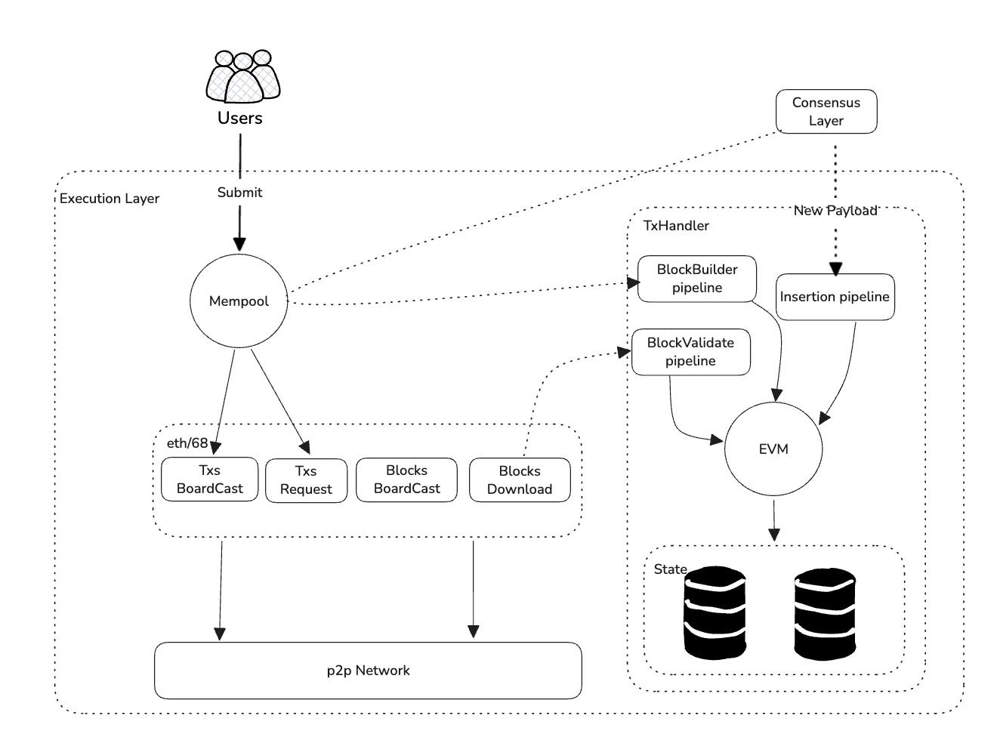

对于出块节点和非出块节点，处理交易的流程会有一些差别。对于出块节点，会负责从交易池中挑选交易，然后打包进区块，并更新本地的状态数据库，对于非出块节点，只需要将同步到的最新区块中的交易重新执行一遍，让本地的状态更新到最新。

### 交易种类

目前以太坊总共支持五类交易。这些交易的主要结构都类似，不同交易会通过交易类型字段来区分，不同类型的交易中通过一些扩展字段来实现特定的用途。

| 交易类型 | 交易 ID | 交易标识 | 何时引入 |
| --- | --- | --- | --- |
| Legacy Transactions | 0x00 | LegacyTxType | 以太坊主网启动 |
| Access List Transactions | 0x01 | AccessListTxType | Berlin 升级，通过 EIP-2930 引入 |
| Dynamic Fee Transactions | 0x02 | DynamicFeeTxType | London 升级，通过 EIP-1559 引入 |
| Blob Transactions | 0x03 | BlobTxType | Cancun 升级， 通过 EIP-4844 引入 |
| Set Code Transactions | 0x04 | SetCodeTxType | Prague 升级，通过  EIP-7702 引入 |

- LegacyTxType：创世区块沿用至今的基础格式，采用**第一价格拍卖模型**（用户手动设置`gasPrice`），EIP-155 升级后默认嵌入 `chainId` 防跨链重放攻击，当前在以太坊主网上的使用量已经比较少，以太坊当前兼容这个交易类型，后续会逐步淘汰
- AccessListTxType：预热存储访问大幅降低 Gas成本，这个特性已经被后续的交易类型继承，直接使用这个交易类型的交易也较少
- DynamicFeeTxType：更新了以太坊的经济模型的交易类型，引入 Base Fee 和 target 机制，继承了 AccessList 特性，这也是当前最主流的交易类型
- BlobTxType：专为链下扩容涉及的交易类型，允许交易通过 blob 结构携带低成本的大量数据，降低链下扩容方案的成本，继承了 AccessList 和 DynamicFee 特性，并且交易中的 blob 有与 EIP-1559 类似的单独计费机制
- SetCodeTxType：允许 EOA **转换为合约账户（也可以通过交易撤销合约能力）**，并可以执行 EOA 中对应的合约代码，继承了 AccessList 和 DynamicFee 特性

### 交易生命周期

当交易被打包进行区块之后，已经完成了对状态数据的修改，可以理解为交易的生命周期已经结束，在这个过程中，交易会经历四个周期：

- 交易验证：EOA 提交的交易会经过一系列基础验证之后才会被加入到交易池中
- 交易广播：新提交到交易池的交易会被广播到其他的节点的交易池中
- 交易执行：出块节点会从交易池中挑选交易进行执行
- 交易打包：交易会按照一定的顺序（先区分是否是本地交易，然后再按照 gas fee 大小）打包进区块，会忽略那些会验证不通过的交易

### 交易池

交易池是临时存放交易的地方，交易在被打包之前，都会被存储在交易池中，交易池中的交易会被同步到其他节点，同时也会从其他节点的交易池中同步交易。用户提交的交易会首先进入到交易池中，然后经过共识层触发共识流程，驱动交易执行以及被打包进区块。

当前交易池的实现有两种类型：

- Blob 交易池（Blob TxPool）
- 其他交易的交易池（Legacy TxPool）

由于 Blob 交易携带的数据与其他交易携带的数据处理流程不一样，所以会使用单独的交易池来处理，是其他类型的交易虽然类型不一致，但在不同节点之间同步以及被打包的流程基本一致，所以会在同一个交易池中被处理，交易池中交易都由外部 EOA 的所有者提交，向交易池中提交交易有两种方式：

- `SendTransaction`
- `SendRawTransaction`

SendTransaction 是客户端发送的是一个未签名的交易对象，节点会用交易中发起地址 `from` 对应的私钥来对交易进行签名。而 SendRawTransaction 则需要提前对交易签名，然后将签名完成的交易提交到节点。这种方式更常用，使用 Metamask、Rabby 等钱包使用的就是这种方式。

在这里以 SendRawTransaction 为例，在节点启动之后，节点会启动以一个 API 模块，用来处理外部的各类 API 请求，SendRawTransaction 就是其中的一个 API，源代码在 `internal/ethapi/api.go` :

```go
func (api *TransactionAPI) SendRawTransaction(ctx context.Context, input hexutil.Bytes) (common.Hash, error) {
	tx := new(types.Transaction)
	if err := tx.UnmarshalBinary(input); err != nil {
		return common.Hash{}, err
	}
	return SubmitTransaction(ctx, api.b, tx)
}
```

## 4. 核心数据结构

对于交易模块来说，核心的数据结构就两部分，一部分是用来表示交易本身的数据结构，另一部分就是表示临时存储交易的交易池结构。由于交易在交易池中需要在不同的节点之间传播，所以在交易池中的实现中会依赖底层的 p2p 协议。

### 交易结构

使用了 `core/types/transaction.go` 的 Transaction 来统一表示了所有的交易类型：

```go
type Transaction struct {
	inner TxData    // 交易实际的数据会存储在这里
	time  time.Time 
	
	//....
}
```

TxData 是一个 interface 类型，定义了所有交易类型都需要实现的属性获取方法，但是对于 LegacyTxType 这类交易，其中很多字段都没有，那就会使用之前已经存在的字段替代或者直接返回空：

```go
type TxData interface {
	txType() byte // 交易类型
	copy() TxData // 创建交易数据的深度拷贝

	chainID() *big.Int // 链ID，用于区分不同的以太坊网络
	accessList() AccessList // 预编译的访问列表，用于优化gas消耗（EIP-2930引入）
	data() []byte   // 交易的输入数据，用于合约调用或创建
	gas() uint64    // Gas 限制，表示交易最多可以消耗的 gas 数量
	gasPrice() *big.Int  // 每单位 Gas 的价格（用于 Legacy 交易）
	gasTipCap() *big.Int // 小费上限（用于 EIP-1559 交易）
	gasFeeCap() *big.Int // 总费用上限（用于 EIP-1559 交易）
	value() *big.Int // 交易中发送的 ETH 数量
	nonce() uint64 // 交易序号，用于防止重放攻击
	to() *common.Address // 接收方地址，如果是合约创建则为nil

	rawSignatureValues() (v, r, s *big.Int) // 原始签名值(v, r, s)
	setSignatureValues(chainID, v, r, s *big.Int) // 设置签名值

	effectiveGasPrice(dst *big.Int, baseFee *big.Int) *big.Int // 计算实际的gas价格（考虑baseFee）

	encode(*bytes.Buffer) error // 将交易编码为字节流
	decode([]byte) error // 从字节流解码交易

	sigHash(*big.Int) common.Hash // 需要签名的交易哈希
}
```

除了上面每个交易都需要实有的细节之外，每个新增加的交易都有自身的扩展部分。

在 Blob 交易中：

- BlobFeeCap：每个 blob 数据的最大费用上限，类似 maxFeePerGas，但是专门用于计算 blob 数据的费用
- BlobHashes：存储所有 blob 数据的哈希值数组，这些数据会在执行层存储，用于证明 Blob 数据的完整性和真实性
- Sidecar：包含实际的 blob 数据及其证明，这些数据不会在执行层存储，只会在共识层存储一段时间，也不会被编码到交易中

在 SetCode 交易中：

- AuthList：是一个授权列表，用于实现合约代码的多重授权机制，用于帮助 EOA 获取智能合约的能力

所有的交易类型都需要实现 TxData，然后每种交易的差异化处理会在交易类型的内部去实现。这样面向接口的一个好处就是后续可以很轻松地增加一种新的交易类型，而不需要去修改当前的交易流程流程。

### 交易池结构

与交易结构类似，交易池也采用了同样的设计模式，使用 `core/txpool/txpool.go` 中的 TxPool 来统一管理交易池，其中 `SubPool` 是一个 interface，每个交易池的具体实现都需要实现这个 interface：

```go
type TxPool struct {
	subpools []SubPool // 交易池的具体实现
	chain    BlockChain
	
	// ...
}

type LegacyPool struct {
	config      Config     // 交易池参数配置
	chainconfig *params.ChainConfig // 区块链参数配置
	chain       BlockChain // 区块链接口
	gasTip      atomic.Pointer[uint256.Int] // 当前接受的最低 gas 小费
	txFeed      event.Feed // 交易事件的发布订阅系统
	signer      types.Signer // 交易签名验证器

  pending map[common.Address]*list     // 当前可处理的交易
	queue   map[common.Address]*list     // 暂时不可处理的交易
	//...
}

type BlobPool struct {
	config  Config                 // 交易池的参数配置
	reserve txpool.AddressReserver // 

	store  billy.Database // 持久化数据存储，用于存储交易元数据和 blob 数据
	stored uint64         // 
	limbo  *limbo         // 

	signer types.Signer // 
	chain  BlockChain   // 
  index  map[common.Address][]*blobTxMeta // 
	spent  map[common.Address]*uint256.Int // 
	//...
}
```

当前实现了 SubPool 的两个交易池为：

- BlobTxPool：用于管理 Blob 交易
- LegacyTxPool：用于管理 Blob 交易之外的其他交易

之所以 Blob 交易需要和其他交易分开管理，是因为 Blob 交易中有可能会携带大量的 blob 数据，其他的交易都可以直接在内存中管理和同步，而 Blob 交易中的 blob 数据则需要持久化存储，所以不能使用和其他交易一样的管理方式。

## 5. 费用机制

由于以太坊本身无法处理**停机问题**，所以使用 Gas 机制来防止一些恶意的攻击，另外 Gas 本身也作为用户的手续费在使用，这是 Gas 最初的两个用途。

经过了这些年的发展之后，Gas 除了上面的两个用途，还是以太坊经济模型的重要组成部分，可以控制 ETH 的发行数量，还可以帮助以太坊完成通缩。甚至还可以动态调节以太坊网络的流量，提升用户使用体验。

以太坊的费用机制使用 Gas 来实现，有维护网络安全、实现经济模型平衡等多种作用。

### Gas

以太坊在处理交易时，在 EVM 上执行的每个操作都需要消耗 Gas，比如使用内存、读取数据、写入数据等等，有的操作消耗 Gas 多，有的消耗少，比如 ETH 的转账操作需要消耗 21,000 Gas。在每一笔交易中，都需要设定该交易最高需要消耗多少 Gas，如果 Gas 消耗完，那么交易就执行结束，而且这个过程中消耗的 Gas 不会退还，也正是这个机制可以用来处理以太坊的停机问题。

以太坊中区块的大小也是使用 Gas 来限制，而不是使用具体的大小单位，**区块内所有交易实际消耗的 Gas 不能大于区块本身 Gas 限制**。Gas 只是 EVM 执行过程中的计量单位，用于需要为每笔交易消耗的 Gas 支付 ETH，Gas 的价格通常使用 Gwei 来表示， 1 Ether = 10^9 Gwei。

在当前的以太坊网络中，当前的一个区块的大小限制是 36M Gas，但是在当前的社区中对于提升区块的 Gas 限制的声量很大，认为提升区块 Gas 限制到 60M 是比较合理的选择，这个数字会提升网络的容量，而且同时不会威胁到网络的安全，目前已经在测试网测试中。同时社区中也有人认为单纯使用 Gas 限制来控制的区块的大小不合理，需要引入字节大小的限制，目前这些正在社区讨论中。

### EIP-1559

在引入 EIP-1559 的机制之后，将之前的 GasPrice 直接拆分成了 Base Fee 和 **Priority Fee（maxPriorityFeePerGas）**，其中 Base Fee 会全部被销毁，以控制以太坊中 ETH 的增长速度，**Priority Fee** 则会给出出块节点对应的验证者。用户可以在交易中设置 maxFeePerGas 来保证最终支付的费用是受限的。

如果要保证交易成功，那么就需要保证  maxFeePerGas ≥ Base Fee + Priority Fee，否则交易会执行失败，并且费用也不会退换。用户需要实际支出的费用为 (Base Fee+Priority Fee)×Gas Used，多余的费用会退还给交易发起的地址。

Base Fee 处在动态变化中，以区块中 Gas 的实际用量为基准，区块最大 Gas 限制的一半称之为 target，如果上一个区块的实际用量超过了 target，那么当前的区块的 Base Fee 就会增加，如果前一个区块的 Gas 用量低于 target，那么 Base Fee 就会减少，否则就不变。

### Blob 交易费用机制

Blob 交易的费用结算分为两部分，一部分是使用 EIP-1559 来和其他交易共同调整 Base Fee，另一部分是 Blob 交易中的 Blob 数据有一个独立的 Blob Fee 机制，其中 target 值是最大 Blob 数量的一半，也是根据 Blob 数据块的使用量来调整 Blob Fee，但是不单独设置 Priority Fee，因为 Blob 交易也可以直接设置交易中的 Priority Fee 来促使 Blob 交易被更快打包。

## 6. 交易处理流程源码分析

在上面详细介绍了以太坊中交易机制的设计及实现，接下来，我们将通过分析代码，详细介绍交易在 Geth 中具体实现，包括交易在整个生命周期中的处理流程。 

### 交易提交

无论是通过 `SendTransaction` 还是 `SendURawTransaction` 的方式提交交易，都会调用 `internal/ethapi/api.go` 中的 `SubmitTransaction` 函数向交易池提交交易。

在 这个函数中，会对交易做两个基本的检查，一个是检查 gas fee 是否合理，另一个是检查是交易是否满足 EIP-155 的规范，EIP-155 通过在交易签名中引入 chainID 参数，解决了跨链交易重放问题。该检查确保当节点配置开启 EIP155Required 时，所有向交易池提交的交易都必须符合这个标准。

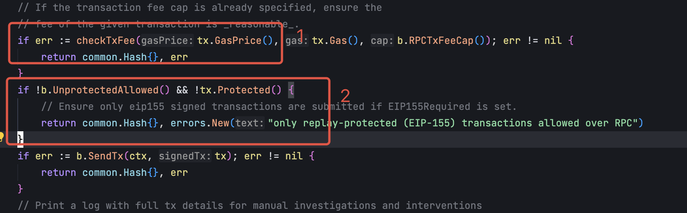

在完成检查之后，就会把交易提交到交易池，由 `eth/api_backend.go` 中的 SendTx 来实现添加逻辑：

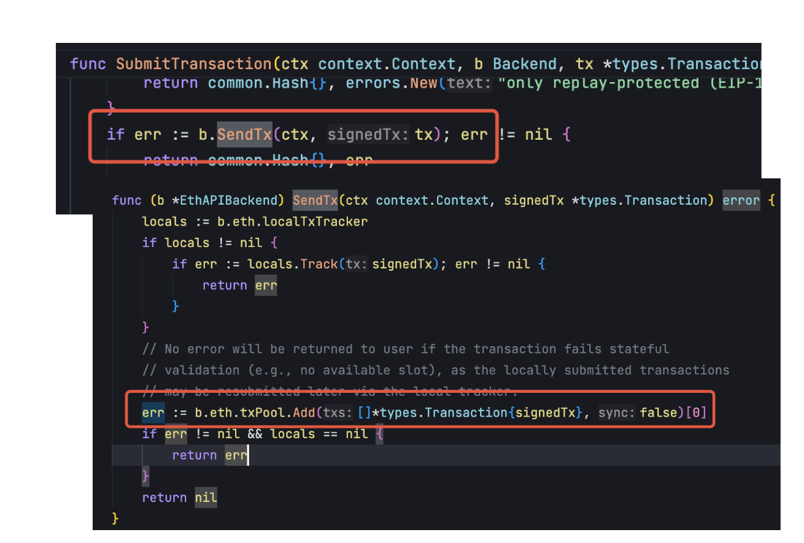

在交易池中，会通过 Filter 方法来为交易匹配对应的交易池，当前有两个交易池实现，如果是 blob 交易，那么就会放入 `BlobPool` ，否则放入`LegacyPool` ：

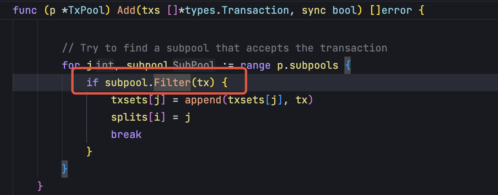

到这里，EOA 提交的交易就已经被放入交易池，这个交易就会开始在交易池中传播，进入后续的交易打包和执行流程。

如果在交易打包之前，重新发送了一笔交易，新的交易设置了新的 gasPrice 和 gasLimit，就会把原来交易池中的交易删除，替换成了新的 gasPrice 和 gasLimit 之后重新返回到交易池中。这种方式也可以用来取消不想执行的交易。

```go
func (api *TransactionAPI) Resend(ctx context.Context, sendArgs TransactionArgs, gasPrice *hexutil.Big, gasLimit *hexutil.Uint64) (common.Hash, error) {
	if sendArgs.Nonce == nil {
		return common.Hash{}, errors.New("missing transaction nonce in transaction spec")
	}
	if err := sendArgs.setDefaults(ctx, api.b, false); err != nil {
		return common.Hash{}, err
	}
	matchTx := sendArgs.ToTransaction(types.LegacyTxType)

	// Before replacing the old transaction, ensure the _new_ transaction fee is reasonable.
	price := matchTx.GasPrice()
	if gasPrice != nil {
		price = gasPrice.ToInt()
	}
	gas := matchTx.Gas()
	if gasLimit != nil {
		gas = uint64(*gasLimit)
	}
	if err := checkTxFee(price, gas, api.b.RPCTxFeeCap()); err != nil {
		return common.Hash{}, err
	}
	// Iterate the pending list for replacement
	pending, err := api.b.GetPoolTransactions()
	if err != nil {
		return common.Hash{}, err
	}
	for _, p := range pending {
		wantSigHash := api.signer.Hash(matchTx)
		pFrom, err := types.Sender(api.signer, p)
		if err == nil && pFrom == sendArgs.from() && api.signer.Hash(p) == wantSigHash {
			// Match. Re-sign and send the transaction.
			if gasPrice != nil && (*big.Int)(gasPrice).Sign() != 0 {
				sendArgs.GasPrice = gasPrice
			}
			if gasLimit != nil && *gasLimit != 0 {
				sendArgs.Gas = gasLimit
			}
			signedTx, err := api.sign(sendArgs.from(), sendArgs.ToTransaction(types.LegacyTxType))
			if err != nil {
				return common.Hash{}, err
			}
			if err = api.b.SendTx(ctx, signedTx); err != nil {
				return common.Hash{}, err
			}
			return signedTx.Hash(), nil
		}
	}
	return common.Hash{}, fmt.Errorf("transaction %#x not found", matchTx.Hash())
}
```

### 交易广播

节点在接收到 EOA 提交的交易之后，需要在网络中进行传播，txpool（`core/txpool/txpool.go` ）提供了 SubscribeTransactions 方法，可以订阅交易池中的新事件，Blob 交易池和 Legacy 交易池实现订阅的方式不一致：

```go
func (p *TxPool) SubscribeTransactions(ch chan<- core.NewTxsEvent, reorgs bool) event.Subscription {
	subs := make([]event.Subscription, len(p.subpools))
	for i, subpool := range p.subpools {
		subs[i] = subpool.SubscribeTransactions(ch, reorgs)
	}
	return p.subs.Track(event.JoinSubscriptions(subs...))
}
```

BlobPool 区分了两种事件源：

- discoverFeed ：仅包含新发现的交易
- insertFeed ：包含所有交易，包括因重组而重新进入池的交易

```go
func (p *BlobPool) SubscribeTransactions(ch chan<- core.NewTxsEvent, reorgs bool) event.Subscription {
	if reorgs {
		return p.insertFeed.Subscribe(ch)
	} else {
		return p.discoverFeed.Subscribe(ch)
	}
}
```

LagacyPool 不区分新交易和重组交易，它使用单一的 txFeed 来发送所有交易事件。

```go
func (pool *LegacyPool) SubscribeTransactions(ch chan<- core.NewTxsEvent, reorgs bool) event.Subscription {
	return pool.txFeed.Subscribe(ch)
}
```

总的来说， SubscribeTransactions 通过事件机制将交易池与其他组件解耦，这个订阅可以被多个模块使用，比如交易广播、交易打包以及对外 RPC 都需要监听这个流程，然后做出对应的处理。

同时 p2p 模块 (`eth/handler.go`)  会持续监听新交易事件，如果接收到了新交易，那么就会发送广播，将交易广播出去：

```go
// eth/handler.go 在产生新交易之后，会通过 p2p 网络广播出去
func (h *handler) txBroadcastLoop() {
	defer h.wg.Done()
	for {
		select {
		case event := <-h.txsCh: // 这里监听新交易信息
			h.BroadcastTransactions(event.Txs)
		case <-h.txsSub.Err():
			return
		}
	}
}
```

在广播交易时，需要对交易进行分类，如果是 blob 交易或者是超过了一定大小的交易，无法直接传播，对于普通的交易，则标记为可以直接传播。然后从当前节点的对等节点中去找那些没有这笔交易的节点。如果节点可以直接广播，则标记为 true，这个过程也是在 BroadcastTransactions 方法中实现的：

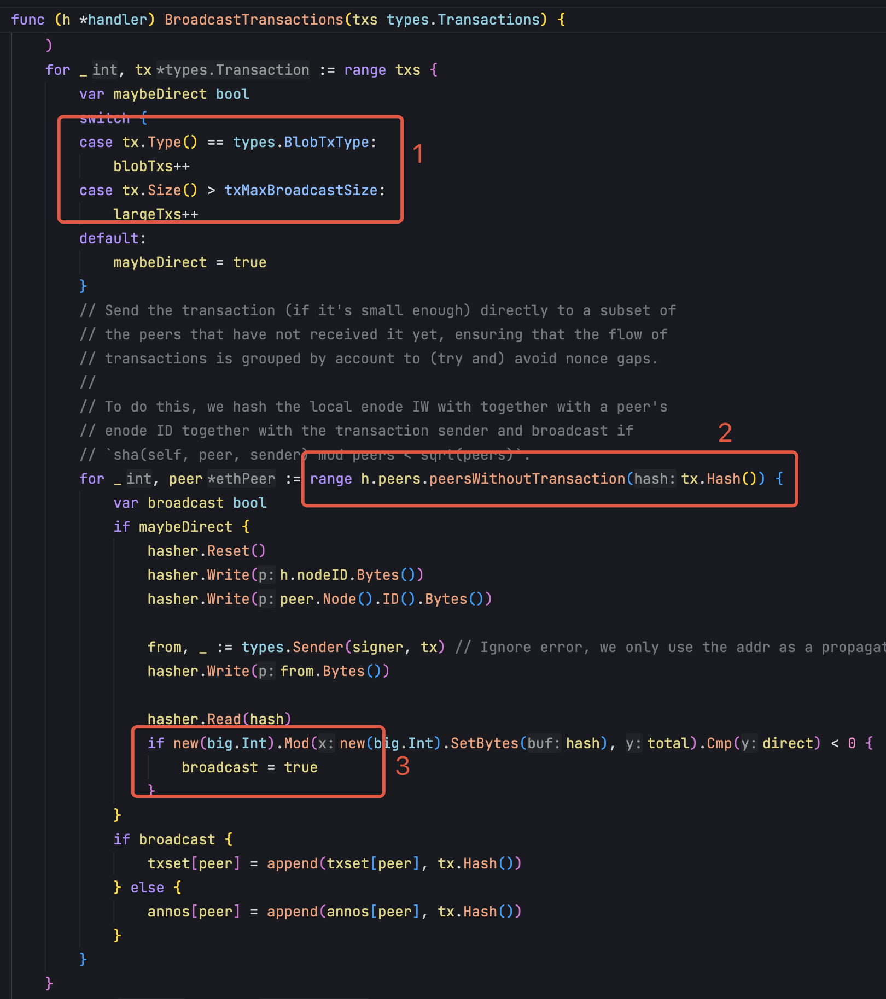

依照上面的原则对交易分类完成，可以直接传播的交易就直接发送，blob 交易或者大交易则只广播 hash，等到需要用到这笔交易的时候再来获取。

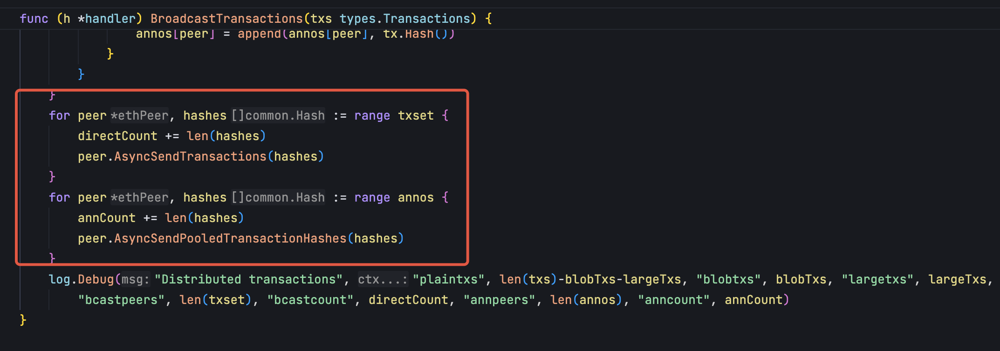

广播中只发送 hash 的交易会被放到 peer 节点的这个字段中：

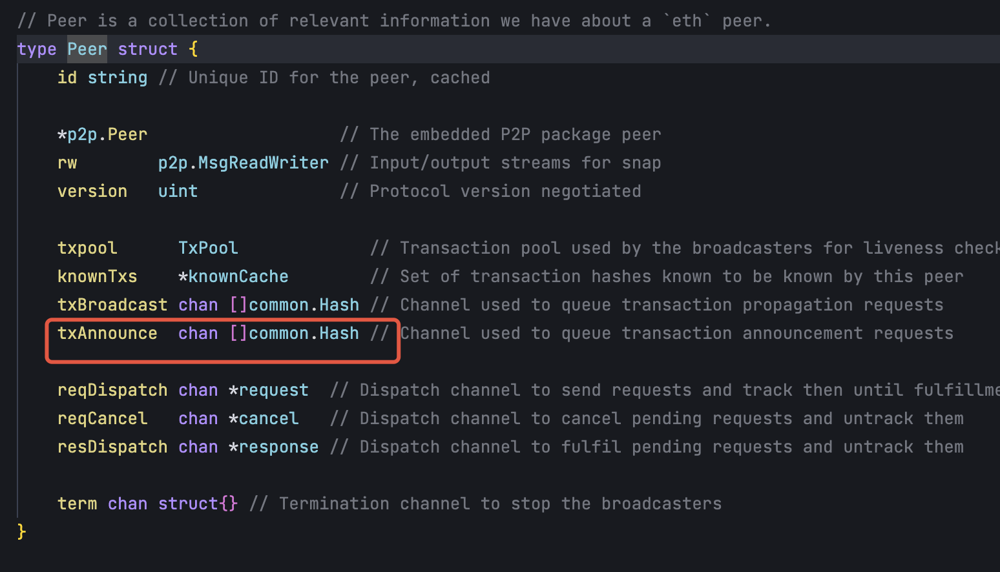

新交易会通过 p2p 模块广播出去，同时也会从 p2p 网络中接收新的交易。在 `eth/backend.go` 中初始化 Ethereum 实例时，会初始化 p2p 模块，添加交易池的接口。p2p 模块运行起来之后，会从 p2p 消息中解析出交易请求添加到交易池中。

具体来说，在实例化 handler 的时候，会指定好从其他节点获取交易的方式，会通过 `eth/fetcher` 中的 TxFetcher 去获取远端的交易，TxFetcher 会通过这里的 fetchTx 方法去获取远端的交易，实际是调用了 `eth/protocols/eth` 协议中实现的 RequestTxs 方法去获取交易：

```go

// eth/backend.go New 函数
if eth.handler, err = newHandler(&handlerConfig{
		NodeID:         eth.p2pServer.Self().ID(),
		Database:       chainDb,
		Chain:          eth.blockchain,
		TxPool:         eth.txPool,
		Network:        networkID,
		Sync:           config.SyncMode,
		BloomCache:     uint64(cacheLimit),
		EventMux:       eth.eventMux,
		RequiredBlocks: config.RequiredBlocks,
	}); err != nil {
		return nil, err
	}
	
	// eth/handler.go newHandler 函数，注册获取新交易的过程
	fetchTx := func(peer string, hashes []common.Hash) error {
		p := h.peers.peer(peer)
		if p == nil {
			return errors.New("unknown peer")
		}
		return p.RequestTxs(hashes) // 去其他节点请求交易
	}
	addTxs := func(txs []*types.Transaction) []error {
		return h.txpool.Add(txs, false) // 将交易加入交易池
	}
	h.txFetcher = fetcher.NewTxFetcher(h.txpool.Has, addTxs, fetchTx, h.removePeer)
	
	
	// eth/handler_eth.go Handle 方法，在接收到新的交易之后，会添加到交易池中
	for _, tx := range *packet {
		if tx.Type() == types.BlobTxType {
			return errors.New("disallowed broadcast blob transaction")
		}
	}
	return h.txFetcher.Enqueue(peer.ID(), *packet, false)
	
	// eth/fetcher/tx_fetcher.go 的 Handle 方法会调用上面注册的 addTxs 来将讲义添加到交易池
	for j, err := range f.addTxs(batch) {
		//....
	}
```

RequestTxs 方法通过发送 GetPooledTransactionsMsg 消息，然后收到其他节点发送的 PooledTransactionsMsg 的响应，由 backend 中的 Handle 方法来处理，在这个方法中调用了 txFetcher 的  Enqueue 方法，最终 Enqueue 方法调用了 adTxs 方法把从其他节点获取的交易添加到交易池：

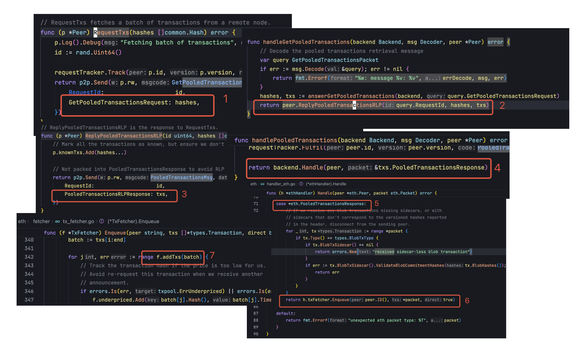

在交易池中还有一个延迟加载的设计，通过 `core/txpool/subpool.go` 中的 LazyTransaction 来实现，通过延迟加载机制减少内存使用并提高交易处理效率。它存储交易的关键元数据，只在真正需要时才加载完整交易数据，在以太坊处理大量交易时发挥着重要作用。这种设计特别适合交易池和区块打包这样的场景，其中大多数交易可能最终不会被包含在区块中，因此不需要完整加载所有交易数据。

```go
type LazyTransaction struct {
	Pool LazyResolver       // Transaction resolver to pull the real transaction up
	Hash common.Hash        // Transaction hash to pull up if needed
	Tx   *types.Transaction // Transaction if already resolved

	Time      time.Time    // Time when the transaction was first seen
	GasFeeCap *uint256.Int // Maximum fee per gas the transaction may consume
	GasTipCap *uint256.Int // Maximum miner tip per gas the transaction can pay

	Gas     uint64 // Amount of gas required by the transaction
	BlobGas uint64 // Amount of blob gas required by the transaction
}

func (ltx *LazyTransaction) Resolve() *types.Transaction {
	if ltx.Tx != nil {
		return ltx.Tx
	}
	return ltx.Pool.Get(ltx.Hash)
}
```

另外由于以太坊是一个 perminssionless 的网络，节点有可能会从网络中接收到一些恶意的请求，极端情况下，节点可能会面临 DDos 攻击，所以节点会使用一系列的方式来防止来自网络的恶意攻击：

- 交易基础验证
- 节点资源限制
- 交易驱逐机制
- p2p 网络层防护

这里以 Legacypool 为例（Blobpool 也有类似的机制），在交易被添加进交易池之前，首先会经过一个基础的验证，在 `core/txpool/validation.go` 中的 ValidateTransaction 方法中，会对交易做一个基础的验证，包括交易类型、交易大小、Gas 等是否符合要求，如果不符合，就会拒绝接收交易。

这里的交易大小使用 `Slot` 来规定，在 `core/txpool/legacypool/legacypool.go` 中定义了 Slot：

```go
const (
	txSlotSize = 32 * 1024
	txMaxSize = 4 * txSlotSize // 128KB
)
```

每个交易不能超过 4 个 Slot，而且对于每个账户、整个节点都有最大 Slot 的限制，对于账户，达到限制之后就不能提交新的交易。对于节点，达到限制之后就需要剔除旧的交易，在 `core/txpool/legacypool/legacypool.go` 中的 truncatePending 方法中会公平驱逐交易，防止单个账户占用过多交易池资源：

```go
type Config struct {
	AccountSlots uint64
	GlobalSlots  uint64 
}
```

在网络层上， 对于 blob 交易或者是超过了一定大小的交易，不会直接在网络上传播交易内容，只会传播交易 Hash，从而避免网络上传播的数据量过大，造成 DDos 攻击。

### 交易打包

在交易提交到交易池之后，会在以太坊网络中的节点之间传播，在某个节点的验证者被选中为出块节点之后，验证者就会委托共识层和执行层构造区块。

验证者会首先从共识层触发区块构造流程，共识层在接收到区块构造请求之后，就会调用执行层的 engineAPI 来构造区块，engineAPI 的实现在 `eth/catalyst/api.go` 。共识层会先调用 `ForkchoiceUpdated`  API 来发送构造区块的请求，`ForkchoiceUpdated` 有多个版本，具体调用哪个版本依据当前网络版本来决定，调用完成之后会返回 PayloadID，然后根据这个参数调用 `GetPayload` 对应版本 API 来获取区块的构造结果。

无论调用的是 ForkchoiceUpdated 的哪个版本，最终都是调用 forkchoiceUpdated 方法来构造区块：

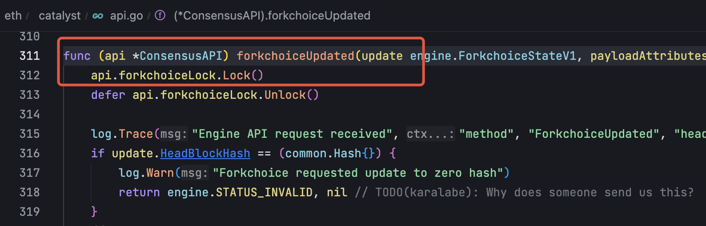

在 ForkchoiceUpdated 方法中会对执行层当前的状态做校验，如果当前执行层正在同步区块、或者获得最终性的区块不符合预期，那么该方法都会向共识层直接返回错误信息，构造区块失败：

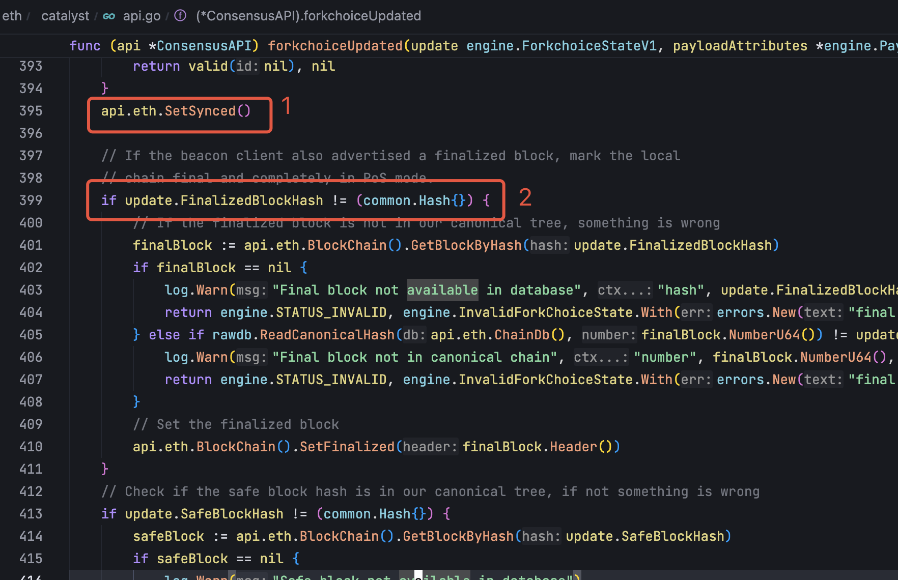

在对执行层的信息校验完成之后，就会调用 `miner/miner.go` 中的 BuildPayload 方法来构造区块。构造区块的具体操作都在 `miner/payload_building.go` 中的 generateWork 方法中完成，但这里需要注意，在调用这个方法之后，就会先产生了一个空的 payload，并把这个 payloadID 返回给共识层。同时会启动一个 goroutine 真正去完成区块的打包流程，这个 goroutine 会持续去交易池中找价值更高的交易，每次重新打包交易之后，都会更新 payload。

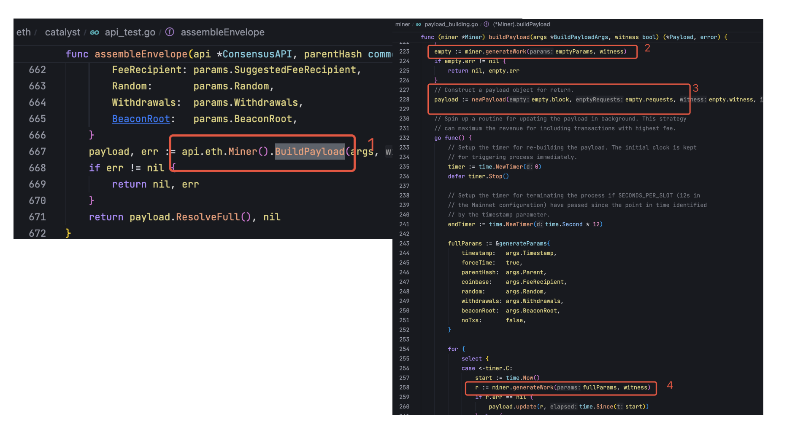

打包交易的是通过 `miner/worker.go` 中的 fillTransactions 方法来完成，实际上就是调用 txpool 的 Pending 方法来获取待打包的交易：

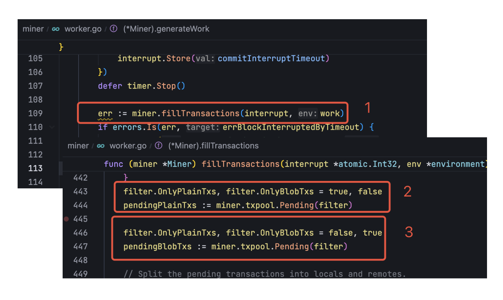

共识层在 slot 结束之前会调用 getPayload API 来获取最终打包好的区块。如果提交的交易被打包在这个区块当中，那么交易就会被 EVM 执行，并改变状态数据库。如果这次没有被打包，那么就会等待下一次被打包。

### 交易执行

在打包交易的过程中，同时也会将交易在 EVM 中执行，得到区块交易完成之后状态的变化，同样还是在 generateWork 函数中，准备好当前区块执行的环境变量，主要是获取最新区块和最新状态数据库：

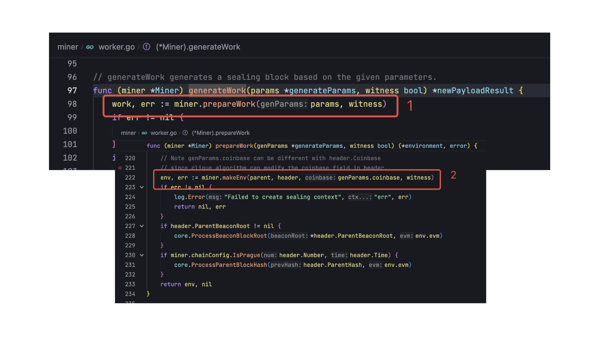

这里的 state 就是代表状态数据库：

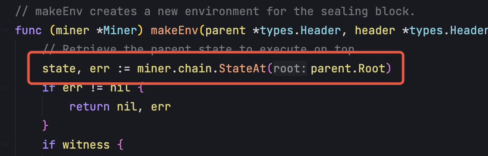

在这里形成了一个 StateDB → stateObjects→ stateAcount 的结构，分别代表完整的状态数据库、账号对象集合以及单个账户对象。其中 StateObject 中结构中，dirtyStorage 表示当前交易执行后已改变的状态，pendingStorage 表示当前区块执行之后已改变的状态，originStorage 表示原始的状态，所以这三个状态从新到旧是 dirtyStorage → pendingStorage → originStorage，这里关于存储的详细解析可以查看之前关于存储的详细解析：

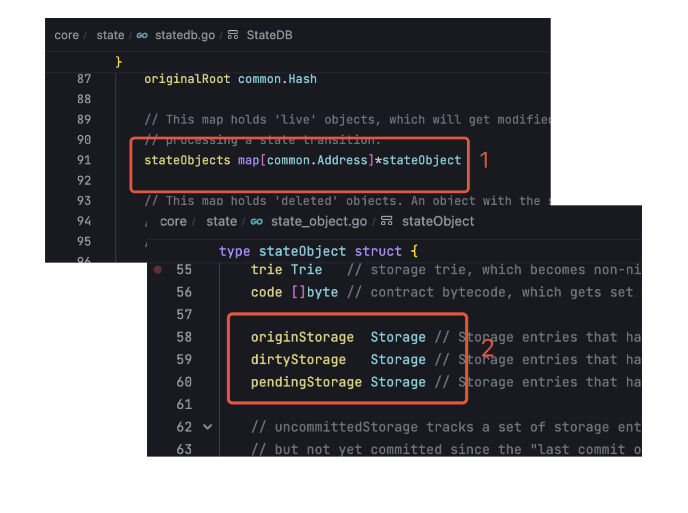

在 `eth/backend.go` 的 New 方法中启动时会加载交易池的配置，其中有一个 Locals 的配置，这个配置中的地址会被视为本地地址，这些本地地址提交的交易会被优先处理。

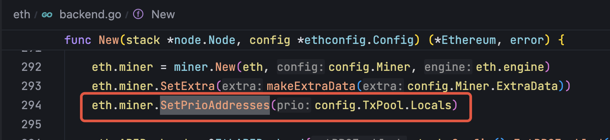

在获取到当前的环境变量之后，就可以执行交易了，首先会获取全部待打包的交易，并把其中的本地交易挑选出来，区分成本地交易和正常交易，然后会对本地交易和正常交易分别按照手续费从高到低打包交易。交易具体的执行都在 `miner/worker.go` 中 commitTransactions 方法中进行：

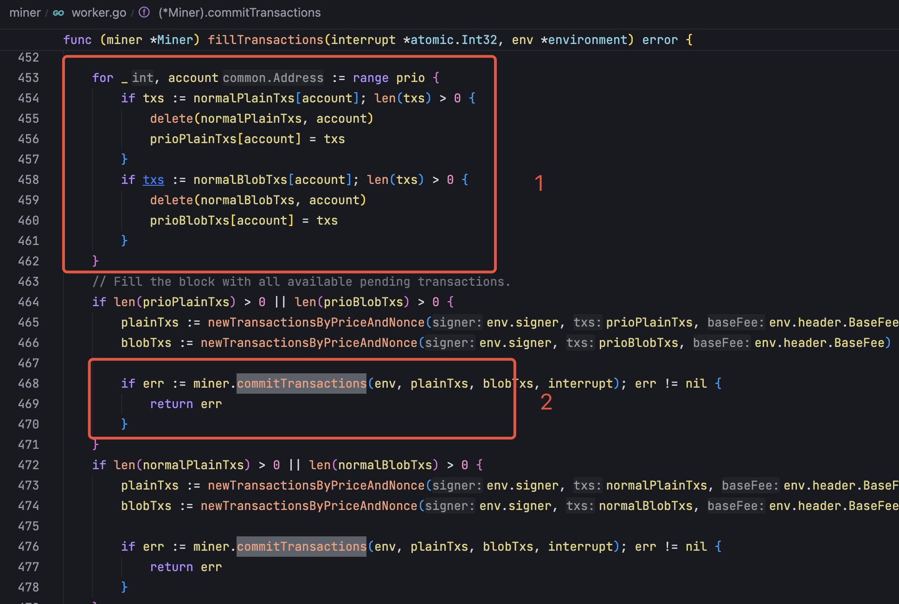

最终都是调用 ApplyTransaction 函数，在这个函数中，会调用 EVM 执行交易，并修改状态数据库：

```go
func ApplyTransaction(evm *vm.EVM, gp *GasPool, statedb *state.StateDB, header *types.Header, tx *types.Transaction, usedGas *uint64) (*types.Receipt, error) {
	msg, err := TransactionToMessage(tx, types.MakeSigner(evm.ChainConfig(), header.Number, header.Time), header.BaseFee)
	if err != nil {
		return nil, err
	}
	// Create a new context to be used in the EVM environment
	return ApplyTransactionWithEVM(msg, gp, statedb, header.Number, header.Hash(), tx, usedGas, evm)
}
```

### 交易验证

上面讨论的情况都是交易被打包进区块的流程，大多数情况下，节点只会验证已经被打包好的区块，而不是自己打包区块。

共识层在同步到区块之后，使用 engine API 将同步到的最新区块传输到执行层。使用的是 engine_NewPayload 系列方法。这系列的方法最后都会调用 `newPayload` 方法,在这个方法中将共识层的 payload 组装成一个 block：

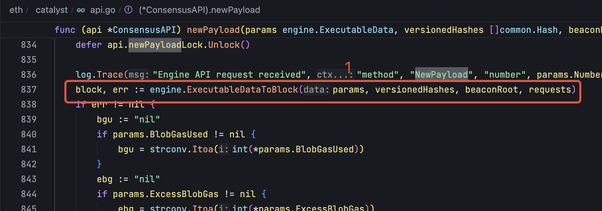

然后检查这个区块是否已经存在了，如果存在了，那么就直接返回取消有效的状态：

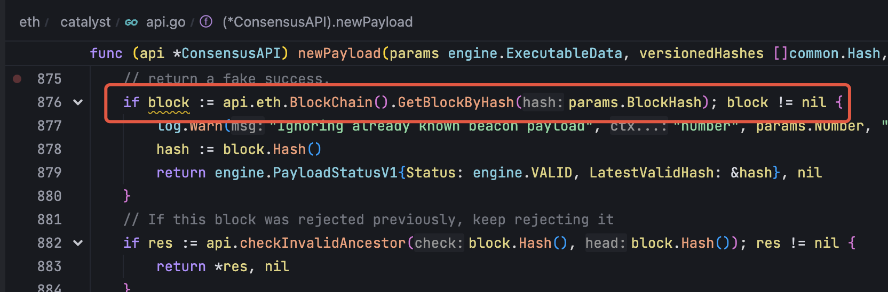

如果当前执行层还在同步状态，那么暂时就无法接收新的区块：

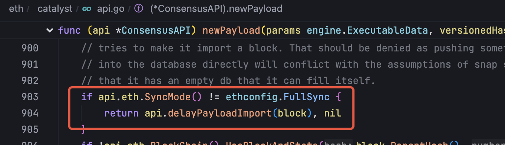

如果上面的条件都满足，那么就开始将区块插入到区块链中，这里需要注意，在插入区块的时候不会直接指定链头，因为链头的决策会涉及到链分叉的选择，这个需要依靠共识层来决定：

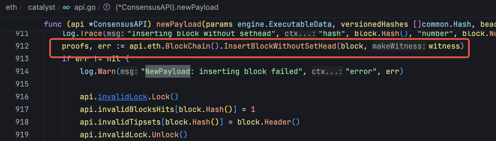

共识层会调用 forkChoiceupdated API 来调用 `core/blockchain.go` 中的 `SetCanonical`  方法来决定区块头：

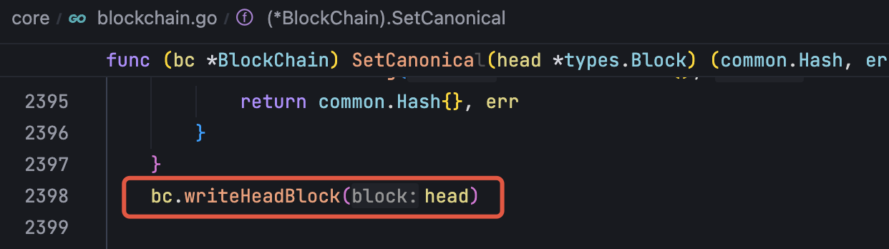

还有一种情况会触发区块头的设置，那就时区块发生重组，区块重组会执行 `core/blockchain.go` 的 `reorg` 方法，在这个方法中同样会设置当前最新确定的区块头。 

回到区块的执行过程，在 `core/blockchain.go` 中的 InsertBlockWithoutSetHead 方法会调用 `insertChain` 方法，在这个方法中，会做一系列条件的检查，检查完成之后，就会开始处理区块：

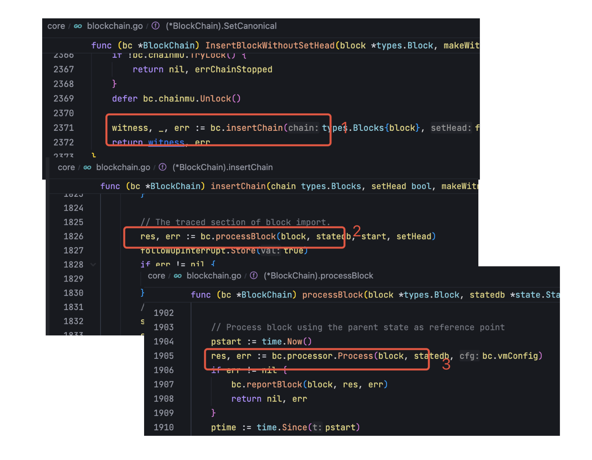

在具体的 Process 里面，处理逻辑就很清晰了，和之前打包交易的流程类似，不断在 evm 中执行交易，然后修改状态数据库，与打包不同的地方在于，这里只是将新区块中的交易重放一遍，而不需要去交易池中获取。

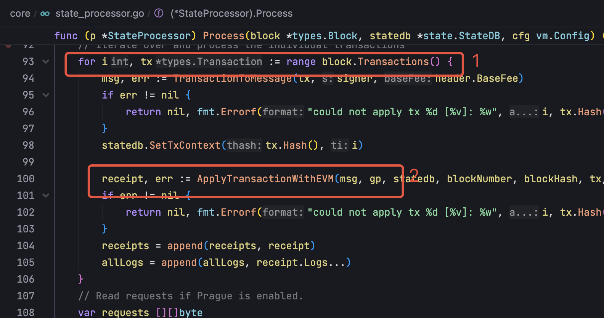

## 7. 总结

交易是驱动以太坊状态变化的唯一方式，交易在以太坊中的处理需要经过多个阶段。交易需要先经过验证，再被提交到交易池，在不同的节点之间通过 p2p 网络传播，然后被出块节点打包进区块，最后其他节点同步区块，在本地执行区块中的交易，并同步状态变更。

随着以太坊协议的不断发展，从最开始只能支持一种交易，到目前可以支持 5 种交易。这些不同类型的交易可以让以太坊适应不同的角色，及可以作为 DApp 的运行平台，也可以作为 Layer2 或者其他链下扩容的结算层。最近新增加的 EIP-7702 为以太坊被大规模采用做好了技术上的准备。

## Ref

[1][https://ethereum.org/zh/developers/docs/transactions/](https://ethereum.org/zh/developers/docs/transactions/)

[2][https://hackmd.io/@danielrachi/engine_api](https://hackmd.io/@danielrachi/engine_api)

[3][https://github.com/ethereum/go-ethereum/commit/c8a9a9c0917dd57d077a79044e65dbbdd421458b](https://github.com/ethereum/go-ethereum/commit/c8a9a9c0917dd57d077a79044e65dbbdd421458b)

[4][https://pumpthegas.org/](https://pumpthegas.org/)

[5][https://github.com/ethereum/EIPs/pull/9698](https://github.com/ethereum/EIPs/pull/9698)