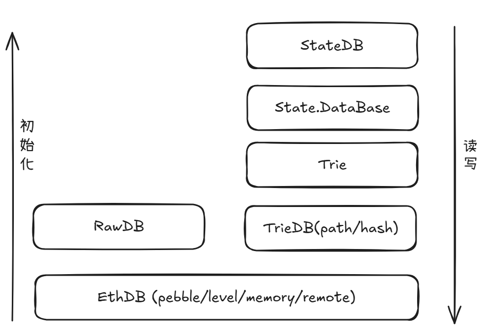
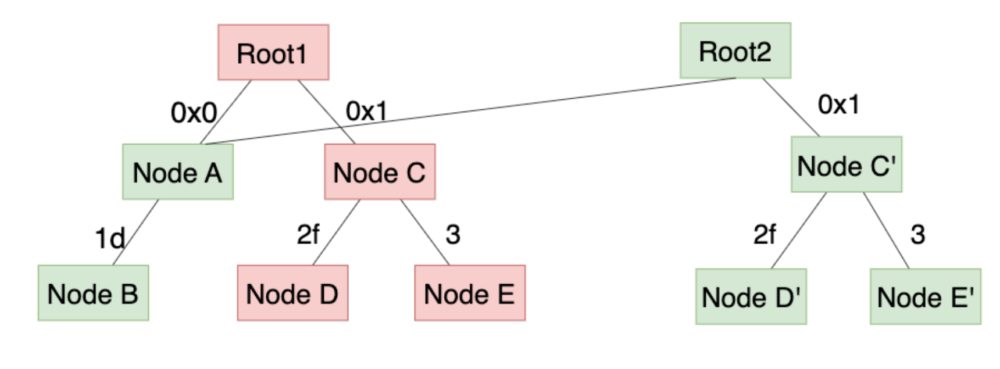
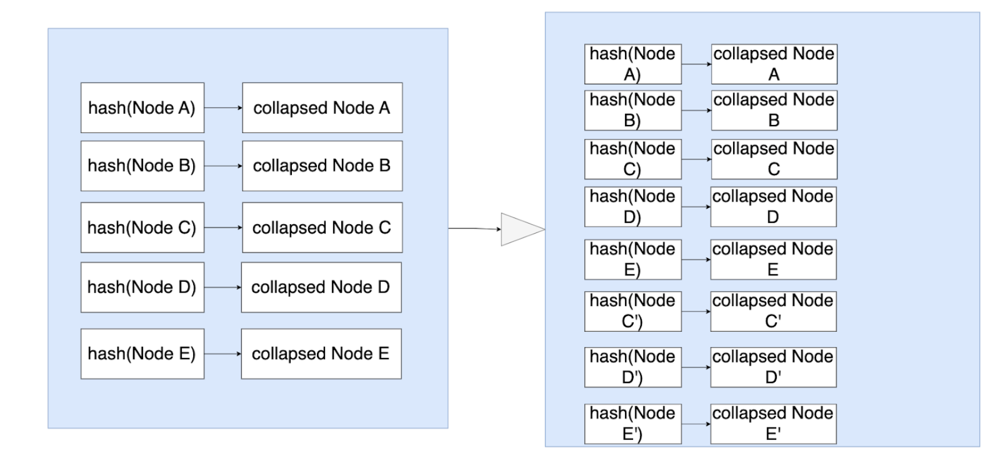
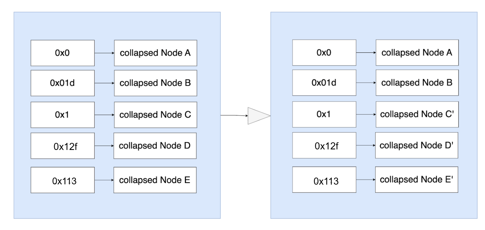

# Geth 源码系列：存储设计及实现

Author: Po

这篇文章是 Geth 源码系列的第二篇，通过这个系列，我们将搭建一个研究 Geth 实现的框架，开发者可以根据这个框架深入自己感兴趣的部分研究。这个系列共有六篇文章，在这第二篇文章中，将系统讲解 Geth 的存储结构设计与相关源码，介绍其数据库层次划分并详细分析各个层次中相应模块的核心功能。

以太坊作为全球最大的区块链平台，其主流客户端 Geth（Go-Ethereum）承担了绝大部分节点运行与状态管理的职责。Geth 的状态存储系统，是理解以太坊运行机制、优化节点性能、以及推动未来客户端创新的基础。

# 1. Geth底层数据库总览

自 Geth v1.9.0 版本起，Geth 将其数据库分为两部分：**快速访问存储**（KV数据库，用于最近的区块和状态数据）和称为 **freezer 的存储**（用于较旧的区块和收据数据，即“ancients”）。

这样划分的目的是减少对昂贵、易损的 SSD 的依赖，将访问频率较低的数据迁移到成本更低、耐用性更高的磁盘上。与此同时，这种拆分也能减轻 LevelDB/PebbleDB 的压力，提高其整理和读取性能，使得在给定的缓存大小下，更多状态树节点能够常驻内存，从而提升整体系统效率。

- **快速访问存储:** Geth 用户可能对底层数据库的选项较为熟悉——可以通过 `--db.engine` 参数进行配置。目前的默认选项是 `pebbledb`，也可以选择 `leveldb`。这两个都是 Geth 所依赖的第三方键值数据库，负责存储路径为 `datadir/geth/chaindata`（所有的区块和状态数据）和 `datadir/geth/nodes`（数据库元数据文件，体积很小）的文件。通过 `--history.state value` 设置快速访问保存的最近历史状态区块数，默认为90,000个区块。
- **freezer** 或 **ancients存储（历史数据）**，其目录路径通常为 `datadir/geth/chaindata/ancients`。由于历史数据基本是静态的，不需要高性能 I/O，因此可以节省宝贵的 SSD 空间，用于存储更活跃的数据。

本文的重点是状态数据，它存储在 ****KV 数据库中。因此，文中提到的底层数据库默认是指这个 KV 存储，而非 freezer。

## Geth 存储结构：五个逻辑数据库

Geth 的底层使用 LevelDB/PebbleDB 存储所有以 [RLP](https://ethereum.org/en/developers/docs/data-structures-and-encoding/rlp/) 编码后的数据，但其逻辑上划分出五种用途不同的数据库：

| 名称 | 描述 |
| --- | --- |
| State Trie | 世界状态，包括账户、合约存储 |
| Contract Codes | 合约代码 |
| State snapshot | 世界状态快照 |
| Receipts | 交易收据 |
| Headers/Blocks | 区块数据 |

每种数据通过 key 前缀（`core/rawdb/schema.go`）区分，逻辑上实现职责分离。通过`geth db inspect`可以查看 Geth 存储的所有以太坊数据（块高22,347,000），可以看到磁盘空间占用最大的是区块、收据和状态数据。

```bash
+-----------------------+-----------------------------+------------+------------+
|       DATABASE        |          CATEGORY           |    SIZE    |   ITEMS    |
+-----------------------+-----------------------------+------------+------------+
| Key-Value store       | Headers                     | 576.00 B   |          1 |
| Key-Value store       | Bodies                      | 44.00 B    |          1 |
| Key-Value store       | Receipt lists               | 42.00 B    |          1 |
| Key-Value store       | Difficulties (deprecated)   | 0.00 B     |          0 |
| Key-Value store       | Block number->hash          | 42.00 B    |          1 |
| Key-Value store       | Block hash->number          | 873.78 MiB |   22347001 |
| Key-Value store       | Transaction index           | 13.48 GiB  |  391277094 |
| Key-Value store       | Log index filter-map rows   | 12.98 GiB  |  132798523 |
| Key-Value store       | Log index last-block-of-map | 2.73 MiB   |      59529 |
| Key-Value store       | Log index block-lv          | 45.05 MiB  |    2362175 |
| Key-Value store       | Log bloombits (deprecated)  | 0.00 B     |          0 |
| Key-Value store       | Contract codes              | 9.81 GiB   |    1587159 |
| Key-Value store       | Hash trie nodes             | 0.00 B     |          0 |
| Key-Value store       | Path trie state lookups     | 19.62 KiB  |        490 |
| Key-Value store       | Path trie account nodes     | **45.88 GiB**  |  397626541 |
| Key-Value store       | Path trie storage nodes     | **176.23 GiB** | 1753966511 |
| Key-Value store       | Verkle trie nodes           | 0.00 B     |          0 |
| Key-Value store       | Verkle trie state lookups   | 0.00 B     |          0 |
| Key-Value store       | Trie preimages              | 0.00 B     |          0 |
| Key-Value store       | Account snapshot            | 13.34 GiB  |  290797237 |
| Key-Value store       | Storage snapshot            | **93.42 GiB**  | 1295163402 |
| Key-Value store       | Beacon sync headers         | 622.00 B   |          1 |
| Key-Value store       | Clique snapshots            | 0.00 B     |          0 |
| Key-Value store       | Singleton metadata          | 1.36 MiB   |         20 |
| Ancient store (Chain) | Hashes                      | 809.85 MiB |   22347001 |
| Ancient store (Chain) | Bodies                      | **639.98 GiB** |   22347001 |
| Ancient store (Chain) | Receipts                    | **244.19 GiB** |   22347001 |
| Ancient store (Chain) | Headers                     | 10.69 GiB  |   22347001 |
| Ancient store (State) | History.Meta                | 37.58 KiB  |        487 |
| Ancient store (State) | Account.Index               | 5.80 MiB   |        487 |
| Ancient store (State) | Storage.Index               | 7.47 MiB   |        487 |
| Ancient store (State) | Account.Data                | 6.46 MiB   |        487 |
| Ancient store (State) | Storage.Data                | 2.70 MiB   |        487 |
+-----------------------+-----------------------------+------------+------------+
|                                    TOTAL            |  1.23 TIB  |            |
+-----------------------+-----------------------------+------------+------------+
```

# 2. 源码视角下的存储分层: 6种DB

总体而言，Geth 中包含 `StateDB`、`state.Database`、`trie.Trie`、`TrieDB`、`rawdb` 和 `ethdb` 六个数据库模块，它们如同一棵“状态生命树”的各个层级。最顶层的 `StateDB` 是 EVM 执行阶段的状态接口，负责处理账户与存储的读写请求，并将这些请求逐层下传，最终由最底层负责物理持久化的 `ethdb` 读/写物理数据库。

接下来，我们将依次介绍这六个数据库模块的职责及它们之间的协作关系。



## 2.1 StateDB

在 Geth 中，`StateDB` 是 **EVM 与底层状态存储之间的唯一桥梁**，负责抽象和管理合约账户、余额、nonce、存储槽等信息的读写，对所有其他数据库（TrieDB, EthDB）的状态相关读写都由 `StateDB` 中的相关接口触发，可以说 **StateDB 是所有状态数据库的大脑**。它并不直接操作底层的 Trie 或底层数据库（ethdb），而是提供一个简化的内存视图，让 EVM 能以熟悉的账户模型进行交互。因此，多数依赖 Geth 的项目其实也不会关心底层的 `EthDB`或 `TrieDB` 是怎么实现的——它们能正常工作就够了，没必要动。大多数基于 Geth 的分叉项目都会修改 `StateDB` 结构，以适应自己的业务逻辑。例如，Arbitrum 修改了 `StateDB` 以管理它们的 Stylus 程序；EVMOS 修改了 `StateDB` 来追踪对其有状态预编译合约（stateful precompile）的调用。

源码中，`StateDB` 的主要定义位于 `core/state/statedb.go`。它的核心结构维护了一系列内存状态对象（`stateObject`），每个`stateObject`对应一个账户（包含合约存储）。它还包含一个 `journal`（事务日志）用于支持回滚，以及用于追踪状态更改的缓存机制。在交易处理和区块打包过程中，`StateDB` 提供临时状态变更的记录，只有在最终确认后才会写入底层数据库。

`StateDB` 的核心读写接口如下，基本都是账户模型相关的API:

```go
// 读相关
func (s *StateDB) GetBalance(addr common.Address) *uint256.Int 
func (s *StateDB) GetStorageRoot(addr common.Address) common.Hash 
// 写入dirty状态数据
func (s *StateDB) SetStorage(addr common.Address, storage map[common.Hash]common.Hash) 
// 将EVM执行过程中发生的状态变更(dirty数据) commit到后端数据库中
func (s *StateDB) commitAndFlush(block uint64, deleteEmptyObjects bool, noStorageWiping bool) (*stateUpdate, error) 
```

### **生命周期**

`StateDB`的生命周期只持续一个区块。在一个区块被处理并提交之后，这个 `StateDB` 就会被废弃，不再具有作用

- EVM 第一次读取某个地址时，`StateDB` 会从`Trie→TrieDB→EthDB`数据库中加载它的值，并将其缓存一个新的状态对象（`stateObject.originalStorage`）中。这一阶段被视为“干净的对象”（clean object）。
- 当交易与该账户发生交互并改变其状态时，对象就变成“脏的”（dirty）。`stateObject`会同时追踪该账户的原始状态和所有修改后的数据，包括其存储槽及其干净/脏状态。
- 如果整个交易最终成功被打包到区块，`StateDB.Finalise()` 会被调用。这个函数负责清理已 `selfdestruct` 的合约，并重置 journal（事务日志）以及 gas refund 计数器。
- 当所有交易都执行完毕后，`StateDB.Commit()` 被调用。在这之前，状态树`Trie`实际上还未被更改。直到这一步，`StateDB` 才会将内存中的状态变更写入存储 `Trie`，计算出每个账户的最终 storage root，从而生成账户的最终状态。接下来，所有“脏”的状态对象会被写入 `Trie`中，更新其结构并计算新的 `stateRoot`。
- 最后，这些更新后的节点会被传递给 `TrieDB`，它会根据不同的后端（PathDB/HashDB）缓存这些节点，并最终将它们持久化到磁盘（LevelDB/PebbleDB）——前提是这些数据没有因为链重组被丢弃。

## 2.2 State.Database

`state.Database` 是 Geth 中连接 `StateDB` 与底层数据库（`EthDB` 与 `TrieDB`）的重要中间层，它为状态访问提供了一组简洁的接口和实用方法。虽然它的接口比较薄，但在源码中，它扮演了多个关键角色，尤其是在状态树访问与优化方面。

在 Geth 源码中（`core/state/database.go`），`state.Database` 接口由 `state.cachingDB` 这一具体数据结构实现。它的主要作用包括：

---

- **提供统一的状态访问接口**

`state.Database` 是构建 `StateDB` 的必要依赖，它封装了打开账户 Trie 和存储 Trie 的逻辑，例如：

```go
func (db *cachingDB) OpenTrie(root common.Hash) (Trie, error)
func (db *cachingDB) OpenStorageTrie(stateRoot common.Hash, address common.Address, root common.Hash, trie Trie) (Trie, error)
```

这些方法隐藏了底层 `TrieDB` 的复杂性，开发者在构建某个区块的状态时，只需调用这些方法获取正确的 Trie 实例，而不必直接操作 hash 路径、trie 编码或底层数据库。

- **暂存和复用合约代码（code cache）**

合约代码的访问代价较高，且往往在多个块中重复使用。为此，`state.Database` 中实现了代码缓存逻辑，避免重复从磁盘加载合约字节码。这一优化对提高区块执行效率至关重要：

```go
func (db *CachingDB) ContractCodeWithPrefix(address common.Address, codeHash common.Hash) []byte 
```

这个接口允许按地址和代码哈希快速命中缓存，若未命中才回退到底层数据库加载。

- **长生命周期，跨多个区块复用**

与 `StateDB` 的生命周期仅限于单个区块不同，`state.Database` 的生命周期和整个链（`core.Blockchain`）保持一致。它在节点启动时构造，并贯穿整个运行周期，作为 `StateDB` 的“忠实伙伴”，为其在每个区块处理时提供支持。

---

- **为未来的 Verkle Tree 迁移做准备**

虽然当前 `state.Database` 看似只是“代码缓存+trie访问封装”，但它在 Geth 架构中的定位非常前瞻性。一旦未来的状态结构切换至 Verkle Trie，它将成为迁移过程的核心组件：处理新旧结构之间的桥接状态。

## 2.3 Trie

在 Geth 中，状态树`Trie`（[Merkle Patricia Trie](https://ethereum.org/zh/developers/docs/data-structures-and-encoding/patricia-merkle-trie/)）本身并不存储数据，但 Trie 承担计算状态根哈希和收集修改节点的核心职责，并起到衔接 `StateDB`与底层存储之间的桥梁作用，是以太坊状态系统的中枢结构。

当 EVM 执行交易或调用合约时，并不会直接操作底层的数据库，而是通过 `StateDB` 间接与 `Trie`交互。`Trie`接收账户地址和存储槽位的查询与更新请求，并在内存中构建状态变化路径。这些路径最终通过递归哈希运算，自底向上生成新的根哈希（state root），这个根哈希是当前世界状态的唯一标识，并被写入区块头中，确保状态的完整性和可验证性。

在一个区块执行完毕并进入提交阶段（`StateDB.Commit`），`Trie`会将所有修改过的节点“塌缩”为一个必要的子集，并传递给 `TrieDB`，由其进一步交由后端的节点数据库（如 HashDB 或 PathDB）持久化。由于 `Trie`节点以结构化形式编码，它既支持高效读取，也使得状态在不同节点之间可以安全地同步和验证。因此，Trie 不只是一个状态容器，更是连接上层 EVM 与底层存储引擎的纽带，使得以太坊状态具备一致性、安全性和模块化可扩展性。

源码中，Trie主要定位于 `trie/trie.go`中, 它提供了如下核心接口:

```go
type Trie interface {
	GetKey([]byte) []byte
	GetAccount(address common.Address) (*types.StateAccount, error)
	GetStorage(addr common.Address, key []byte) ([]byte, error)
	UpdateAccount(address common.Address, account *types.StateAccount, codeLen int) error
	UpdateStorage(addr common.Address, key, value []byte) error
	DeleteAccount(address common.Address) error
	DeleteStorage(addr common.Address, key []byte) error
	UpdateContractCode(address common.Address, codeHash common.Hash, code []byte) error
	Hash() common.Hash
	Commit(collectLeaf bool) (common.Hash, *trienode.NodeSet)
	Witness() map[string]struct{}
	NodeIterator(startKey []byte) (trie.NodeIterator, error)
	Prove(key []byte, proofDb ethdb.KeyValueWriter) error
	IsVerkle() bool
}
```

以节点查询`trie.get`为例，它会根据节点类型递归地查找账户或合约存储对应的节点，查找时间复杂度是log(n)，n为路径深度。

```go
func (t *Trie) get(origNode node, key []byte, pos int) (value []byte, newnode node, didResolve bool, err error) {
	switch n := (origNode).(type) {
	case nil:
		return nil, nil, false, nil
	case valueNode:
		return n, n, false, nil
	case *shortNode:
		if !bytes.HasPrefix(key[pos:], n.Key) {
			// key not found in trie
			return nil, n, false, nil
		}
		value, newnode, didResolve, err = t.get(n.Val, key, pos+len(n.Key))
		if err == nil && didResolve {
			n.Val = newnode
		}
		return value, n, didResolve, err
	case *fullNode:
		value, newnode, didResolve, err = t.get(n.Children[key[pos]], key, pos+1)
		if err == nil && didResolve {
			n.Children[key[pos]] = newnode
		}
		return value, n, didResolve, err
	case hashNode:
		child, err := t.resolveAndTrack(n, key[:pos])
		if err != nil {
			return nil, n, true, err
		}
		value, newnode, _, err := t.get(child, key, pos)
		return value, newnode, true, err
	default:
		panic(fmt.Sprintf("%T: invalid node: %v", origNode, origNode))
	}
}
```

## 2.4 TrieDB

`TrieDB` 是`Trie`与磁盘存储之间的中间层，**专注于 Trie 节点的存取与持久化**。每一个 Trie 节点（无论是账户信息还是合约的存储槽）最终都会通过 `TrieDB`进行读写。

程序启动时会创建一个 `TrieDB` 实例，在节点关闭时会被销毁。它在初始化时需要传入一个 `EthDB` 实例，`EthDB`实例负责具体的数据持久化操作。

目前，Geth 支持两种 TrieDB 后端实现：

- **HashDB**：传统方式，以哈希为键。
- **PathDB**：新引入的 Path-based 模型（Geth 1.14.0版本后默认配置），以路径信息作为键，优化了更新与修剪性能。

源码中，TrieDB 主要位于`triedb/database.go`。

### Trie 节点的读取逻辑

我们先来看节点的读取流程，因为它相对简单。

所有的 `TrieDB` 后端都必须实现一个 `database.Reader` 接口，其定义如下：

```go
type Reader interface {
    Node(owner common.Hash, path []byte, hash common.Hash) ([]byte, error)
}
```

这个接口提供了基本的节点查询功能，它会根据路径（`path`）和节点哈希（`hash`）从 trie 树中定位并返回该节点。注意，返回的是原始字节数组 —— `TrieDB` 对节点的内容并不关心，也不知道这是不是账户节点、叶子节点还是分支节点（这由上层的`Trie`来解析）。

接口中的 `owner` 参数用于区分不同的 trie：

- 如果是账户 trie，则 `owner` 留空。
- 如果是合约的存储 trie，则 `owner` 是该合约的地址，因为每个合约都有自己独立的存储 trie。

换句话说，`TrieDB` 是底层节点的**读写总线**，为上层的 Trie提供统一的接口，不涉及语义，只关心路径和哈希。它让 Trie 与物理存储系统之间解耦，使得不同存储模型可以灵活替换而不影响上层逻辑。

### TrieDB 之 HashDB

`TrieDB`历史上采用的节点持久化方式是：

**将每个 Trie 节点的哈希（Keccak256）作为键，将该节点的 RLP 编码作为值**，并写入底层的 key-value 存储中。这种方式现在被称为`HashDB`。

这种设计方式非常直接，但有几个显著的优点：

- **支持多棵 Trie 并存**：只需知道根哈希，就能遍历恢复整个 Trie。每个账户的存储、账户 Trie、不同历史状态的根哈希都可以分别管理。
- **子树去重（Subtrie Deduplication）**：由于相同的子树具有相同的结构和节点哈希，它们在 `HashDB` 中会自然共享，不需要重复存储。这对于以太坊的大状态树尤为重要，因为大部分状态在区块之间是保持不变的。

要注意的是，**普通的 Geth 节点并不会在每个区块之后将 Trie 完整写入磁盘**，这种完整持久化只发生在 “归档模式”（`--gcmode archive`）下，而大多数主网节点并不使用归档模式。

那普通模式下，状态是怎么写入磁盘的呢？实际上，**状态更新会先缓存在内存中，延迟写入磁盘**。这个机制叫做“延迟刷盘”（delayed flush），触发条件包括：

- ⏱️ **定时刷盘**：默认每隔 5 分钟（等价于处理完约 5 分钟内的区块）会自动写入一次。
- 💾 **缓存容量达到上限**：当状态缓存填满，必须刷盘释放内存。
- ⛔ **节点关闭时**：为了数据完整性，所有缓存都会刷盘。

尽管 `HashDB` 的结构设计很简单，但它在内存管理方面非常复杂，特别是 **对失效节点的垃圾回收机制**：假设某个合约在一个区块被创建，在下一个区块就被销毁 —— 此时与该合约有关的状态节点（包括合约账户和其独立的存储 Trie）都已经没用了，如果不清理，它们会白白占用内存。因此，`HashDB` 设计了引用计数和节点使用追踪机制来判断哪些节点不再使用并从缓存中清除。

### TrieDB 之 PathDB

`PathDB` 是 `TrieDB` 的一种新后端实现。它改变了 Trie 节点在磁盘上持久化和内存中维护的方式。如前所述，`HashDB` 是通过节点的哈希进行索引存储的。而这种方法让清除（prune）状态中不再使用的部分变得非常困难。为了解决这一长期问题，[Geth 引入了 `PathDB`](https://github.com/ethereum/go-ethereum/issues/23427)。

`PathDB`与 `HashDB` 有几个显著区别：

- Trie 节点在数据库中是按照其路径（path）作为键进行存储的。某账户或storage key节点的路径为该账户地址哈希或storage key在trie树上与其他节点公共前缀部分；某个合约的 storage Trie 中的节点，其路径前缀包含该账户地址哈希。

```jsx
account trie node key = Prefix(1byte) || COMPACTED(node_path)
storage trie node key = Prefix(1byte) || account hash(32byte) || COMPACTed(node_path）
```

- `HashDB` 会定期把每个区块的完整状态刷盘。这意味着即使是你并不关心的旧区块，也会残留完整状态。而 `PathDB` 始终只在磁盘上维护一棵 Trie。每个区块只更新同一棵 Trie。因为使用路径作为键，节点的修改仅需覆盖旧节点即可；被清除的节点也可以安全删除，因为没有其他 Trie 会引用它们。
- 被持久化的这棵 Trie 并非链的最新头部，而是落后头部**至少 128 个区块**。最近 128 个区块的 Trie 更改则分别存在内存中，用于应对短链重组（reorg）；
- 如果出现更大的 reorg，`PathDB`会利用 freezer 中预存的每个区块的 state diff（状态差异）进行逆应用（rollback），将磁盘状态回滚至分叉点。

## 2.5 RawDB

在 Geth 中，`rawdb` 是一个底层数据库读写模块，它直接封装了对状态、区块链数据、Trie 节点等核心数据的存取逻辑，是**整个存储系统的基础接口层**。它并不直接暴露给 EVM 或业务逻辑层，而是作为内部工具服务于如 `TrieDB`、`StateDB`、`BlockChain` 等模块的持久化操作。`rawdb` 和 `trie` 一样，并不直接存储数据本身，它们都是**对底层数据库的抽象封装层**，负责定义存取规则，而非执行最终的数据落盘或读取。可以把 `rawdb` 看作是 Geth 的“硬盘驱动器”，它定义了**所有核心链上数据的键值格式和访问接口**，负责确保不同模块可以统一、可靠地读写数据。虽然在直接开发中很少会使用它，但它是整个 Geth 存储层最基础、最关键的一环。

### 核心功能

源码中，`rawdb` 主要定位于`core/rawdb/accessors_trie.go`。`rawdb` 提供了大量 `ReadXxx` 和 `WriteXxx` 等读写方法，用于标准化地访问不同类型的数据。例如：

- 区块数据（`core/rawdb/accessors_chain.go`）：`ReadBlock`, `WriteBlock`, `ReadHeader`等
- 状态数据（`core/rawdb/accessors_trie.go`）：`WriteLegacyTrieNode`, `ReadTrieNode`等
- 总体元数据：如总难度、最新头区块哈希、创世信息等

这些方法通常以约定好的 key 前缀（如 `h` 表示 header, `b` 表示 block, `a` 表示 AccountTrieNode）组织数据在底层数据库中（LevelDB 或 PebbleDB）。

### 与 TrieDB 的关系

`TrieDB` 本身并不直接操作硬盘，它把具体的读写委托给 `rawdb`。而 `rawdb` 又会调用更底层的 `ethdb.KeyValueStore` 接口，这可能是 LevelDB、PebbleDB 或内存数据库。例如，写入 `Trie`相关的数据（账户、存储槽等）时:

- 基于`HashDB` 的 Trie 节点采用`rawdb.WriteLegacyTrieNode` 等方法负责将以 `(hash, rlp-encoded node)` 的形式写入数据库。
- 基于`PathDB`的 Trie 节点则采用`WriteAccountTrieNode, WriteStorageTrieNode` 等方法将以`（path, rlp-encoded node)`的形式写入数据库。

## 2.6 EthDB

在 Geth 中，`ethdb` 是整个存储系统的核心抽象，它扮演着“生命之树”的角色——深深扎根于磁盘，向上传递支持至 `EVM` 与执行层各个组件。其主要目的是**屏蔽底层数据库实现的差异**，为整个 Geth 提供统一的键值读写接口。正因如此，Geth 在任意地方都不直接使用具体的数据库（如 LevelDB、PebbleDB、MemoryDB等），而是通过 `ethdb` 提供的接口进行数据访问。

### 接口抽象与职责划分

源码中，`ethdb` 主要定位于`ethdb/database.go`。`ethdb` 中最核心的接口是 `KeyValueStore()`,它定义了常见的键值操作方法：

```go
type KeyValueStore interface {
	Has(key []byte) (bool, error)
	Get(key []byte) ([]byte, error)
	Put(key []byte, value []byte) error
	Delete(key []byte) error
}

```

这套接口非常简洁，覆盖了基础读写操作。而扩展接口 `ethdb.Database` 则在此基础上加入了对 **freezer 冷存储的读写支持（`AncientStore`）**，主要用于链数据（如历史区块、交易回执）的管理：新近区块保存在 KV 存储中，较老的则迁移至 freezer。

此外，`ethdb` 还提供了多种具体实现版本：

- `LevelDB`：最早期的默认实现，稳定成熟。
- `PebbleDB`：目前推荐使用的默认实现，更快、资源效率更高。
- `RemoteDB`：用于远程状态访问场景，在轻节点、验证者或模块化执行环境中尤为重要。
- `MemoryDB`：完全内存实现，常用于 dev 模式和单元测试。

这让 Geth 能够灵活地在不同场景间切换存储后端，比如开发调试使用 `MemoryDB`，主网上线使用 `PebbleDB`。

### 生命周期与模块贯通

每个 Geth 节点启动时，都会创建唯一的 `ethdb` 实例，这个对象贯穿程序始终，直到节点关闭。在结构设计上，它被注入到 `core.Blockchain` 中，进而传递到 `StateDB`、`TrieDB` 等模块，成为全局共享的数据访问入口。

正因为 `ethdb` 抽象了底层数据库细节，Geth 的其他组件才能专注于各自的业务逻辑，比如：

- `StateDB` 只关心账户和存储槽；
- `TrieDB` 只关心如何存储和查找 Trie 节点；
- `rawdb` 只关心如何组织链数据的键值布局；

这些上层组件都无需感知数据是存在哪个具体数据库引擎里。

# 3. 六种 DB 的创建顺序和调用链

本节从 Geth 节点启动开始，梳理这 6 种 DB 的启动流程和调用关系。

## 3.1 创建顺序：

整体创建顺序为`ethdb → rawdb/TrieDB → state.Database → stateDB → trie`，源码中具体调用链如下:

```bash
【节点初始化阶段】
MakeChain
└── MakeChainDatabase
└── node.OpenDatabaseWithFreezer
└── node.openDatabase
└── node.openKeyValueDatabase
└── newPebbleDBDatabase / remotedb
↓
ethdb.Database
↓
rawdb.Database (封装 ethdb)
└── rawdb.NewDatabaseWithFreezer(ethdb)
↓
trie.Database (TrieDB)
└── trie.NewDatabase(ethdb)
└── backend: pathdb.New(ethdb) / hashdb.New(ethdb)
↓
state.Database (cachingDB)
└── state.NewDatabase(trieDB)
↓
【区块处理阶段】
chain.InsertChain
└── bc.insertChain
└── state.New(root, state.Database)
↓
state.StateDB
└── stateDB.OpenTrie()
└── stateDB.OpenStorageTrie()
↓
trie.Trie / SecureTrie
```

## 3.2 生命周期一览

| DB模块 | 创建时机 | 生命周期 | 主要职责 |
| --- | --- | --- | --- |
| **ethdb.Database** | 节点初始化 | 程序全程 | 抽象底层存储，统一接口（LevelDB / PebbleDB / Memory） |
| **rawdb** | 包裹 ethdb 调用 | 不存储数据本身 | 提供区块/receipt/总难度等链数据的读写接口 |
| **TrieDB** | `core.NewBlockChain()` | 程序全程 | 缓存+持久化 PathDB/HashDB 节点 |
| **state.Database** | `core.NewBlockChain()` | 程序全程 | 封装 TrieDB，合约代码缓存，后期支持 Verkle 迁移 |
| **state.StateDB** | 每个区块执行前创建一次 | 区块执行期间 | 管理状态读写，计算状态根，记录状态变更 |
| **trie.Trie** | 每次账户或slot访问时创建 | 临时，不存储数据本身 | 负责 Trie 结构修改和根哈希计算 |

# 4. HashDB 和 PathDB 状态提交和读取机制详细对比

区块执行完毕后StateDB会调用`func (s ***StateDB**) **Commit**(block uint64, deleteEmptyObjects bool, noStorageWiping bool)`，并触发如下存储状态更新:

- 通过`ret, err := s.**commit**(deleteEmptyObjects, noStorageWiping)`收集 Trie 状态树涉及到的所有更新
    
    ```
    func (s *StateDB) commit(deleteEmptyObjects bool, noStorageWiping bool) (*stateUpdate, error) {
        ...
    		newroot, set := s.trie.Commit(true)
    		root = newroot
    		...
    		}
    ```
    
    - 其中调用到的`trie.Commit`方法会把所有的节点（不论是short节点还是full节点）[塌缩为hash节点](https://github.com/ethereum/go-ethereum/blob/4dfec7e83e4634cc8ab254b4bdbe9e692142316b/trie/committer.go#L51)`t.root = **newCommitter**(nodes, t.tracer, collectLeaf).**Commit**(t.root, t.uncommitted > 100)`，并收集所有脏节点返回给 StateDB
    - StateDB利用收集到的所有脏节点更新TrieDB缓存层：
        - `HashDB`在内存中维护了`dirties map[**common**.**Hash**]***cachedNode**`这个对象来缓存这些更新，并更新相应的trie节点引用，缓存有大小限制
        - `PathDB`则在内存中维护了`tree ***layerTree**`  这个对象并增加一层diff来缓存这些更新，最多可缓存128层diff
    
    ```go
    func (s *StateDB) commitAndFlush(block uint64, deleteEmptyObjects bool, noStorageWiping bool) (*stateUpdate, error) {
    		...
    		// If trie database is enabled, commit the state update as a new layer
    		if db := s.db.TrieDB(); db != nil {
    			start := time.Now()
    			if err := db.Update(ret.root, ret.originRoot, block, ret.nodes, ret.stateSet()); err != nil {
    				return nil, err
    			}
    			s.TrieDBCommits += time.Since(start)
    		}
    		...
    ```
    
- 当`HashDB`或`PathDB`缓存超限时，则会触发flush，通过`rawdb`提供的相关接口将缓存写入`ethdb`的实际持久层：
    - 全节点`HashDB`模式下，由于key是hash，所以同一个账户如果被修改，**由于底层数据库通过key无法感知是否是同一个账户，不能轻易删除该key及其对应的值，否则可能会影响其他账户状态**，所以只会把新修改的KV写入DB，而无法删除旧状态，因此全节点状态很难被修剪。例如两个不同的合约地址A和B实际保存相同的合约代码，他们在`HashDB`中共享同一个（key为hash，value为合约代码）的存储，若EVM执行后销毁其中一个合约A，另外一个合约B代码和合约A代码在数据库中的key一样，所以不能随意删除数据库中hash为key的值，否则会导致B合约后面读取不到该合约代码了。
    - 全节点`PathDB`模式下，由于key是path，所以同一个账户在底层DB对应的key是一样的，会把同一个账户对应的状态覆盖掉，因此更容易裁剪全节点的状态。因此现在Geth全节点默认采用的是`PathDB`模式
    - 由于 归档（archive）节点需要存储每一个区块对应的状态，此时`HashDB`则更具优势，因为不同区块下很多账户的数据实际上并未修改，基于hash作为key相当于自动具备裁剪的特性；而此时`PathDB`则需要保存每个区块下所有账户的状态，导致状态会超级大，因此Geth的archive节点只支持`HashDB`模式

## 实例：全节点下 HashDB 和 PathDB 实际落盘对比

假设左边的 Trie 是 MPT 的初始状态，其中红色的是将被修改的节点；右边的则是 MPT 的新状态，绿色表示之前的4个红色节点被修改了。



- 在`HashDB`模式下，由于 C/D/E节点更改后hash必定会发生变化，因此尽管 C/D/E 节点对应的三个账户之前已经落盘了，这三个账户对应的新节点 C’/D’/E’ 还是需要落盘，且一旦持久化之后就很难删除这些旧节点了。磁盘更新之前（左图）和之后（右图）的状态如下，其中collapsed Node可以简单理解为节点存储的值。



- 在`PathDB`模式下，虽然 C/D/E 节点对应的值发生了变化，但是由于底层存储的 key(path) 不变，在持久化是可以直接替换这三个节点对应的值为 C’/D’/E’ 就可以了，磁盘数据并不会有过多冗余（虽然有些相同的合约可能会在不同的 path下都保存了一份，但是影响不大）。磁盘更新之前（左图）和之后（右图）的状态如下。



## 实例: HashDB 和 PathDB 读取账户对比

在`core/rawdb/accessors_trie.go`中增加如下 debug 代码，测试 stateDB 读取`0xB3329fcd12C175A236a02eC352044CE44d` （account hash:`0x**aea7c67d**a6a9bdb230dd07d0e96626e5e57c9cba04dc8039c923baefe55eacd1`）涉及到的Trie节点数据库读取:

```go
func ReadAccountTrieNode(db ethdb.KeyValueReader, path []byte) []byte {
	fmt.Println("PathDB read:", hexutil.Encode(accountTrieNodeKey(path)))
	data, _ := db.Get(accountTrieNodeKey(path))
	return data
}

func ReadLegacyTrieNode(db ethdb.KeyValueReader, hash common.Hash) []byte {
	fmt.Println("HashDB read:", hash)
	data, err := db.Get(hash.Bytes())
	if err != nil {
		return nil
	}
	return data
}
```

PathDB 读取到的 Trie 节点如下，可看出读取的是账户地址 hash 的前 8 位相应 path 的节点:

```bash
#0x41为前缀，多加的0是nibbles（半字节） 的对齐需要
PathDB read: 0x410a
PathDB read: 0x410a0e
PathDB read: 0x410a0e0a
PathDB read: 0x410a0e0a07
PathDB read: 0x410a0e0a070c
PathDB read: 0x410a0e0a070c06
PathDB read: 0x410a0e0a070c0607
PathDB read: 0x410a0e0a070c06070d
```

HashDB 读到的 Trie 节点如下，可以看出读取是的 hash 为 key 对应的节点:

```go
HashDB read: 0xb01e32b0c38555bb27f1a924b8408824f97dd8d70f096b218d397906a9095385
HashDB read: 0x99d38ce254e6c35a49504345a30e94b4ea08338279385bae33feaaa11c3a0a00
HashDB read: 0xfcc42d902aa9107b83ee7839a8bc61b370cc5eac9ee60db1af7165daf6c3f76b
HashDB read: 0x3232bc99a88337d2aea2e8c237eb5b4ebb9366ff5bdd94b965ac6f918bd6303f
HashDB read: 0x04ae6f0462f6c0c7e5827dc46fcd69329483d829c39f624744f7b55c09c2cc96
HashDB read: 0x22a16c466cc420e8ed97fd484cecc8f73160ee74a56cfc87ff941d1b56ff46f8
HashDB read: 0xae26238e219065458f314e456265cd9c935e829ba82aebe6d38bacdbb14582f3
HashDB read: 0xe9ce7770c224e563b0c407618b7b7d8614da3d5da89f3960a3bec97e78fc0ae0
HashDB read: 0x2c7d134997a5c3e0bf47ff347479ee9318826f1c58689b3d9caeac77287c3af8
```

总体来说，`PathDB`和`HashDB`均是保持Trie数据结构来存储状态数据，只是`PathDB`以Trie节点的`path`作为key，而`HashDB`则是以Trie节点值对应的hash作为key，两者均存储值相同均为Trie节点的值。

# 5. DB 相关读写操作流程追踪

1. **交易执行阶段**
- 所有账户和Storage值通过`StateDB.GetState`等方法经过`Trie→TrieDB(pathdb/hashdb)→RawDB→Level/PebbleDB`读取到StateDB内存中
- 随后EVM执行状态变更（如调用 `Statedb.SetBalance()` ）也保留在 StateDB 的内存中
    - 包括：余额变更、nonce 更新、storage 修改
1. **单个区块执行完毕更新缓存**
- 调用 `StateDB.Commit()` → 收集脏节点转化为修改的 Trie 节点组，并计算新 StateRoot
- 内部调用 `Trie.Commit()` → 调用 `TrieDB.Update()`将更改保存在 TrieDB 缓存层
    - PathDB 最多有 128 个块的 diff 缓存层限制
    - HashDB 的缓存层有大小限制
    - 超过上述限制则进一步触发`TrieDB.Commit`实际落盘到底层数据库
1. **单个区块执行完毕 Header / Receipts 提交：**
    - 除状态以外，区块头、body、交易回执等数据通过 `RawDB.Write*(ethdb)` 等接口写入 `ethdb`层
2. **多个区块执行后缓存超限触发实际落盘TrieDB.Commit → batch → DB**
    - 节点是归档节点node 或超过 flushInterval 或超过 TrieDB 的缓存限制或节点关闭前，开始触发commit，并最终落盘。如下是`PathDB`模式下落盘核心代码:

```go
func (db *Database) commit(hash common.Hash, batch ethdb.Batch, uncacher *cleaner) error {
	...
	rawdb.WriteLegacyTrieNode(batch, hash, node.node) // 多个修改的trie节点加入 batch（未落盘）
	if batch.ValueSize() >= ethdb.IdealBatchSize { // 达到 IdealBatchSize 后触发写盘
	    batch.Write()            // 落盘
	    batch.Replay(uncacher)   // 通知 uncacher 清理内存
	    batch.Reset()            // 重置 batch
	}
	...
```

# 6. 总结

Geth 中的这 6 个数据库模块各自承担不同层级的职责，形成了一条自底向上的数据访问链。通过多层抽象与多级缓存，上层模块无需关心底层的具体实现，从而实现了底层存储引擎的可插拔性与较高的 I/O 性能。

最底层的 `ethdb` 抽象了物理存储，屏蔽具体数据库类型，支持如 LevelDB、Pebble、RemoteDB 等多种后端；其上一层是 `rawdb`，负责对区块、区块头、交易等核心链上数据结构的编码、解码与封装，简化了链数据的读写操作。`TrieDB` 管理状态树节点的缓存与持久化，支持 `hashdb` 与 `pathdb` 两种后端，用于实现不同的状态修剪策略和存储方式。

再往上，`trie.Trie` 是状态变化的执行容器与根哈希的计算核心，承担实际的状态构建与遍历操作；`state.Database` 封装对账户和合约存储 Trie 的统一访问，并提供合约代码缓存；而最顶层的 `state.StateDB` 是在区块执行过程中与 EVM 对接的接口，提供账户与存储的读缓存和写支持，使得 EVM 无需感知底层 Trie 的复杂结构。

这些模块通过职责分离与接口隔离，协同构建了一个既灵活又高效的状态管理体系，使 Geth 能在复杂链状态与交易执行中保持良好性能与可维护性。

# References

[1][go-ethereum 源码](https://github.com/ethereum/go-ethereum)

[2][The Tale of 5 DBs](https://s1na.substack.com/p/the-tale-of-5-dbs-24-07-26)

[3][Path-based storage & Inline prune - NodeReal](https://nodereal.io/blog/en/geth-path-based-storage-model-and-newly-inline-state-prune/)

[4][RLP 编码规范](https://ethereum.org/en/developers/docs/data-structures-and-encoding/rlp/)

[5][Ethereum data structures and encoding](https://ethereum.org/en/developers/docs/data-structures-and-encoding/)
